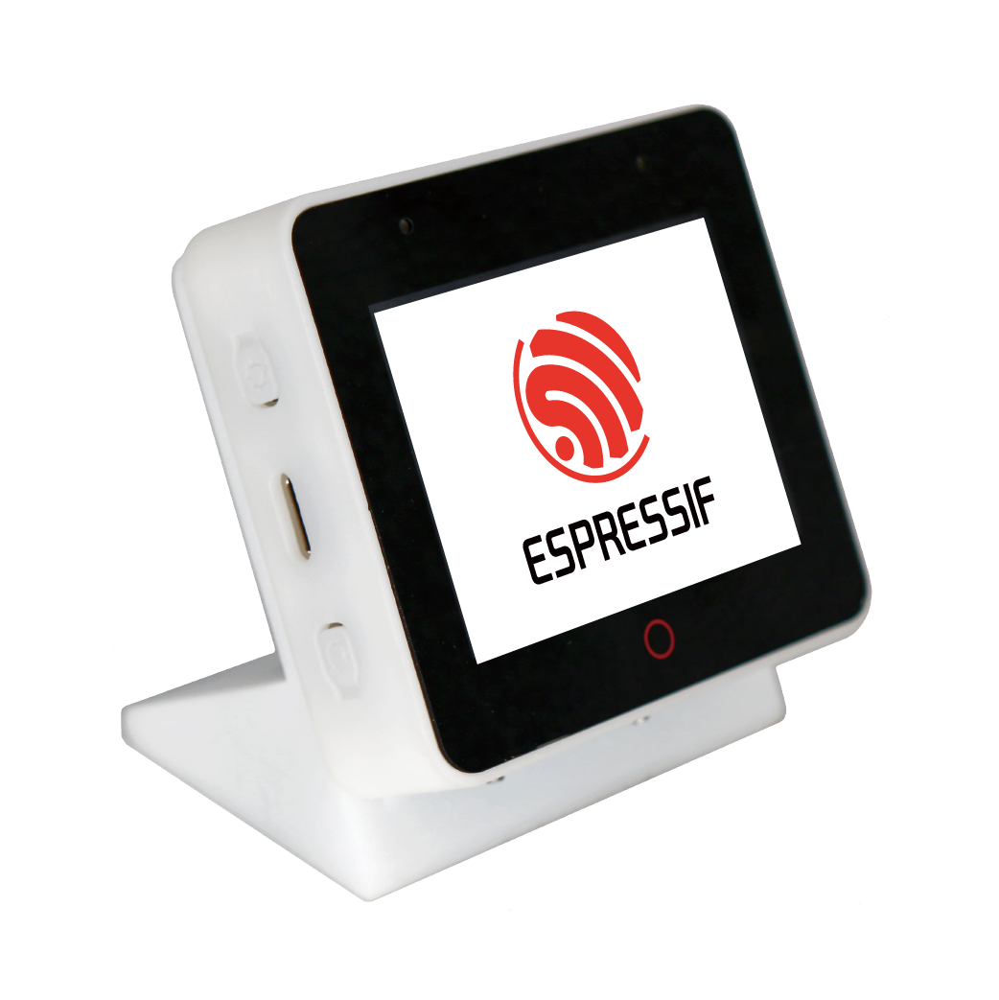
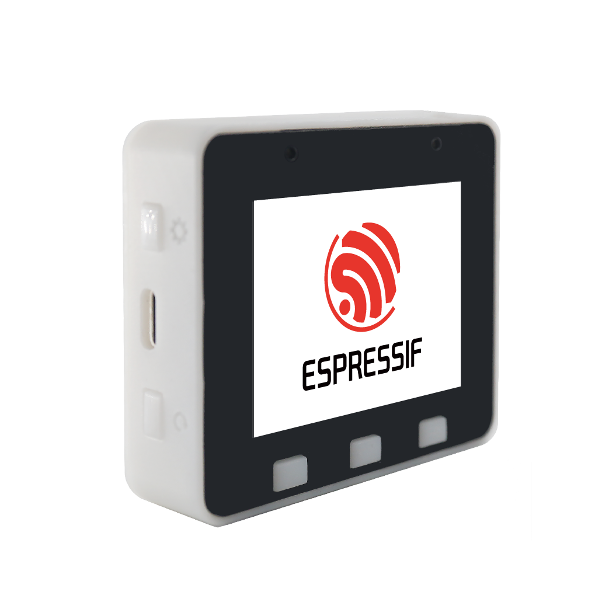

* [中文版本](README_cn.md)

# ESP-BOX AIoT Development Framework

    
    
    
    

**Important Note:**

> We recommend [updating the application firmware](./docs/firmware_update.md) when you first receive the product to have the new features and bugfix. Click [here](./docs/getting_started.md) to access the user guide of the latest release firmware. Click [here](https://github.com/espressif/esp-box/releases) to visit the older firmware.

The ESP-BOX is a new generation AIoT development platform released by Espressif Systems. The ESP32-S3-BOX and ESP32-S3-BOX-Lite are AIoT development boards that are based on Espressif’s ESP32-S3 Wi-Fi + Bluetooth 5 (LE) SoC. They provide a platform for developing the control of home appliances using Voice Assistance + touch and screen controller, sensor, infrared controller, and intelligent Wi-Fi gateway. Development boards come with pre-built firmware that supports offline voice interaction, with the SDKs and examples provided by Espressif, you will be able to develop a wide variety of AIoT applications based on the BOX series products such as online and offline voice assistants, voice-enabled devices, human-computer interaction devices, control panels, multi-protocol gateways easily. 

| Product Name |        Product Figure       |
| :-----: | :---------------------: |
| [ESP32-S3-BOX](docs/hardware_overview/esp32_s3_box/hardware_overview_for_box.md) |  |
| [ESP32-S3-BOX-Lite](docs/hardware_overview/esp32_s3_box_lite/hardware_overview_for_lite.md) |  |

## Versions

|      ESP-BOX     | Dependent ESP-IDF |  Branch Note                                           | Support State  |
| :--------------: | :---------------: | :----------------------------------------------------: | -------------- |
|      master      | release/v4.4 commit id: 2bdea81b2a |  Latest developing firmware  esp-sr version:  dev/v2.0 commit id: c873a35  | New feature develop, compatible with ESP32-S3-BOX and ESP32-S3-BOX-Lite |
|      Tag 0.3.0     | release/v4.4 commit id: 2bdea81b2a | esp-sr version:  dev/v2.0 commit id: c873a35  | Compatible with ESP32-S3-BOX and ESP32-S3-BOX-Lite |
| Tag 0.2.1 | release/v4.4 with [patch](https://github.com/espressif/esp-box/tree/v0.2.1/idf_patch) | esp-sr version: close v1.0 commit id: 3ce34fe | Support ESP32-S3-BOX only |
| Tag 0.1.1 | release/v4.4 with [patch](https://github.com/espressif/esp-box/tree/v0.1.1/idf_patch) | esp-sr version: v0.9.6 commit id: 3ce34fe | Support ESP32-S3-BOX only |

## Features

* Supports far-field voice interaction with 2 mics
* Offline voice wake-up with high wake-up rate
* Offline speech commands recognition in Chinese and English languages with high recognition rate
* Reconfigurable 200+ speech commands in Chinese and English languages
* Continuous Identification and Wakeup Interrupt
* Flexible and reusable GUI framework
* End-to-end AIoT dvelopment framwork ESP-RainMaker
* Pmod™ compatible headers support expand peripheral modules

## Open-Source Content

* [Schematic and PCB Source File](./hardware)
* [Shell 3D Print Source File](./hardware)
* [Firmware Source Code](./examples/factory_demo)
* [Examples Source Code](./examples)

> Based on [Apache 2.0](https://github.com/espressif/esp-box/blob/master/LICENSE) open source license, you can modify, develop, or distribute the contents freely. 

## User Guide

* For getting start of BOX serial development boards, please refer to the [Getting Started](./docs/getting_started.md).
* For experiencing voice assistant, please refer to the [Voice Assistance Control and Customization](./docs/getting_started.md#offline-voice-assistant-with-your-device).
* For experiencing a more humanized interactive experience, please refer to the [Continuous Speech Recognition](./docs/getting_started.md#continuous-recognition).
* For defining the speech commands by mobile APP, please refer to the [ESP-BOX APP User Guide](./docs/getting_started.md#voice-command-customization).
* For product exploded-view and disassembly tutorial, please refer to [Disassembly Tutorial](docs/disassembly_tutorial.md).
* For more details of hardware information, please refer to the [Hardware Overview](./docs/hardware_overview).
* For latest version firmware, please refer to the [Firmware Update](./docs/firmware_update.md).

## Developer Guide

ESP-BOX integrates components commonly used in AIOT development that you can leverage to build your own applications.

### Quick Start

* **Step 1**. ESP-IDF (Espressif IoT Development Framework) is required to build the application. If this is your first time using the ESP-IDF, please refer to [ESP-IDF development guide](https://docs.espressif.com/projects/esp-idf/en/release-v4.4/esp32s3/index.html) to understand the open-source drivers and components provided by Espressif.
* **Step 2**. Next, setting up development environment. Please refer to [ESP-IDF(release/v4.4) Installation Step by Step](https://docs.espressif.com/projects/esp-idf/en/release-v4.4/esp32s3/get-started/index.html#installation-step-by-step).
* **Step 3**. Run command `git clone --recursive https://github.com/espressif/esp-box.git` to download the code of this project and then switch the ESP-IDF version to [specified version](#versions);
* **Step 4**. Take a small step, you can [build and flash a simple example](./examples/image_display).
* **Step 5**. Moving further, please read [ESP-BOX technical architecture](./docs/technical_architecture.md) to understand the technical details.
* **Step 6**. Going deeper, please read [ESP Speech Recognition Application Guide](https://github.com/espressif/esp-sr), [ESP RainMaker Programming Guide](https://docs.espressif.com/projects/esp-rainmaker/en/latest/), [LVGL GUI Quick overview](https://docs.lvgl.io/8.1/get-started/index.html).
* **Step 7**. For extended function, please read [Pmod™ compatible headers](./docs/hardware_overview) and [ESP-IDF API reference](https://docs.espressif.com/projects/esp-idf/en/v4.4/esp32s3/api-reference/index.html), to develop drivers for more extended devices.

## Contact Us

* If you have any technical issues, please submit issue tickets at [GitHub Issues](https://github.com/espressif/esp-box/issues) or forum [esp32.com](https://esp32.com/) for help.
* If you are interested in ESP-BOX project, welcome to the [ESP-BOX forum](https://esp32.com/viewforum.php?f=44) to share with us your ideas.

## Contributing Examples

We welcome any open-source software or hardware contribution. If you have any examples you want to share with us, please click the [Contributions Guide](https://docs.espressif.com/projects/esp-idf/en/latest/esp32s3/contribute/index.html) and commit to the [Pull Requests](https://github.com/espressif/esp-box/pulls) to contribute your code. 

