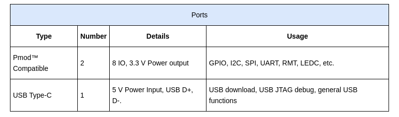

* [中文版](./README_cn.md)

# ESP-BOX Developer Guide

ESP-BOX is a new generation AIoT application development kits released by Espressif Systems, powered by Espressif ESP32-S3 SoC, supporting AI acceleration and Wi-Fi + Bluetooth 5 (LE) wireless functions. ESP-BOX has a built-in 2.4-inch LCD capacitive touch screen, dual microphones, a speaker, and dual Pmod™ compatible expansion interfaces. With the out-of-the-box voice wake-up and voice recognition functions, as well as Espressif's open-source development framework and examples, developers can create various interesting AIoT applications better and faster.

## Hardware Overview

* [ESP-BOX Mainboard Schematic](./docs/hardware/schematic/SCH_ESP32-S3-BOX_V2.5.pdf)
* [ESP-BOX Mainboard PCB](./docs/hardware/pcb/PCB_ESP32-S3-BOX_V2.4.pdf)

### Specifications:

### Ports:

* [Digilent Pmod™ Interface Specification](https://digilent.com/reference/_media/reference/pmod/pmod-interface-specification-1_3_1.pdf)

## Technical Architecture

The ESP-BOX development framework includes three main layers: system layer, framework layer, and application layer:

### System Layer 

ESP-IDF is the open-source development framework for Espressif SoCs including  ESP32、ESP32-S and ESP32-C series. It integrates a large number of system-level basic components, a set of development tools for code compilation and debugging, and detailed development guidance documents:

1. System-level basic components, mainly including multi-tasking, multi-core support based on FreeRTOS, and memory heap allocator with external expansion of PSRAM; a uniform operation interface support for LL, HAL, Driver, and VFS layers of multiple ESP chips; multiple standard network protocol stacks like TCP/IP, HTTP, MQTT, WebSocket, etc.
2. Set of development tools, mainly including GCC cross-toolchain for code building, JTAG debugging tool based on OpenOCD, real-time tracking based on Segger SystemView, Flash and eFuse programmers, etc.
3. Development guidance documents, API references, guidelines, and notes of  Espressif’s various chip platforms and software versions. Developers can view these documents  [Online](https://docs.espressif.com/projects/esp-idf/en/latest/esp32/get-started/) or [Download](https://docs.espressif.com/projects/esp-idf/en/latest/esp32/esp-idf-en-v4.4-dev-3540-g4e03a9c-esp32.pdf).

### Framework Layer

In addition to system-level support, ESP-BOX also integrates several excellent solution frameworks for typical problems in different scenarios. Including the speech recognition framework ESP-SR, the human-computer interaction framework ESP-HMI, and the end-to-end IoT development framework ESP-RainMaker. The  functions and customization methods of these solution frameworks will be briefly introduced as follows:

**ESP-SR**

ESP-SR is a speech recognition framework developed by Espressif for the field of intelligent speech. ESP-SR can provide high-performance and high-reliability speech recognition functions for developers by using ESP32-S3 AI extension instructions. Now, this framework has three modules:

1. Espressif's acoustic algorithm ([Audio Front-End, AFE](https://github.com/espressif/esp-sr/tree/master/acoustic_algorithm)) , which is specially designed to improve speech recognition performance in far-field or noisy environments  to enable developers to obtain high-quality and stable audio data. It mainly includes  AEC (Acoustic Echo Cancellation) , BSS (Blind Source Separation), NS (Noise Suppression). ESP-SR encapsulates the above algorithms into simple APIs. Without undersatanding details of these algorithms, developers only need to arrange and combine the algorithms that need to be used for specific application scenarios, and input the voice data to be processed according to the API format requirements and can get the results.
2. Espressif wake word engine ([WakeNet](https://github.com/espressif/esp-sr/blob/master/wake_word_engine/README.md)), which is used to monitor specific language fragments in real-time in a continuous audio stream, and wake up the smart device from the standby state to the voice interaction state. WakeNet uses MFC (Mel-Frequency Cepstrum) to obtain the features of the input audio clip , and classifies the characteristic signals by the neural network algorithm optimized for ESP32-S3. It can trigger the wake-up signal when monitor the command word,  and the [Effective recognition rate](https://github.com/espressif/esp-sr/blob/master/wake_word_engine/README.md#performance-test) is not less than 80% in noisy environment. ESP-BOX  provides different offline wake words like “Xiao Ai Tong Xue” “Hi, Lexin” etc. and also allows [customized wake word](https://github.com/espressif/esp-sr/blob/master/wake_word_engine/ESP_Wake_Words_Customization.md).
3. Espressif wake-up word engine ([WakeNet](https://github.com/espressif/esp-sr/blob/master/wake_word_engine/README.md)), which is used to monitor specific language fragments in real-time in a continuous audio stream, and wake up the smart device from the standby state to the voice interaction state. WakeNet uses MFC (Mel-frequency Cepstrum) to obtain the features of the input audio clip, then classifies the characteristic signals by the neural network algorithm optimized for ESP32-S3. That can trigger the wake-up signal when analyzed the command word,  and the [Effective recognition rate](https://github.com/espressif/esp-sr/blob/master/wake_word_engine/README.md#performance-test) is more than 80% in a noisy environment. ESP-BOX  provides different offline wake words like “Hi, ESP” and “Hi, Lexin”.  And also allows [customized wake word](https://github.com/espressif/esp-sr/blob/master/wake_word_engine/ESP_Wake_Words_Customization.md).

**ESP-HMI**

ESP-HMI is a human-computer interaction solution designed by Espressif based on the open-source GUI framework LVGL. With the powerful computing and peripheral resources in ESP32-S3, it can achieve excellent data visualization, touch control, and other functions:

1. Screen driver library: compatible with a variety of mainstream 8080, SPI, I2C interface color screens, monochrome screens, touch screens, and provide a uniform display driver interface. Developers can directly use the adapted screen controller or add their screens according to the display driver interface. And the UI interface can be deployed to a variety of screens.
2. Open source UI templates: Espressif has designed multiple open source UI templates suitable for IoT control panels, multimedia players, voice assistants, and other different IoT scenarios, which can help developers carry out more professional secondary development.
3. Hardware design reference: Espressif provides hardware reference designs, circuit schematics, and development guides related to screen applications to help developers quickly complete hardware designs.

**ESP-RainMaker**

[ESP-RainMaker](https://rainmaker.espressif.com/docs/get-started.html) is a complete system for IoT development, and it can As an end-to-end platform, it can provide developers with one-stop IoT product functions and examples such as device distribution, cloud connection, and OTA, it contains the following functions:

1. Device-side SDK, developers can use Espressif chips to define their IoT products by designing device parameters and attributes, and complete device-side firmware development quickly.
2. Secure cloud middleware, developers do not need to manage device certificates and cloud infrastructure. They can directly use Espressif chips to quickly establish a secure communication link with the cloud.
3. iOS / Android  APP, which integrates the necessary functions such as device discovery, Wi-Fi provisioning, user login, device association and control, and developers do not need to carry out additional code development work.

**AI Instructions and Libraries**

With the help of ESP32-S3 Xtensa® 32bit LX7 dual-core CPU and AI / DSP extended instruction set, ESP32-S3 can efficiently complete vector operations, complex number operations, FFT and other operations, which can accelerate neural network calculations and digital signal processing calculation capabilities. AI developers can implement high-performance image recognition, voice wake-up and recognition with Espressif's open source software library based on the AI / DSP extended instruction set.

**Device Drivers**

TBD:

### Application Layer

TBD:

## Develop Guide

1. [Setting up development environment]().
2. Try out some [examples](./examples).
3. Read the [Build System](https://docs.espressif.com/projects/esp-idf/en/latest/esp32s3/api-guides/build-system.html) to see the overview of building process.
4. Read the [Application Startup Flow](https://docs.espressif.com/projects/esp-idf/en/latest/esp32s3/api-guides/startup.html) to get a better understanding of the program.
5. Read the [Setup Command word]() to redesign your own command words.
6. Read the [LVGL Quick overview](https://docs.lvgl.io/latest/en/html/get-started/quick-overview.html) to learn the most importance things to add your favorite GUI.
7. Read the [ESP-IDF API Reference](https://docs.espressif.com/projects/esp-idf/en/latest/esp32/api-reference/index.html) to develop drivers for Pmod interface devices.
8. If you have questions please add [GitHub Issues](https://docs.github.com/en/issues) or goto esp32.com forum to get help.
9. [Pull Requests](https://docs.github.com/en/github/collaborating-with-pull-requests) is welcome if you're interested in contributing to ESP-Box.
