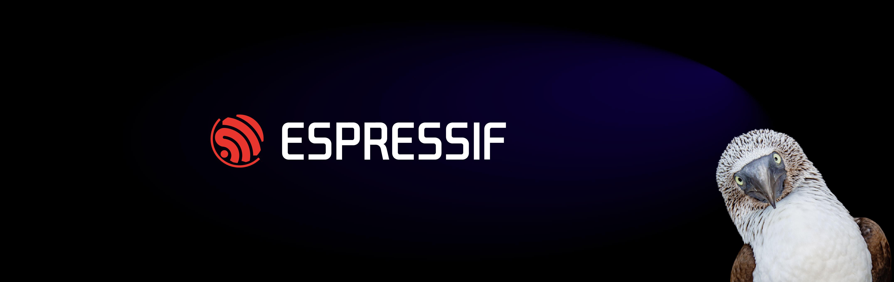
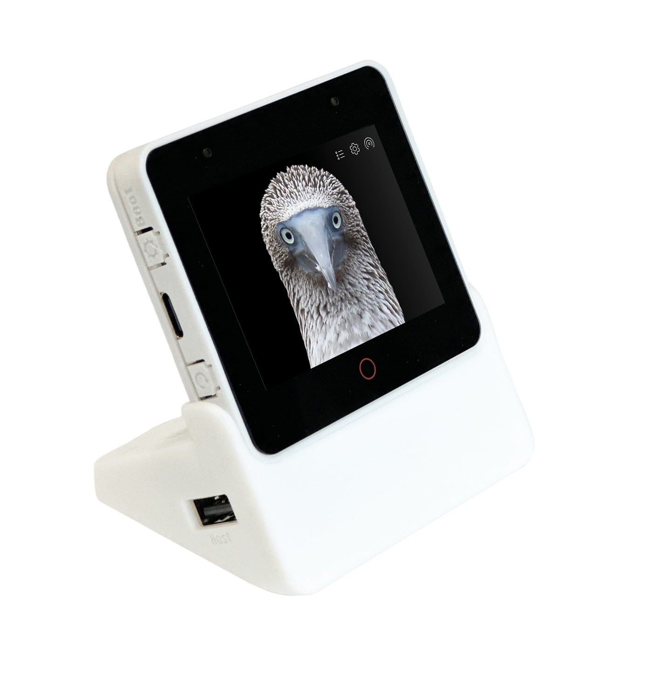

    

* [中文版本](README_cn.md)
* [Promotional Video](https://www.youtube.com/watch?v=KGVOi1Mrjb0)
# ESP-BOX AIoT Development Framework

    
    
    
    

**Important Note:**

> Upon receiving the ESP32-S3-BOX-3, we advise updating the built-in factory firmware to ensure you have the latest bugfixes via Espressif's online firmware flashing tool ESP Launchpad. Up till now, the latest version is **ESP-BOX-3_Demo_V1.2.4**. To verify the software version, please go to the 'About Us' Page.

The ESP-BOX is an advanced AIoT, Edge AI, and IIoT applications development platform released by Espressif Systems. The ESP32-S3-BOX, ESP32-S3-BOX-Lite, and ESP32-S3-BOX-3 are a series of development boards designed for this platform, they are built on Espressif’s powerful ESP32-S3 Wi-Fi + Bluetooth 5 (LE) SoC and feature compact and beautiful enclosures. Leveraging the multi-functional accessories and reliable examples from the repo’s, these development boards cater to both prototyping new projects and building complex IoT systems, providing a perfect balance of form and function.

ESP-BOX provides a platform for developing applications in various domains, including Offline Voice Assistants, Online AI Chatbots (developed using OpenAI and other large language model platforms), Matter Device/Controller, Robot Controller, USB Device/Host, Wireless Sensor Application and a wide range of Human Machine Interaction (HMI) applications. Experience the possibilities—add one to your toolkit and explore the limitless potential!

| Product Name |        Product Figure       |    Marketing Status       |
| :-----: | :---------------------: |:---------------------: |
| [ESP32-S3-BOX **1** ](docs/hardware_overview/esp32_s3_box/hardware_overview_for_box.md) |  |End of Life   [User Guide](https://github.com/espressif/esp-box/blob/v0.5.0/docs/getting_started.md) |
| [ESP32-S3-BOX-Lite **1** ](docs/hardware_overview/esp32_s3_box_lite/hardware_overview_for_lite.md) |  |[Active](https://www.aliexpress.com/item/1005004441701974.html?spm=a2g0o.store_pc_groupList.8148356.15.378130cf2Qwt87&pdp_npi=3%40dis%21HKD%21HKD273.50%21HKD273.50%21%21%21%21%21%40210318cb16926755466344763e3593%2112000029194032303%21sh%21HK%213721963538)   [User Guide](https://github.com/espressif/esp-box/blob/v0.5.0/docs/getting_started.md)|
| [ESP32-S3-BOX-3](docs/hardware_overview/esp32_s3_box_3/hardware_overview_for_box_3.md) |  |[Active](https://www.aliexpress.com/item/1005005920207976.html)   [User Guide](./docs/getting_started.md)|

**Note 1**: Upon receiving the ESP32-S3-BOX and ESP32-S3-BOX-Lite, we advise updating the [built-in factory firmware](./docs/firmware_update.md) to ensure you have the latest bug fixes. In the master branch, we will gradually offer limited support for these two development boards. For further information, kindly refer to the examples readme.
## Versions

|      ESP-BOX     | Dependent ESP-IDF |  Branch Note                                           | Support State  |
| :--------------: | :---------------: | :----------------------------------------------------: | -------------- |
|      master      | >= release/v5.1 commit id: 22cfbf30c3 |  Latest developing firmware  esp-sr components version:  v1.4.1   | Partial support for ESP32-S3-BOX, ESP32-S3-BOX-Lite, and ESP32-S3-BOX-3  **Use menuconfig to select board**  Refer to the Examples **README** for more details. |
|      Tag 0.5.0     | release/v5.1 commit id: 22cfbf30c3 | esp-sr components version:  v1.3.4   | Compatible with ESP32-S3-BOX and ESP32-S3-BOX-Lite  Use menuconfig to select board |
|      Tag 0.3.0     | release/v4.4 commit id: 2bdea81b2a | esp-sr version:  dev/v2.0 commit id: c873a35  | Compatible with ESP32-S3-BOX and ESP32-S3-BOX-Lite |
| Tag 0.2.1 | release/v4.4 with [patch](https://github.com/espressif/esp-box/tree/v0.2.1/idf_patch) | esp-sr version: close v1.0 commit id: 3ce34fe | Support ESP32-S3-BOX only |
| Tag 0.1.1 | release/v4.4 with [patch](https://github.com/espressif/esp-box/tree/v0.1.1/idf_patch) | esp-sr version: v0.9.6 commit id: 3ce34fe | Support ESP32-S3-BOX only |

## Features

* An out-of-the-box entry-level edge AI + HMI application development board.
* FreeRTOS-based four-in-one voice interaction panel: offline voice recognition, network communication, screen display, peripheral control.
* Supports far-field voice interaction with 2 mics.
* Offline voice wake-up and commands recognition with high wake-up rate.
* Allows continuous recognition, wake-up interrupt, and over 200 customizable command words.
* Flexible and versatile home automation solutions: Matter, Home Assistant, ESP-RainMaker
* Visual drag-and-drop GUI development: LVGL SquareLine Studio, Embedded Wizard, etc.
* Rich development framework: ESP-IDF, Arduino, PlatformIO, Circuit Python, and more.

## Open-Source Content

* [Schematic and PCB Source File](./hardware)
* [Shell 3D Print Source File](./hardware)
* [Built-in Firmware Source Code](./examples/factory_demo)
* [Other Examples](./examples)

> Based on [Apache 2.0](https://github.com/espressif/esp-box/blob/master/LICENSE) open source license, you can modify, develop, or distribute the contents freely.

## Built-in Firmware User Guide

* It is recommended to start by reading the product [Hardware Overview](./docs/hardware_overview/esp32_s3_box_3/hardware_overview_for_box_3.md).
* Next you can explore the [Getting Started](./docs/getting_started.md).
* For exploring interesting sensor demos, please refer to [Sensor Applications](./docs/getting_started.md#sensor-monitor).
* For experiencing voice assistant, please refer to the [Voice Assistance Control](./docs/getting_started.md#offline-voice-assistant).
* For experiencing a more humanized interactive experience, please refer to the [Continuous Speech Recognition](./docs/getting_started.md#continuous-speech-recognition).
* For defining the speech commands by mobile APP, please refer to the [ESP BOX APP User Guide](./docs/getting_started.md#voice-command-customization).
* For switching the voice model language, please refer to [Switch Voice Model Language](./docs/getting_started.md#switch-voice-model-language).
* For product exploded-view and disassembly tutorial, please refer to [Disassembly Tutorial](docs/disassembly_tutorial.md).
* For more details of hardware information, please refer to the [Hardware Overview](./docs/hardware_overview).
* For latest version firmware, please refer to the [Firmware Update](./docs/firmware_update.md).

## Developer Guide

ESP-BOX integrates ESP-IDF components commonly used in AIoT development from [ESP Registry](https://components.espressif.com/components?q=lcd) that you can leverage to build your own applications.

### Quick Start

* **Step 1**. ESP-IDF (Espressif IoT Development Framework) is required to build the application. If this is your first time using the ESP-IDF, please refer to [ESP-IDF development guide](https://docs.espressif.com/projects/esp-idf/en/latest/esp32s3/index.html) to understand the open-source drivers and components provided by Espressif.
* **Step 2**. Next, setting up development environment. Please refer to [ESP-IDF (release/v5.1) Installation Step by Step](https://docs.espressif.com/projects/esp-idf/en/release-v5.1/esp32s3/get-started/index.html#ide).
* **Step 3**. Run command `git clone --recursive https://github.com/espressif/esp-box.git` to download the code of this project and then switch the ESP-IDF version to [specified version](#versions);
* **Step 4**. Take a small step, you can [build and flash a simple example](./examples/image_display).
* **Step 5**. Moving further, please read [ESP-BOX technical architecture](./docs/technical_architecture.md) to understand the technical details.
* **Step 6**. Going deeper, please read [ESP Speech Recognition Application Guide](https://github.com/espressif/esp-sr), [ESP RainMaker Programming Guide](https://docs.espressif.com/projects/esp-rainmaker/en/latest/), [LVGL GUI Quick overview](https://docs.lvgl.io/8.3/).
* **Step 7**. For extended function, please read [Pmod™ compatible headers](./docs/hardware_overview) and [ESP-IDF API reference](https://docs.espressif.com/projects/esp-idf/en/release-v5.1/esp32s3/api-reference/index.html), to develop drivers for more extended devices.
### Cloud Quick Start
The ESP BOX APP is built based on the commercial mobile APP architecture, Nova Home, which provides fancy UI and better user experience but has limited openness. To gain access to it, customers are required to contact us commercially via email at sales@espressif.com.
For developer, we offer [ESP RainMaker](https://rainmaker.espressif.com/) solution, which includes publicly available development document and API guide. Below is the pathway to access them:
* [ESP RainMaker Get Started](https://rainmaker.espressif.com/docs/get-started.html)
* [ESP RainMaker Programming Guide](https://docs.espressif.com/projects/esp-rainmaker/en/latest/)
* [RainMaker App APIs Definitions](https://swaggerapis.rainmaker.espressif.com)

### NuttX
The ESP32-S3-BOX-3 also supports integration with [NuttX](https://github.com/apache/nuttx/tree/master/boards/xtensa/esp32s3/esp32s3-box), offering further flexibility and functionality. Nuttx is a real-time operating system (RTOS) known for its compact size, efficiency, and real-time performance, making it an excellent choice for embedded systems.

### Great Projects from Developers
We actively collect [outstanding projects](./docs/great_projects.md) based on ESP-BOX to inspire more developers to innovate. We thank the enthusiasts promoting thriving community culture and welcome more developers to contribute to the vibrant ESP32 community.

## Contact Us

* If you have any technical issues, please submit issue tickets at [GitHub Issues](https://github.com/espressif/esp-box/issues) or forum [esp32.com](https://esp32.com/) for help.
* If you are interested in ESP-BOX project, welcome to the [ESP-BOX forum](https://esp32.com/viewforum.php?f=44) to share with us your ideas.

## Contributing Examples

We welcome any open-source software or hardware contribution. If you have any examples you want to share with us, please click the [Contributions Guide](https://docs.espressif.com/projects/esp-idf/en/latest/esp32s3/contribute/index.html) and commit to the [Pull Requests](https://github.com/espressif/esp-box/pulls) to contribute your code.

