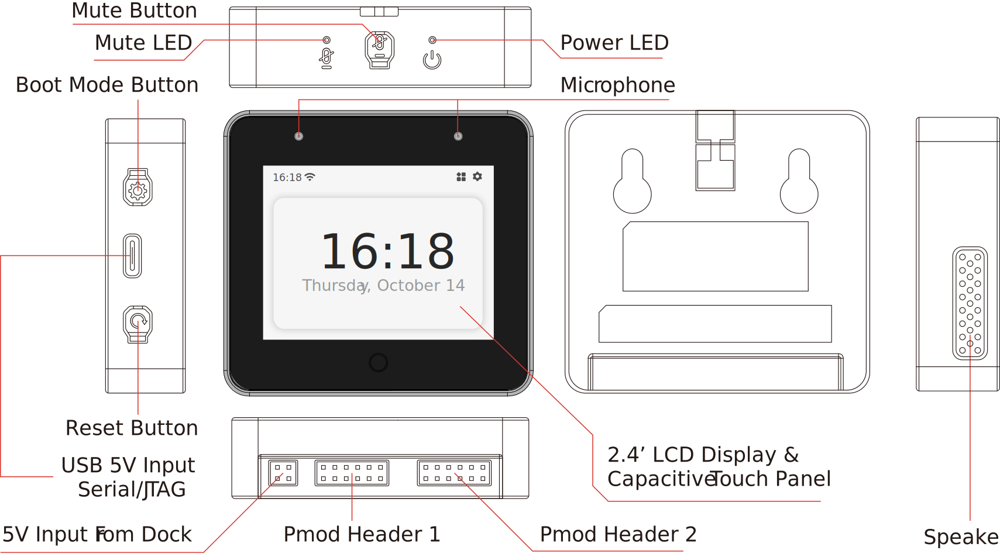

* [中文版本](README_cn.md)

# ESP-BOX AIoT Development Framework

**Important Note: We recommend [updating the ESP32-S3-BOX firmware](./docs/firmware_update.md) when you first receive the product to have the latest features and bugfix.**

The ESP-BOX is a new generation AIoT development platform released by Espressif Systems. The ESP32-S3-BOX is an AIoT development board that is based on Espressif’s ESP32-S3 Wi-Fi + Bluetooth 5 (LE) SoC. The ESP32-S3-BOX provides a platform for developing the control of home appliances using Voice Assistance + touch screen controller, sensor, infrared controller, and intelligent Wi-Fi gateway. The ESP32-S3-BOX comes with pre-built firmware that supports offline voice interaction, with the SDKs and examples provided by Espressif, you will be able to develop a wide variety of AIoT applications based on the ESP32-S3-BOX such as online and offline voice assistants, voice-enabled devices, HMI touch-screen devices, control panels, multi-protocol gateways easily. 

**ESP-BOX features:**

* Supports far-field voice interaction with 2 mics
* Offline voice wake-up with high wake-up rate
* Offline speech commands recognition in Chinese and English languages with high recognition rate
* Reconfigurable voice commands in Chinese and English languages
* Flexible and reusable GUI framework
* End-to-end IoT development framework ESP-RainMaker
* Pmod™ compatible headers support expand peripheral modules

**ESP-BOX Open-Source Content Include:**

* [Schematic and PCB Source File](./hardware)
* [Shell 3D Print Source File](./hardware/esp32_s3_box_shell_step)
* [Firmware Source Code](./examples/factory_demo)
* [Examples Source Code](./examples)

> Based on [Apache 2.0](https://github.com/espressif/esp-box/blob/master/LICENSE) open source license, you can modify, develop, or distribute the contents freely. 

## User Guide

* For getting start of ESP32-S3-BOX, please refer to the [Getting Started](./docs/getting_started.md)
* For voice control and customization, please refer to the [Voice Assistance Control and Customization](./docs/getting_started.md#voice-assistance-control-and-customization)
* For control the device by graphical user interface, please refer to the [ESP32-S3-BOX GUI Guide](./docs/getting_started.md#esp32-s3-box-graphical-user-interface)
* For product exploded-view and disassembly tutorial, please refer to [ESP32-S3-BOX Disassembly Tutorial](docs/disassembly_tutorial.md)
* For more detils of ESP32-S3-BOX hardware, please refer to the [ESP32-S3-BOX hardware overview](./docs/hardware_overview.md).
* For latest version firmware, please refer to the [ESP32-S3-BOX firmware update](./docs/firmware_update.md)

## Developer Guide

* **Step 1**. ESP-IDF (Espressif IoT Development Framework) is required to build the application. If this is your first time using the ESP-IDF, please refer to [ESP-IDF development guide](https://docs.espressif.com/projects/esp-idf/en/release-v4.4/esp32s3/index.html) to understand the open-source drivers and components provided by Espressif.
* **Step 2**. Next, setting up development environment. Please refer to [ESP-IDF(release/v4.4) Installation Step by Step](https://docs.espressif.com/projects/esp-idf/en/release-v4.4/esp32s3/get-started/index.html#installation-step-by-step).
* **Step 3**. Additionally, apply the patch files on current ESP-IDF, please refer [Patch for ESP-IDF](./idf_patch) for details.
* **Step 4**. Take a small step, you can [build and flash a simple example](./examples/image_display).
* **Step 5**. Moving further, please read [ESP-BOX technical architecture](./docs/technical_architecture.md) to understand the technical details.
* **Step 6**. Going deeper, please read [ESP Speech Recognition Application Guide](https://github.com/espressif/esp-sr), [ESP RainMaker Programming Guide](https://docs.espressif.com/projects/esp-rainmaker/en/latest/), [LVGL GUI Quick overview](https://docs.lvgl.io/latest/en/html/get-started/quick-overview.html).
* **Step 7**. For extended function, please read [ESP32-S3-BOX Pmod™ compatible headers](./docs/hardware_overview.md) and [ESP-IDF API reference](https://docs.espressif.com/projects/esp-idf/en/latest/esp32/api-reference/index.html), to develop drivers for more extended devices.

## Contact Us

* If you have any technical issues, please submit issue tickets at [GitHub Issues](https://github.com/espressif/esp-box/issues) or forum [esp32.com](https://esp32.com/) for help.
* If you are interested in ESP-BOX project, welcome to the [ESP-BOX forum](https://esp32.com/viewforum.php?f=44) to share with us your ideas.
* We welcome any open-source software or hardware contribution. Please commit to the [Pull Requests](https://github.com/espressif/esp-box/pulls) to contribute your code.