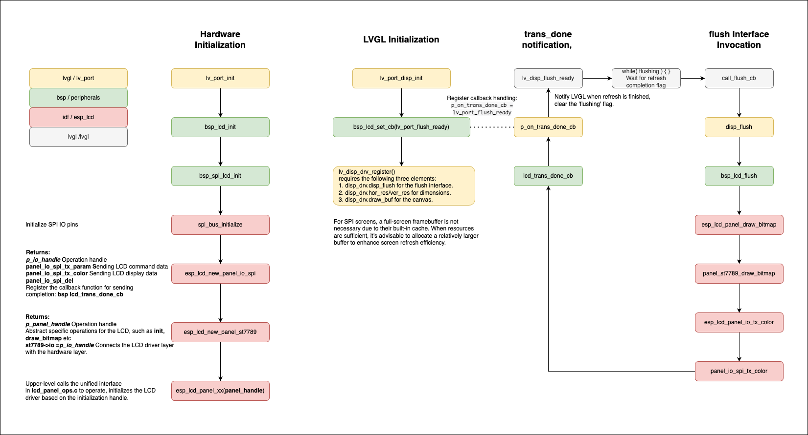

# Development Guide
* [中文版本](./development_guide_cn.md)

This document aims to assist users in setting up the development environment and application development using Espressif's ESP32-S3 chip for AIoT application.

## Preparation

- Installation of Development Environment

  Follow the instructions in the [ESP-IDF Programming Guide](https://docs.espressif.com/projects/esp-idf/zh_CN/latest/esp32s3/get-started/index.html#get-started-get-prerequisites) to install the esp-idf development environment. Despite the availability of graphical IDEs and plugins, we recommend manual installation and compilation using the command-line interface.

  The installation completed following the above instructions may not necessarily be the version of ESP-IDF that esp-box's dependencies require. In this case, it's necessary to switch the esp-idf to the specified version according to the [version notes](https://github.com/espressif/esp-box#versions). Using commit id 22cfbf30c3 as an example, the following command will accomplish the switch.

  ```shell
  cd esp-idf
  git fetch
  git checkout 22cfbf30c3
  git submodule update --init --recursive
  ./install.sh
  ```

- Clone esp-box

  In the command-line interface, navigate to your working directory and run the following command to clone the repository.

  ```shell
  git clone --recursive https://github.com/espressif/esp-box.git
  ```

## Compiling and Running Your First Application
Once you have successfully completed the preparation, you can start compiling your first application. You can begin with the `examples/factory_demo` project.

### Set Up ESP-IDF Environment Variables
You need to do this step every time you open a new command-line interface for compilation.

```shell
cd esp-idf
. ./export.sh
```

### Start Compilation

After navigating to the project directory, initiate the compilation.

```shell
cd esp-box/examples/factory_demo
idf.py build
```

You will see log outputs similar to the following:

```
Executing action: all (aliases: build)
Running cmake in directory /home/user/esp-box/examples/factory_demo/build
Executing "cmake -G Ninja -DPYTHON_DEPS_CHECKED=1 -DESP_PLATFORM=1 -DIDF_TARGET=esp32s3 -DCCACHE_ENABLE=0 /home/user/work/esp-box/examples/factory_demo"...
-- Found Git: /usr/bin/git (found version "2.36.0") 
-- Not find RMAKER_PATH, default is /home/user/work/esp-box/examples/factory_demo/../../components/esp-rainmaker
-- Component directory /home/user/work/esp-box/components/esp-rainmaker does not contain a CMakeLists.txt file. No component will be added
-- Component directory /home/user/work/esp-box/components/esp-rainmaker/components/esp-insights does not contain a CMakeLists.txt file. No component will be added
-- The C compiler identification is GNU 8.4.0
-- The CXX compiler identification is GNU 8.4.0
-- The ASM compiler identification is GNU
-- Found assembler: /home/user/esp/.espressif/tools/xtensa-esp32s3-elf/esp-2021r2-8.4.0/xtensa-esp32s3-elf/bin/xtensa-esp32s3-elf-gcc

......

Project build complete. To flash, run this command:
/home/user/esp/.espressif/python_env/idf4.4_py3.8_env/bin/python ../../../../esp/esp-idf/components/esptool_py/esptool/esptool.py -p (PORT) -b 460800 --before default_reset --after hard_reset --chip esp32s3 --no-stub write_flash --flash_mode dio --flash_size 16MB --flash_freq 80m 0x0 build/bootloader/bootloader.bin 0x8000 build/partition_table/partition-table.bin 0x16000 build/ota_data_initial.bin 0x20000 build/factory_demo.bin 0x3bd000 build/storage.bin 0x647000 build/model.bin
```

### Flashing Firmware and Running

All BOX development boards can download firmware directly via the USB interface. Before downloading, make sure that the computer correctly recognizes the device.

- Linux and MacOS usually do not require driver installation to recognize the device.
- For Windows systems, we recommend using `Windows 10` and above. In this system, the `USB-Serial-Jtag` driver will be automatically downloaded. If using the `Windows 7` system, please manually download the [USB-Serial-JTAG driver](https://dl.espressif.com/dl/idf-driver/idf-driver-esp32-usb-jtag-2021-07-15.zip) and install it.
  
Download the firmware and open the monitor using the following command:

```shell
idf.py -p PORT flash monitor
```

Replace PORT with the port name recognized by your computer. Typically, it is `/dev/ttyACM0` on Linux systems.

The firmware will automatically start running after the download is complete.

## Debugging Applications

- JTAG Debugging: See [here](https://docs.espressif.com/projects/esp-idf/zh_CN/latest/esp32s3/api-guides/jtag-debugging/index.html)
- Application Layer Tracing: See [here](https://docs.espressif.com/projects/esp-idf/zh_CN/latest/esp32s3/api-guides/app_trace.html)

## Components

Includes the following components:

| Component    | Description                                 |
| ------------ | ------------------------------------------- |
| bsp          | Includes supported development board info and onboard peripheral drivers |
| esp-rainmaker | Connects with Rainmaker cloud                  |
| esp-sr       | Espressif speech recognition library        |
| i2c_bus      | I2C driver                                  |
| i2c_devices  | Drivers for common I2C devices               |
| iot_button   | Button driver                               |
| lvgl         | LVGL graphics library                       |
| audio        | Playback/file management/decoding library   |


### BSP Component
- boards
  
  **bsp_board.c** is the system call file used to be compatible with different hardware platforms. Currently, the box project supports two hardware platforms: [BOARD_S3_BOX](./hardware_overview/esp32_s3_box/hardware_overview_for_box.md) and [BOARD_S3_BOX_LITE](./hardware_overview/esp32_s3_box_lite/hardware_overview_for_lite.md). After the system initialization, based on the different device addresses detected by IIC, it determines the current hardware platform and calls different hardware initialization interfaces accordingly.

  **esp32_s3_box.c** and **esp32_s3_box_lite.c** are the specific hardware pin configurations and initialization implementations for `BOARD_S3_BOX` and `BOARD_S3_BOX_LITE`, respectively.

- codec

  The **codec** directory contains the driver interfaces for the Micphoone and Speaker that the hardware requires.

    |`BOARD_S3_BOX_LITE`|    |
    | ------------- | -------|
    | ADC Module    | ES7243 |
    | Codec Module  | ES8153 |

    |`BOARD_S3_BOX     `|    |
    | ------------- | -------|
    | ADC Module    | ES7210 |
    | Codec Module  | ES8311 |

- peripherals

    **bsp_btn.c** is the interface for handling buttons in the box, which works in conjunction with the **iot button** component. **iot button** maintains a registered list of button events and establishes a 1ms button query mechanism `button_create_com`. 

    The timer will sequentially poll the button events registered by `bsp_btn_register_callback`, and trigger the callback functions registered by the application layer according to the event of the button through `CALL_EVENT_CB(ev)`.

    - `BOARD_S3_BOX` has 1 physical button named `boot` , and the middle red dot is a virtual TP button.
    The `boot` button handles functions such as restoring Wi-Fi settings to factory defaults and switching between Chinese and English languages.

    - `BOARD_S3_BOX_LITE` has 1 physical button named `boot` and 3 ADC buttons named `prev`, `enter`, and `next`.
    The `boot` function is the same as described above, and the 3 ADC buttons act as navigation keys for function switching.
    The ADC buttons are designed using a single [`ADC`](../hardware/esp32_s3_box_lite_Button_V1.1/schematic/SCH_ESP32-S3-BOX-Lite_Button_V1.1_20211125.pdf) line, connected to different resistors to distinguish which button is pressed based on the ADC value. This approach saves IO port resources.

    **bsp_codec.c** provides an interface middleware for the above codecs, unifying the calls to different codecs and ADC chips.<br>
    **bsp_i2c.c** provides an interface middleware for the i2c_bus.<br>
    **bsp_i2s.c** provides an interface middleware for i2s.<br>
    **bsp_lcd.c** provides an interface middleware for displaying hardware interfaces.


    - `bsp_spi_lcd_init`initializes the LCD's SPI interface based on the board's pin definition.

    - `lcd_trans_done_cb` is the callback function for SPI data transmission completion, ensuring synchronization with LVGL's graphics rendering logic. `p_on_trans_done_cb(p_user_data) `-> `lv_port_flush_ready` notifies the display to clear the `flushing` flag.
    - `bsp_lcd_flush` is an LVGL interface that notifies the driver to prepare for screen refresh. If the interface has finished sending data from the previous frame, this function calls `esp_lcd_panel_ops.c/esp_lcd_panel_draw_bitmap` to send the display data to the SPI interface.


### ESP-SR Component
This section focuses on introducing some application interfaces of SR.

  * Configuration File Introduction
    ```
    #define AFE_CONFIG_DEFAULT() { \
    .aec_init = true, \                       //Enable AEC algorithm
    .se_init = true, \                        //Enable BSS/NS algorithm
    .vad_init = true, \                       //Enable VAD (only usable in speech recognition scenes)
    .wakenet_init = true, \                   //Enable wake word detection.
    .voice_communication_init = false, \      //Enable voice communication. Cannot be enabled at the same time as wakenet_init.
    .voice_communication_agc_init = false, \  //Enable AGC in voice communication.
    .voice_communication_agc_gain = 15, \     //AGC gain value in voice communication, in dB.
    .vad_mode = VAD_MODE_3, \                 //VAD detection mode, higher value is more aggressive.
    .wakenet_model_name = NULL, \             //Select wake word model.
    .wakenet_mode = DET_MODE_2CH_90, \        //Wake word detection mode. Corresponds to the number of mic channels, choose according to mic channel count.
    .afe_mode = SR_MODE_LOW_COST, \           //SR_MODE_LOW_COST: Quantized version with less resource consumption.
                                              //SR_MODE_HIGH_PERF: Non-quantized version with higher resource consumption.
    .afe_perferred_core = 0, \                //The CPU core on which internal AFE BSS/NS/MISO algorithms run.
    .afe_perferred_priority = 5, \            //Task priority for internal AFE BSS/NS/MISO algorithms.
    .afe_ringbuf_size = 50, \                 //Internal ring buffer size configuration.
    .memory_alloc_mode = \
          AFE_MEMORY_ALLOC_MORE_PSRAM, \      //Allocate most of the memory from external psram
    .agc_mode = AFE_MN_PEAK_AGC_MODE_2, \     //Linear amplification of audio fed to multinet, peak value at -4dB.
    .pcm_config.total_ch_num = 3, \           //total_ch_num = mic_num + ref_num
    .pcm_config.mic_num = 2, \                //Number of microphone channels in the audio. Currently, only configurations of 1 or 2 are supported.
    .pcm_config.ref_num = 1, \                //Number of reference loop channels in the audio. Currently, only configurations of 0 or 1 are supported.
    }
    ```
  * Model Initialization and Configuration
    ```
    /* ESP_AFE_SR_HANDLE: Voice recognition model
     * ESP_AFE_VC_HANDLE: Voice communication model
     */
     afe_handle = &ESP_AFE_SR_HANDLE;
     afe_config_t afe_config = AFE_CONFIG_DEFAULT();

    /* Wake word model naming format: wm*
     * Command word model naming format: mn*
     * esp_srmodel_filter is an interface encapsulating model partition searching
     */
    afe_config.wakenet_model_name = esp_srmodel_filter(models, ESP_WN_PREFIX, NULL);
    afe_config.aec_init = false; // Disable AEC

    esp_afe_sr_data_t *afe_data = afe_handle->create_from_config(&afe_config);

    ```
  * Switching Wake Word and Command Word Models
    ```
    /* Switching wake word model */
    wn_name = esp_srmodel_filter(models, ESP_WN_PREFIX, (SR_LANG_EN == g_sr_data->lang ? "hiesp" : "hilexin"));
    g_sr_data->afe_handle->set_wakenet(g_sr_data->afe_data, wn_name); // Set wake word model

    /* Switching command word model */
    mn_name = esp_srmodel_filter(models, ESP_MN_PREFIX, ((SR_LANG_EN == g_sr_data->lang) ? ESP_MN_ENGLISH : ESP_MN_CHINESE));
    esp_mn_iface_t *multinet = esp_mn_handle_from_name(mn_name);
    model_iface_data_t *model_data = multinet->create(mn_name, 5760); // Set command word model
    ```
  * Command Word Configuration Interface
    ```
    /* Load built-in command word model from the model
     * Command word model can be modified from the menuconfig path: TOP -> ESP_SPEECH_RECOGNITION -> commands
     */
    esp_mn_commands_update_from_sdkconfig(*multinet, *model_data);

    /* Manual manipulation of command words in code
     * Users can use the following APIs to manipulate command words
     */
    esp_err_t esp_mn_commands_add(command_id, *phoneme_string);
    esp_err_t esp_mn_commands_remove(*phoneme_string);
    esp_err_t esp_mn_commands_modify(*old_phoneme_string, *new_phoneme_string);
    esp_mn_error_t *esp_mn_commands_update(*multinet, *model_data);

    ```
  * Rainmaker and SR Interface
    `cmd_write_to_sr(&cmd)` is the interface through which Rainmaker sends voice commands to the BOX for modification.
    SR control commands follow these rules:

    Each control command can correspond to a maximum of `8` command words. If there are more than `8` command words, adding a new command word will replace the last one in the table.

    The same voice command words cannot be added more than once.
### LVGL Component
 Here, we will introduce the porting interface of LVGL on BOX_S3.

- Input Devices

  * Input device hardware initialization, `indev_init_default()`
    Depending on the type of input device, different initializations are performed. As mentioned in the `bsp_btn` section above, `BOARD_S3_BOX_LITE` uses 3 navigation key buttons, while `BOARD_S3_BOX` uses a TP (Touch Panel) in addition to 1 virtual TP button.

    TP: Currently, the project has ported two touch panel chips, `tt21100` and `ft5x06`. After power-on, the `tp_prob` function detects different IIC addresses to identify the specific chip and performs different initialization actions through `indev_tp_init`.
    
    Buttons: Initialized during the `bsp_btn` button initialization.

  * Registering Input Devices `lv_port_indev_init()` -> `lv_indev_drv_register()`
    Registering a device requires the `type` and `read_cb` parameters. Upon registration, an internal timer with a period of `LV_INDEV_DEF_READ_PERIOD` is created to poll external input events.


- File System

  * Redirecting File Operation APIs

    This primarily involves redirecting APIs like `fopen`, `fclose`, `fwrite` based on the platform. LVGL provides encapsulations like  `lv_fs_fatfs`, `lv_fs_posix`, `lv_fs_sdio`,`v_fs_win32` for reference and configuration. Users can configure this in menuconfig or implement their own.

  * File Drive Letter Configuration

    Espressif's file system drive letter is `'S'`. Users need to be aware that when `lv_fs` performs any file operation, it first checks if the drive letter matches. Drive letters that don't match will receive a return value of `LV_FS_RES_NOT_EX`, which affects normal file operations.

- Display Interface
Display initialization is mainly divided into two parts: hardware interface initialization and registration of display devices. The following diagram provides a simple overview of the initialization modules used in BOX and their interconnections.
  <div align="center">
  
  </div>


