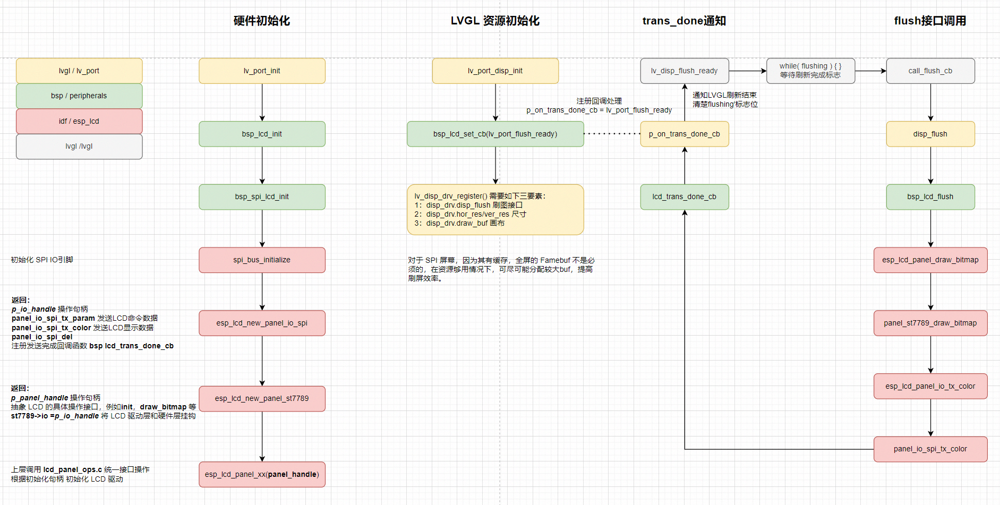

# 开发指南
* [English Version](./development_guide.md)

本文档旨在对用户从设置开发环境到应用开发提供帮助，以便使用基于 Espressif 的 ESP32-S3 芯片进行 AIoT 应用开发。

## 准备

- 开发环境的安装

  按照 [ESP-IDF 编程指南](https://docs.espressif.com/projects/esp-idf/zh_CN/latest/esp32s3/get-started/index.html#get-started-get-prerequisites)的指引完成 esp-idf 开发环境的安装，尽管有图形化的 IDE和插件，但是我们推荐您手动安装并使用命令提示行进行编译。

  按照以上指引完成的安装很可能并不是编译 esp-box 依赖的 esp-idf 版本，此时需要根据[版本说明](https://github.com/espressif/esp-box#versions)来切换 esp-idf 到指定的版本。以 commit id 为 22cfbf30c3 为例子，下面的命令将完成切换

  ```shell
  cd esp-idf
  git fetch
  git checkout 22cfbf30c3
  git submodule update --init --recursive
  ./install.sh
  ```

- 获取 esp-box

  在命令提示行中进入到自己工作的目录后运行如下命令克隆仓库

  ```shell
  git clone --recursive https://github.com/espressif/esp-box.git
  ```

## 编译并运行第一个应用

在成功完成准备工作后就可以开始编译第一个应用了，你可以从 `examples/factory_demo` 工程开始。

### 设置 esp-idf 环境变量

每打开一个新的命令提示行进行编译都需要这一步

```shell
cd esp-idf
. ./export.sh
```

### 进行编译

进入到工程目录下后编译

```shell
cd esp-box/examples/factory_demo
idf.py build
```

您将看到如下的 log 输出：

```
Executing action: all (aliases: build)
Running cmake in directory /home/user/esp-box/examples/factory_demo/build
Executing "cmake -G Ninja -DPYTHON_DEPS_CHECKED=1 -DESP_PLATFORM=1 -DIDF_TARGET=esp32s3 -DCCACHE_ENABLE=0 /home/user/work/esp-box/examples/factory_demo"...
-- Found Git: /usr/bin/git (found version "2.36.0") 
-- Not find RMAKER_PATH, default is /home/user/work/esp-box/examples/factory_demo/../../components/esp-rainmaker
-- Component directory /home/user/work/esp-box/components/esp-rainmaker does not contain a CMakeLists.txt file. No component will be added
-- Component directory /home/user/work/esp-box/components/esp-rainmaker/components/esp-insights does not contain a CMakeLists.txt file. No component will be added
-- The C compiler identification is GNU 8.4.0
-- The CXX compiler identification is GNU 8.4.0
-- The ASM compiler identification is GNU
-- Found assembler: /home/user/esp/.espressif/tools/xtensa-esp32s3-elf/esp-2021r2-8.4.0/xtensa-esp32s3-elf/bin/xtensa-esp32s3-elf-gcc

......

Project build complete. To flash, run this command:
/home/user/esp/.espressif/python_env/idf4.4_py3.8_env/bin/python ../../../../esp/esp-idf/components/esptool_py/esptool/esptool.py -p (PORT) -b 460800 --before default_reset --after hard_reset --chip esp32s3 --no-stub write_flash --flash_mode dio --flash_size 16MB --flash_freq 80m 0x0 build/bootloader/bootloader.bin 0x8000 build/partition_table/partition-table.bin 0x16000 build/ota_data_initial.bin 0x20000 build/factory_demo.bin 0x3bd000 build/storage.bin 0x647000 build/model.bin
```

### 烧录固件并运行

BOX 开发板均可通过 USB 接口直接下载固件。在下载之前需要确保电脑正确识别了设备

- Linux 和 MacOS 通常无需安装驱动即可识别。
- 对于 Windos 系统的电脑，我们推荐使用 `Windows 10` 及以上版本，在该系统下 `USB-Serial-Jtag` 的驱动将联网自动下载。如果使用 `Windows 7` 系统，请手动下载 [USB-Serial-JTAG 驱动](https://dl.espressif.com/dl/idf-driver/idf-driver-esp32-usb-jtag-2021-07-15.zip) 并安装。

通过以下命令下载固件并打开监视器：

```shell
idf.py -p PORT flash monitor
```

请替换 PORT 为电脑识别到的端口名称，Linux 系统下通常为 `/dev/ttyACM0`

固件下载完成将会自动开始运行

## 调试应用程序

- JTAG 调试 参见：https://docs.espressif.com/projects/esp-idf/zh_CN/latest/esp32s3/api-guides/jtag-debugging/index.html
- 应用层跟踪 参见：https://docs.espressif.com/projects/esp-idf/zh_CN/latest/esp32s3/api-guides/app_trace.html

## 组件

包含以下组件：


| 组件          | 说明                                   |
| ------------- | -------------------------------------- |
| bsp           | 包含已支持开发板信息以及板载外设的驱动 |
| esp-rainmaker | 与 Rainmaker 云连接                    |
| esp-sr        | 乐鑫语音识别库                         |
| i2c_bus       | I2C 驱动                               |
| i2c_devices   | 一些常用 I2C 设备驱动                  |
| iot_button    | 按键驱动                               |
| lvgl          | LVGL 图形库                            |
| audio         | 播放/文件管理/解码库                    |


### bsp 组件
- boards

  **bsp_board.c** 是系统调用文件，用以兼容不同硬件平台，目前 box 工程支持 [BOARD_S3_BOX](hardware_overview/esp32_s3_box/hardware_overview_for_box_cn.md) 和 [BOARD_S3_BOX_LITE](hardware_overview/esp32_s3_box_lite/hardware_overview_for_lite_cn.md) 两个硬件平台。系统初始化后，根据 iic detect 到的不同器件地址判断当前运行在哪个硬件平台，以分别调用不同的硬件初始化接口。

  **esp32_s3_box.c** 和 **esp32_s3_box_lite.c** 分别是 `BOARD_S3_BOX` 和 `BOARD_S3_BOX_LITE` 的具体硬件管脚配置和初始化实现。

- codec

  **codec** 目录下为硬件所需要用到的 Microphone 和 Speaker 驱动接口
    |`BOARD_S3_BOX_LITE`|    |
    | ------------- | -------|
    | ADC Module    | ES7243 |
    | Codec Module  | ES8153 |

    |`BOARD_S3_BOX     `|    |
    | ------------- | -------|
    | ADC Module    | ES7210 |
    | Codec Module  | ES8311 |

- peripherals

    **bsp_btn.c** 是 box 的按键处理接口，该接口和 **iot button** 组件协同工作。**iot button** 维护 button 事件注册链表，并建立 1ms 按键查询机制 `button_create_com` 。
    定时器会依次轮询 `bsp_btn_register_callback` 注册的按键事件，并根据按键的事件匹配触发应用层注册的回调函数 `CALL_EVENT_CB(ev)` 。
    - `BOARD_S3_BOX` 有 1 个 `boot` 物理按键， 中间红色小圆点为 TP 虚拟按键。
    boot 处理 wifi 的恢复出厂和中英文语言切换的触发功能。

    - `BOARD_S3_BOX_LITE` 有 1 个 `boot` 物理按键, `prev` `enter` `next` 3 个 ADC 按键。
    boot 功能同上，3 个 ADC 按键作为功能切换的导航键。
    ADC 按键设计使用一路 [ADC](../hardware/esp32_s3_box_lite_Button_V1.1/schematic/SCH_ESP32-S3-BOX-Lite_Button_V1.1_20211125.pdf)，分别接上不同电阻，用 ADC 值来区分哪一路按键被按下，这种方式节省了 IO 口资源。

    **bsp_codec.c** 提供了上述 codec 的接口中间件，这里实现了对不同 codec 和 ADC 芯片的统一调用。

    **bsp_i2c.c** 提供了 i2c_bus 接口中间件。

    **bsp_i2s.c** 提供了 i2s 接口中间件。

    **bsp_lcd.c** 提供了显示与硬件接口的中间件。
    - `bsp_spi_lcd_init` 根据 board 定义的管脚初始化 LCD 的 SPI 接口。

    - `lcd_trans_done_cb` 是 SPI 数据发送完成的回调函数，让 LVGL 的刷图逻辑保持同步。
    `p_on_trans_done_cb(p_user_data)` -> `lv_port_flush_ready` 通知显示清除 `flushing` 标志位。

    - `bsp_lcd_flush` 为 LVGL 通知驱动准备刷新接口，如果接口已经完成上一帧数据发送，接口会在此处调用 `esp_lcd_panel_ops.c/esp_lcd_panel_draw_bitmap` 将显示数据送至 SPI 接口。

### esp-sr 组件
这里主要针对 SR 的一些应用接口展开介绍。

  * 配置文件介绍
    ```
    #define AFE_CONFIG_DEFAULT() { \
    .aec_init = true, \                       //AEC 算法是否使能
    .se_init = true, \                        //BSS/NS 算法是否使能
    .vad_init = true, \                       //VAD 是否使能 ( 仅可在语音识别场景中使用 )
    .wakenet_init = true, \                   //唤醒是否使能.
    .voice_communication_init = false, \      //语音通话是否使能。与wakenet_init 不能同时使能.
    .voice_communication_agc_init = false, \  //语音通话中AGC是否使能
    .voice_communication_agc_gain = 15, \     //AGC的增益值，单位为dB
    .vad_mode = VAD_MODE_3, \                 //VAD 检测的操作模式，越大越激进
    .wakenet_model_name = NULL, \             //选择唤醒词模型
    .wakenet_mode = DET_MODE_2CH_90, \        //唤醒的模式。对应为多少通道的唤醒，根据mic通道的数量选择
    .afe_mode = SR_MODE_LOW_COST, \           //SR_MODE_LOW_COST: 量化版本，占用资源较少。
                                              //SR_MODE_HIGH_PERF: 非量化版本，占用资源较多。
    .afe_perferred_core = 0, \                //AFE 内部 BSS/NS/MISO 算法，运行在哪个 CPU 核
    .afe_perferred_priority = 5, \            //AFE 内部 BSS/NS/MISO 算法，运行的task优先级。
    .afe_ringbuf_size = 50, \                 //内部 ringbuf 大小的配置
    .memory_alloc_mode = \
          AFE_MEMORY_ALLOC_MORE_PSRAM, \      //绝大部分从外部psram分配
    .agc_mode = AFE_MN_PEAK_AGC_MODE_2, \     //线性放大喂给后续multinet的音频，峰值处为 -4dB。
    .pcm_config.total_ch_num = 3, \           //total_ch_num = mic_num + ref_num
    .pcm_config.mic_num = 2, \                //音频的麦克风通道数。目前仅支持配置为 1 或 2。
    .pcm_config.ref_num = 1, \                //音频的参考回路通道数，目前仅支持配置为 0 或 1。
    }
    ```
  * 模型初始化以及设置介绍
    ```
    /* ESP_AFE_SR_HANDLE：语音识别模型
     * ESP_AFE_VC_HANDLE：语音通话模型
     */
    afe_handle = &ESP_AFE_SR_HANDLE;
    afe_config_t afe_config = AFE_CONFIG_DEFAULT();

    /* 唤醒词模型命名方式为 wm*，命令词模型命名方式为mn*
     * esp_srmodel_filter 是一个封装了 model 分区搜寻模型的接口
     */
    afe_config.wakenet_model_name = esp_srmodel_filter(models, ESP_WN_PREFIX, NULL);
    afe_config.aec_init = false; //aec不使能

    esp_afe_sr_data_t *afe_data = afe_handle->create_from_config(&afe_config);
    ```
  * 切换唤醒词和命令词模型
    ```
    /* 唤醒词模型切换 */
    wn_name = esp_srmodel_filter(models, ESP_WN_PREFIX, (SR_LANG_EN == g_sr_data->lang ? "hiesp" : "hilexin"));
    g_sr_data->afe_handle->set_wakenet(g_sr_data->afe_data, wn_name); //设置唤醒词模型

    /* 命令词模型切换 */
    mn_name = esp_srmodel_filter(models, ESP_MN_PREFIX, ((SR_LANG_EN == g_sr_data->lang) ? ESP_MN_ENGLISH : ESP_MN_CHINESE));
    esp_mn_iface_t *multinet = esp_mn_handle_from_name(mn_name);
    model_iface_data_t *model_data = multinet->create(mn_name, 5760); //设置命令词模型
    ```
  * 命令词设置接口
    ```
    /* 加载模型自带命令词模型
     * 命令词模型可从 menuconfig 如下路径进行修改: TOP -> ESP_SPEECH_RECOGNITION -> commands
     */
    esp_mn_commands_update_from_sdkconfig(*multinet, *model_data);

    /* 代码手动操作命令词
     * 用户可调用如下 API 进行命令词的操作
     */
    esp_err_t esp_mn_commands_add(command_id, *phoneme_string);
    esp_err_t esp_mn_commands_remove(*phoneme_string);
    esp_err_t esp_mn_commands_modify(*old_phoneme_string, *new_phoneme_string);
    esp_mn_error_t *esp_mn_commands_update(*multinet, *model_data);
    ```
  * rainmaker 与 sr 的接口
    `cmd_write_to_sr(&cmd)` 是 rainmaker 下发至 BOX 的语音指令修改接口。
    SR 控制命令按照如下规则：
      - 同一个控制命令最多对应 `8` 条命令词，如果超过 `8` 条，新增命令词将替换表中最后 `1` 条。

      - 相同语音命令词不允许重复添加。
### lvgl 组件
这里主要介绍一下 LVGL 在 BOX_S3 上的移植接口。

- 输入设备

  * 输入设备硬件初始化， `indev_init_default()`

    根据输入设备的类型，分别作不同初始化。如上方 `bsp_btn` 介绍，`BOARD_S3_BOX_LITE` 采用 3 个导航键按键，`BOARD_S3_BOX` 采用 TP 加 1 个 TP 的虚拟按键。

    TP：目前工程移植了两款触摸芯片，`tt21100` 和 `ft5x06`。上电后通过 `tp_prob` 函数 detect 不同 IIC 地址来识别具体芯片，进行不同的初始化的初始化动作 `indev_tp_init`。

    按键：在 `bsp_btn` 按键初始化时候初始化。

  * 注册输入设备 `lv_port_indev_init()` -> `lv_indev_drv_register()`

    注册设备需要 `type` 和 `read_cb` 两个参数。注册同时，内部会创建一个周期为 `LV_INDEV_DEF_READ_PERIOD` 的定时器，轮训外部输入事件。

- 文件系统

  * 重定向文件操作 API

    主要是根据平台重定向 `fopen`，`fclose`，`fwrite` 等接口。LVGL 封装了 `lv_fs_fatfs`, `lv_fs_posix`, `lv_fs_sdio`,`v_fs_win32` 可供参考和配置，用户可在 menuconfig 进行配置，也可以自己实现。

  * 文件盘符配置

    Espressif 的文件系统盘符为 `'S'` 。用户需要注意，`lv_fs` 在进行所有文件操作时，都会先判断操作盘符是否匹配。不匹配的盘符会收到 `LV_FS_RES_NOT_EX` 的返回值，影响对文件的正常操作。 

- 显示接口

  显示初始化主要分为两个部分:硬件接口初始化，注册显示设备。下图简单介绍了 BOX 用到的初始化模块和相关联系。
  <div align="center">
  
  </div>


