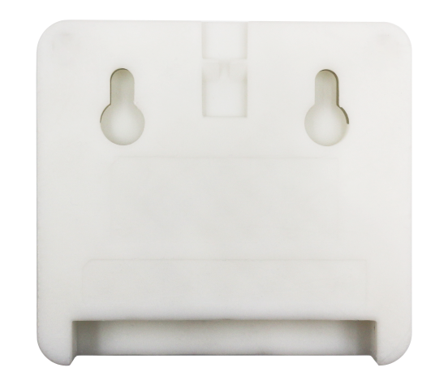
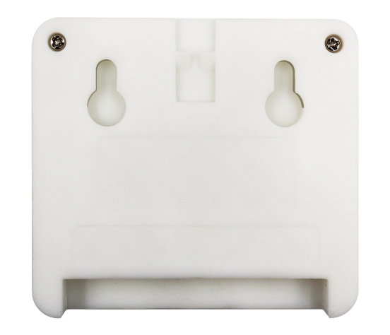
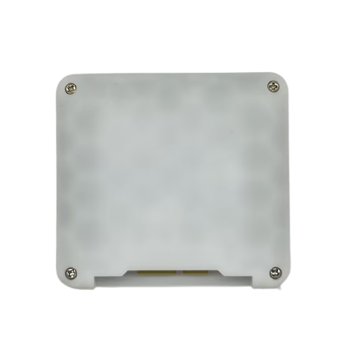

# ESP32-S3-BOX Disassembly Tutorial

The case of the BOX series products have three different versions. Please match the corresponding disassembly tutorial according to the appearance of your product.

| Version |        Tutorial         |Note|
| :-----: | :---------------------: |:---------------------: |
| ESP32-S3-BOX V1         | [Disassembly Tutorial for ESP32-S3-BOX V1](hardware_overview/esp32_s3_box/disassembly_tutorial_v1.md) | Not available |
| ESP32-S3-BOX V2     | [Disassembly Tutorial for ESP32-S3-BOX V2](hardware_overview/esp32_s3_box/disassembly_tutorial_v2.md) |Not available|
| ESP32-S3-BOX-Lite     | Please refer to ESP32-S3-BOX V2 as they are similar in structure.|On sale now|
| ESP32-S3-BOX-3     |[Disassembly Tutorial for ESP32-S3-BOX-3](hardware_overview/esp32_s3_box_3/disassembly_tutorial_3.md)|On sale now|
