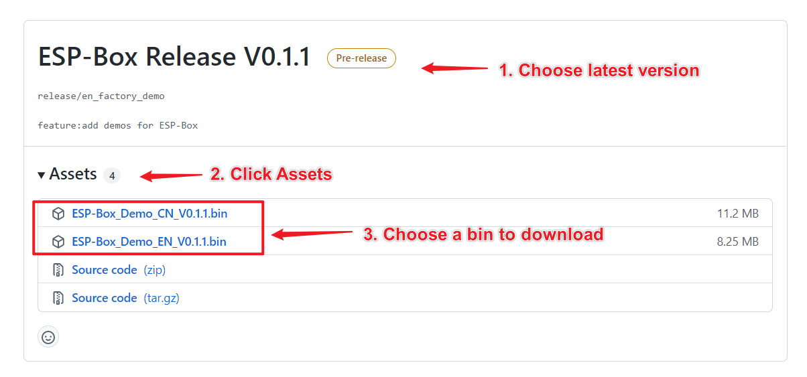
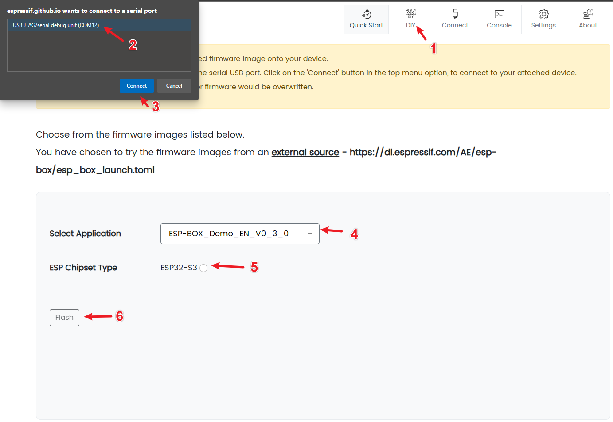
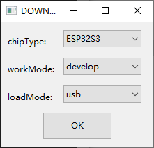
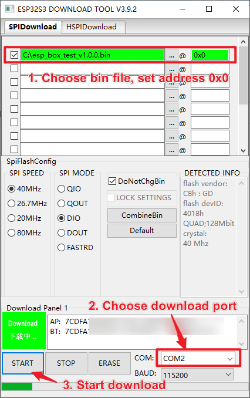
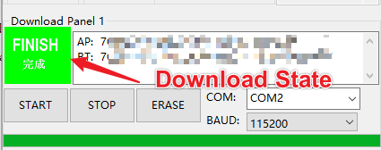
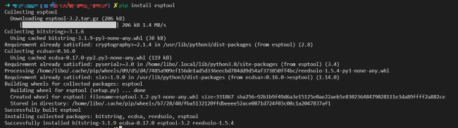
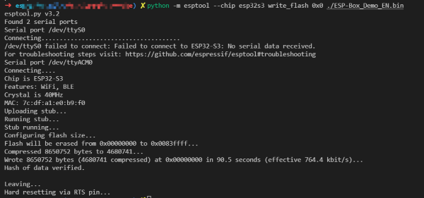
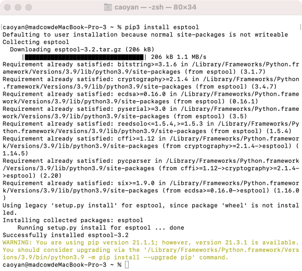
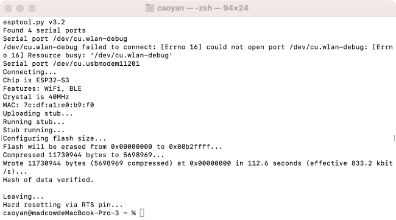

* [中文版本](./firmware_update_cn.md)

# Updating Firmware

**Warning:**
> The firmware released in the latest Tag branch ([Version v0.5.0](https://github.com/espressif/esp-box/releases)) is only applicable to ESP32-S3-BOX and ESP32-S3-BOX-Lite. For users who have purchased ESP32-S3-BOX-3, we will release firmware updates during the project's progression. We suggest that users update the firmware via Espressif's online firmware flashing tool **[ESP Launchpad](https://espressif.github.io/esp-launchpad/?flashConfigURL=https://espressif.github.io/esp-box/launchpad.toml)**.

The BOX series development boards support updating firmware through USB. To update firmware, you only need:

1. A USB Type-C cable
2. Latest firmware (bin file)

**Important Note:**
> If the downloading through USB fails, please hold down the `Boot` button and then press the `Reset` button to initiate Firmware Download mode manually.

## Downloading Latest Firmware

For the latest firmware, please go to https://github.com/espressif/esp-box/releases.

1. Choose the latest release version.
2. Click `Assets` to show more files.
3. Choose an `xxxxxx.bin` and download it.

<div align="center">

</div>

## Updating Firmware

Please follow the link below corresponding to your OS to update the firmware.

| [<center> ESP Launchpad </center>](https://espressif.github.io/esp-launchpad/?flashConfigURL=https://espressif.github.io/esp-box/launchpad.toml) | [<center> Windows </center>](#Updating-Firmware-for-Windows) | [<center> Linux </center>](#Updating-Firmware-for-Linux) | [<center> macOS </center>](#Updating-Firmware-for-macOS) |
|:----:|:----:|:----:|:----:|
| | [](#Updating-Firmware-for-Windows) | [](#Updating-Firmware-for-Linux) | [](#Updating-Firmware-for-macOS) |

### Updating Firmware with ESP-Launchpad (Recommended)

ESP Launchpad is a web based tool, available for flashing firmware application to the ESP32 device connected via USB serial port. You can just click [here](https://espressif.github.io/esp-launchpad/?flashConfigURL=https://espressif.github.io/esp-box/launchpad.toml) to start.

1. Connect your development board to the computer through a USB Type-C cable.
2. `Connect` the device follow indicated steps in the figure below.
3. Choose a bin from `Select Application` and click `Flash` to update.

   <div align="center">
   
   </div>

### Updating Firmware for Windows

We recommend using `Windows 10` and above. Under `Windows 10` system, the driver of `USB-Serial-Jtag` will be downloaded automatically. If you use `Windows 7`, please download and install [USB-Serial-JTAG drive](https://dl.espressif.com/dl/idf-driver/idf-driver-esp32-usb-jtag-2021-07-15.zip) manually.

1. [Download the latest firmware](#latest-firmware-download).
2. Connect your development board to the computer through a USB Type-C cable.
3. Please make sure the computer is connected to the Internet first. When the driver is installed, you can find two new devices appear on the `Device Manager` list, `COMX` (`COM2` for example) and `USB JTAG/serial debug unit`. The first one is used to download firmware or output program logs, and the second one is used for JTAG debugging.

   <div align="center">
   
   </div>

4. Download [Windows download tool](https://www.espressif.com/en/support/download/other-tools?keys=&field_type_tid%5B%5D=842), Flash Download Tools, and unzip it to any folder. Then double-click to run the executable file `flash_download_tool_x.x.x.exe`.
5. Please set `chipType` to `ESP32S3`, `workMode` to `develop`, `loadMode` to `usb`. Then, click `OK` to enter the download tool configuration interface.

   <div align="center">
   
   </div>

6. Follow the instructions below to configure the downloaded tool:
   1. Choose the path of firmware `xxxx.bin`, and set the download address to `0x0`.
   2. Select the COMX port (`COM2` for example) for your PC.
   3. Click `START` to start the downloading.

   <div align="center">
   
   </div>

7. After the firmware is downloaded, `FINISH` will appear on the tool. Next, **please press the `Reset` button to run the new firmware!**

   <div align="center">
   
   </div>

### Updating Firmware for Linux

1. [Download the latest firmware](#latest-firmware-download).
2. Connect your development board to the computer through a USB Type-C cable. There is no need to install the driver of `USB-Serial-Jtag` under Linux system.
3. Install `esptool` by entering the following command in `Terminal` (`pip` can be specified as `pip3`):

    ```
    pip install esptool
    ```

   <div align="center">
   
   </div>

4. Follow the below instruction to download the firmware (`pip` can be specified as `pip3`):

    ```
    python -m esptool --chip esp32s3 write_flash 0x0 download_path/test_bin.bin
    ```

   1. `0x0` is the fixed flash address.
   2. `download_path/test_bin.bin` should be replaced with your firmware path and name.

5. After the firmware is updated, the download tool will prompt `Hash of data verified`. Next, **please press the `Reset` button to run the new firmware!**

   <div align="center">
   
   </div>

### Updating Firmware for macOS

1. [Download the latest firmware](#latest-firmware-download).
2. Connect your development board to the computer through a USB Type-C cable. There is no need to install the driver of `USB-Serial-Jtag` under macOS.
3. Install `esptool` by entering the following command in `Terminal` (`pip3` can be specified as `pip`):

    ```
    pip3 install esptool
    ```

    <div align="center">
    
    </div>

4. Follow the below instruction to download the firmware (`pip3` can be specified as `pip`):

   ```
   python3 -m esptool --chip esp32s3 write_flash 0x0 download_path/test_bin.bin
   ```

   1. `0x0` is the fixed flash address.
   2. `download_path/test_bin.bin` should be replaced with your firmware path and name.

5. After the firmware is updated, the download tool will prompt `Hash of data verified`. Next, **please press the `Reset` button to run the new firmware!**

   <div align="center">
   
   </div>