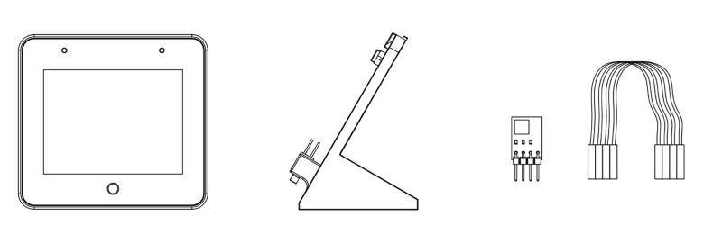
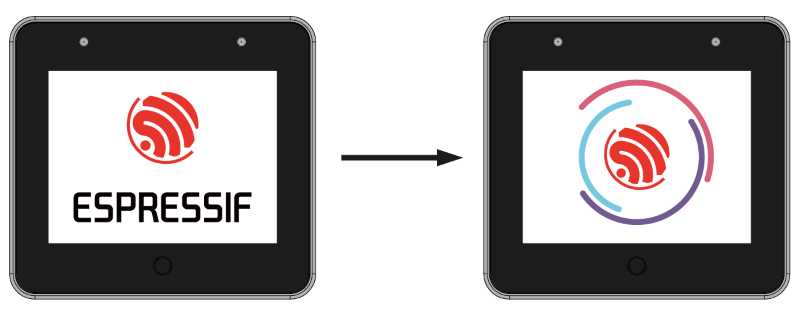
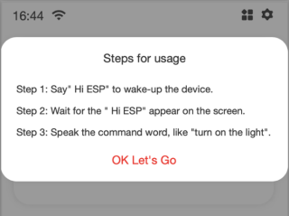
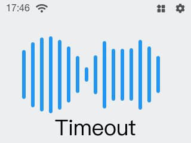
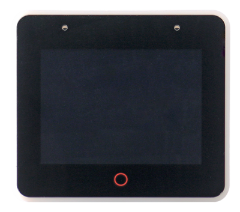
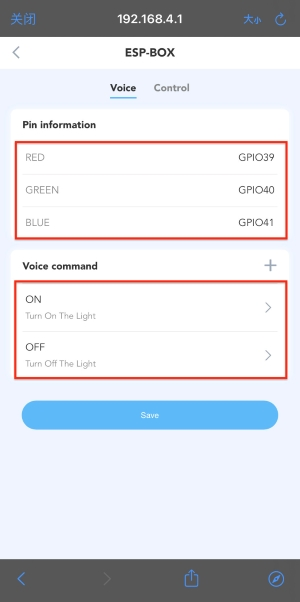
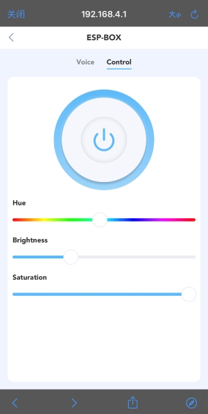
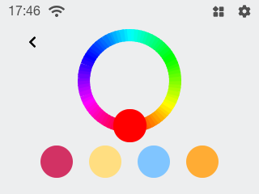

* [中文版本](./getting_started_cn.md)

# Getting Started

The ESP32-S3-BOX provides a platform for developing the control of home appliances using Voice Assistance + touch screen controller, sensor, infrared controller, and intelligent Wi-Fi gateway. The ESP32-S3-BOX comes with pre-built firmware that allows you to experience voice wake-up and offline speech commands recognition in Chinese and English languages, with the SDKs and examples provided by Espressif, you will be able to develop a wide variety of AIoT applications based on the ESP32-S3-BOX such as online and offline voice assistants, voice-enabled devices, HMI touch-screen devices, control panels, multi-protocol gateways easily. 

The ESP32-S3-BOX SDK also includes a reconfigurable AI voice interaction that allows you to customize commands to control your smart home appliances. The content of this material is to give you a brief concept of how the ESP32-S3-BOX works, a basic idea for you to know where to begin. Once you go through the guide below, you may start developing the application yourself. So, let’s begin the journey!

**What is in the ESP32-S3-BOX Kit:**

1. ESP32-S3-BOX main unit
2. Dock (Stand for ESP32-S3-BOX)
3. RGB LED Module & Dupont wires for testing

**What do you need:**

1. Type-C Cable (not included in the BOX Kit)

## Connect the RGB LED Module to the BOX

1. Refer to the pin definition below, insert the RGB LED Module to the BOX.
2. The RGB LED Module has four male pins: R, G, B, GND connect to the G39, G40, G41, GND female port of the PMOD 1.
3. Only one unit of RGB Module is provided in the kit.

## Power on the ESP32-S3-BOX

1. Use a Type-C cable (not included in the ESP32-S3-BOX kit) to power on the ESP32-S3-BOX.

2. Once power on, the interactive Espressif logo will display on the screen.

## Let’s play around with the ESP32-S3-BOX!

1. Initially, the “Steps for usage” pop-up window gives you a hint of how to use the AI Voice Assistance. 

   

   
   

2. Follow the “Steps for usage” or press the “OK Let’s Go” to skip this and return to the Home Screen.

   

   
   

3. Now, say the wake word **“Hi E. S. P.” (pronounce in alphabet)** to activate your ESP32-S3-BOX. If the board wakes up, its screen below will display the wake word you just spoke. If the wake word is not displayed, try the wake word more times.  The animation below gives you a hint that your device is listening.

   

   
   

4. Please voice out one command phrase within 6 seconds each time and say your command such as “**Turn on the light**”, the command phrase will display on the screen, and the RGB light of the LED Module will be turned on. Around 1s, the voice user interface jumps back to the Home Screen.

   

   
   

5. The default command words are: "**Turn on the light**", "**Turn off the light**", "**Turn Red**", "**Turn Green**", "**Turn Blue**", "**Turn White**".

   

   
   

   >**Tips:**
   >* Check the connection of the RGB Module if the LED is not turned on. The pin of the RGB Module may be inserted into the wrong port of the BOX.
   >* If received no command within the specified time, the voice user interface will show “Timeout” and jump back to the Home Screen.

6. Press the Mute button on the top of the ESP32-S3-BOX to disable the voice wake-up and speech recognition function. Press again to restore the function.

   

   
   

7. You can press the “Red Circle” on the device and return to the Home Screen.

   

   
   

## Voice Assistance Control and Customization

The ESP32-S3-BOX is equipped with the Espressif proprietary AI Voice Recognition system, you can customize the command phrases used to give the instructions. (For the details of how the algorithm works, please refer to our Developer Guide on GitHub for an inside peek.)

**Let’s begin to learn about the Voice Command Customization:**

**1. First, connect to the ESP32-S3-BOX Wi-Fi simply using your phone**

1.1. Click on the “Wi-Fi” logo from the Home Screen that appears at the upper left corner.

   

   
   

1.2. You will see a QR Code (as below) once you press the Wi-Fi logo.

   

   
   

1.3. Simply turn on the QR code scanner APP on your phone or your phone’s Camera to do network provisioning. For iPhone users, you have to turn on your Camera.

   

   
   

If code scanning fails, please turn on the WLAN manually, find the "ESP-Box" wireless network, and enter the password "password".

**2. Visit Web Control Interface “192.168.4.1”**

Scan another QR code again, and it will redirect you to the web control interface. Alternatively, you can turn on the mobile phone browser, enter the IP address “192.168.4.1”.

   

   
   

   

   
   

> Tips For Android phones: We recommend you to turn off the mobile network and use the IP address via Chrome, Safari, or Firefox browsers to visit the webpage if scanning the QR code fails to load the webpage

**3. Voice Command Customization**

   1. You can simply turn on & turn off the light from this user interface；

   

   
   

   2. Press on the “light” icon and navigate to the Voice Command Device Control page to check the current default pin information and command word；

   

   
   

   3. The "Control” allows you to make the necessary changes to the light, including color, brightness and saturation。

   

   
   

   4. The Voice page allows you to define the preferred command phrase to control the on/off status and color of the light. For example, you can customize “Good morning” for action ON (as marked with “1” in the figure below). Click Save to return to the previous interface (as marked with “2” in the figure below). Then click Save again (as marked with “3” in the figure below).

   

   
   

   5. Now, you can try out your new command! First, say **“Hi E. S. P.”** to wake-up your device. Then say **“Good morning”** to turn on your light within 6 seconds. The new command phrase will display on the screen and the LED module will be turned on as below.。

   

   
   

   >**How to add appropriate command phrases:**
   Now AI model supports users to customize command phrases. In order to obtain the best recognition experience, you need to pay attention to the following matters when defining command phrase:
   >* Length of command word
   The number of words in the command phrase must be greater than or equal to 2 and less than or equal to 8.
   When defining a series of command phrases, it is best to keep the length of different command phrases similar.
   >* Avoid prefixes
   Multiple command phrase should not be prefixed with each other. Short words will be not recognized, such as “Turn on” and “Turn on the light", “Turn on" will be not recognized.

## ESP32-S3-BOX Graphical User Interface

1. Tap on the “function” logo from the Home Screen that appears at the upper right corner and navigate to the User Interface.

   

   
   

2. Tap on the “Light” icon will allow you to turn on and turn off the light.

   

   
   

3. Long press the “Light” icon to navigate to the Light Tuning Interface, which allows changing the color display. Long press the Light Tuning Circle again to adjust the light saturation and brightness, respectively.

   

   
   

4. The built-in function above is pre-programmed to give you a brief idea of how this ESP32-S3-BOX can be used in your project. 

5. The other three icons (Media, Fan, Security) are added for illustration purposes, and you may start writing your exciting application program! Begin your IoT Journey!

## ESP-BOX BBS

Visit the BBS [esp32.com](https://esp32.com/viewforum.php?f=44) to question us or contact us at sales@espressif.com, and we will reply to you as soon as possible.
