

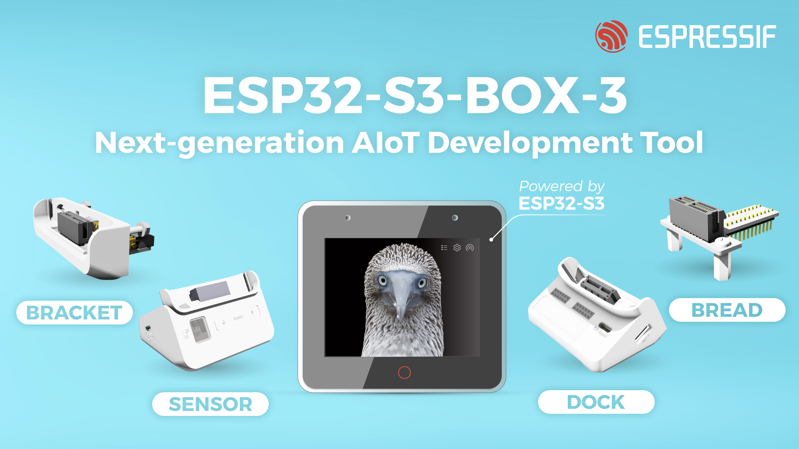

* [中文版本](./getting_started_cn.md)

The guide is applicable to ESP32-S3-BOX-3 only. For the user guide to the ESP32-S3-BOX and ESP32-S3-BOX-Lite built-in firmware, please refer to the [latest release Tag branch](https://github.com/espressif/esp-box/blob/v0.5.0/docs/getting_started.md).

# Overview

In a world where innovation combines with artistry, where sharing and collaboration are paramount, we introduce the ESP32-S3-BOX-3, a fully open-source AIoT development kit based on the powerful ESP32-S3 SoC. This next-generation tool brings a positive change to traditional development boards, it features a compact and beautiful enclosure also provides rich assemblies, empowering developers to easily customize and expand its functionality with Espressif trusted software solutions such as ESP-BOX, ESP-SR, ESP-Rainmaker and ESP-Matter. Whether you're prototyping a new project or building a complex IoT system, the ESP32-S3-BOX-3 strikes the perfect balance of form and function, propelling the future of development board ecology.

The ESP32-S3-BOX-3 comes with pre-built firmware supporting offline voice wake-up and speech recognition in both Chinese and English. The ESP-BOX mobile APP facilitates reconfigurable AI voice interaction, enabling you to create personalized commands for controlling smart devices. Furthermore, the firmware showcases various sensor demos and enables users to perform IR learning, transforming the box into a controller for in-house air conditioners.

This guide provides a comprehensive overview of the built-in firmware's capabilities to get you started on your journey. As you read through, you'll gain valuable experience on developing your applications independently. Let's embark on this exciting adventure together!

# Target Group
The target group for this product includes individuals and organizations engaged in making, prototyping, and development activities. It is designed to cater to a wide range of users, such as hobbyists, makers, engineers, educators, and professionals seeking versatile and expandable solutions for their projects.

# Target Application
* Smart Home
* Smart Agriculture
* Smart City
* Energy Management
* IoT Prototyping and Education
* Industrial Internet of Things
* Smart Retail

# Getting Started

## Contents of the Kit
### ESP32-S3-BOX-3 Kit

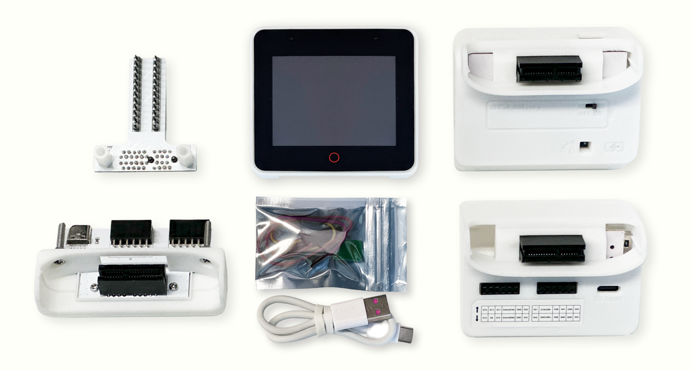

- ESP32-S3-BOX-3, a main unit that can work on its own
- ESP32-S3-BOX-3-DOCK, a functional accessory serving as a stand for the main box
- ESP32-S3-BOX-3-SENSOR, a functional accessory showcasing sensor applications
- ESP32-S3-BOX-3-BRACKET, an adapter accessory for mounting the main box to other devices
- ESP32-S3-BOX-3-BREAD, an adapter accessory facilitating easy connection of the main box to a standard breadboard
- A USB-C Power Cable
- An RGB LED module and Dupont wires for testing

### ESP32-S3-BOX-3B Kit

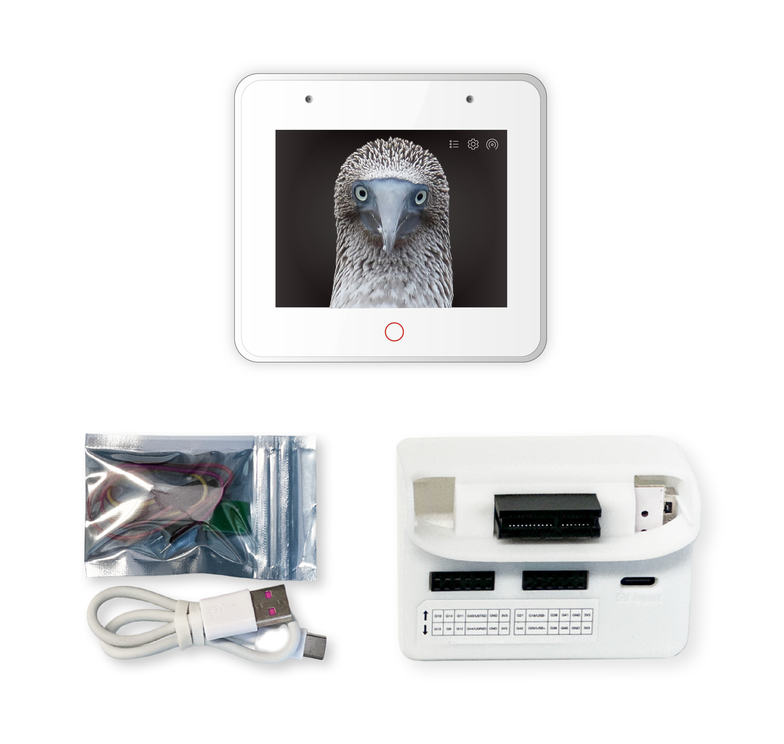

- ESP32-S3-BOX-3, a main unit that can work on its own
- ESP32-S3-BOX-3-DOCK, a functional accessory serving as a stand for the main box
- A USB-C Power Cable
- An RGB LED module and Dupont wires for testing

## Variant Description
The ESP32-S3-BOX-3 offers two different versions: ESP32-S3-BOX-3 and ESP32-S3-BOX-3B. The ESP32-S3-BOX-3 represents the standard edition with four blue accessories, the ESP32-S3-BOX-3B provides fewer accessories to meet starters who don’t need much unnecessary hardware. Here are the distinctions between the two versions:

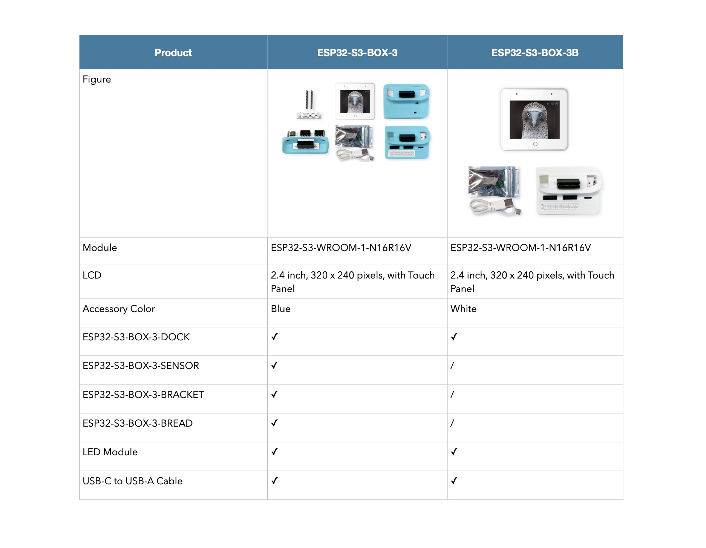

## Power on Your Device
1. Power on your device using the USB-C cable.

2. Once the device is powered on, the screen will play the Espressif logo boot animation.

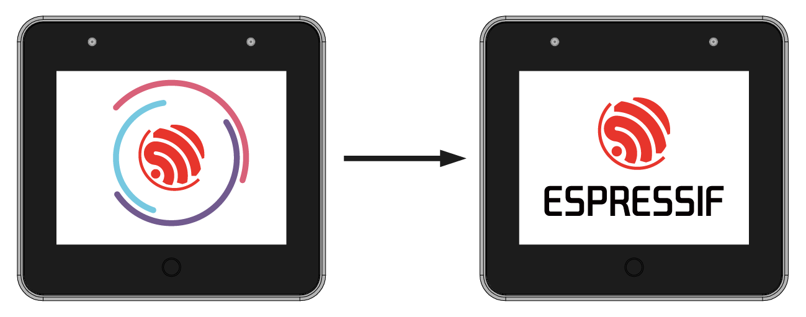

## Let's Play Around!

1. The initial two pages of the quick guide provide an overview of the functions of the buttons on your BOX. Press the `Next` button to proceed to the subsequent page.

<table border="0" align="center">
<tr>
  <td>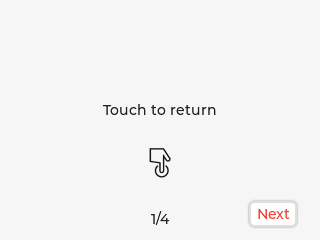</td>
  <td>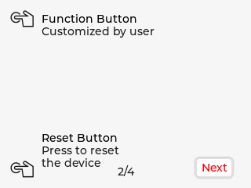</td>
</tr>
</table>

2. The subsequent pages of the quick guide introduce how to use AI voice control. Tap `OK Let’s Go` to access the menu.

<table border="0" align="center">
<tr>
  <td>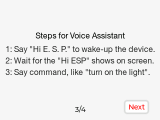</td>
  <td>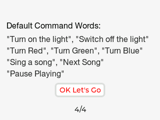</td>
</tr>
</table>

3. The menu consists of six options: `Sensor Monitor`, `Device Control`, `Network`, `Media Player`, `Help`, and `About Us`. You can move between these options by swiping left or right. For instance, you can access the `Device Control` screen, tap on `Light` to toggle the light on or off. Afterward, you can return to the menu, enter the `Media Player` screen, and either play music or adjust the system volume.

<table border="0" align="center">
<tr>
<td>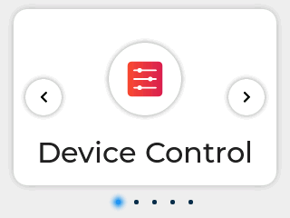</td>
<td>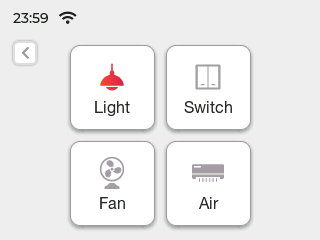</td>
</tr>
<tr>
<td></td>
<td>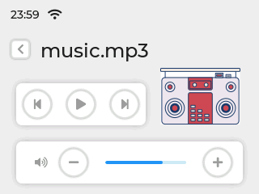</td>
</tr>
</table>

4. Press the mute button on the top of the device to disable voice wake-up and speech recognition. Press it again to enable them.
   

   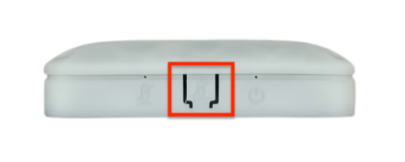
   

5. Tap the red circle located below the screen to go back to the previous page. This red circle serves as a customizable touch region, allowing users to customize extra touch capabilities according to their preferences.
   

   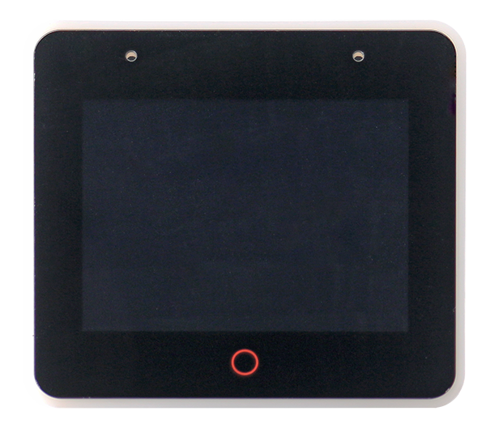
   

## Sensor Monitor
 This feature needs ESP32-S3-BOX-3 is mounted to the ESP32-S3-BOX-3-SENSOR dock. ESP32-S3-BOX-3-SENSOR is a versatile accessory, which integrates a Temp&Hum Sensor, a pair of IR Emitter and Receiver, and a Radar Sensor. It empowers user to create sensor network and other sensor applications with ease. The built-in firmware provides a real-time environment Temp&Hum display, a demonstration of human presence monitoring through a 2.4 GHz radar. Additionally, it offers an IR learning interface, allowing users to use the ESP-BOX for IR learning of their air conditioning controller, thereby enabling control over the air conditioner. This learning capability also extends to other in-house IR controllers, such as Fan, TV, projector, providing a truly engaging experience.

<table border="0" align="center">
<tr>
<td>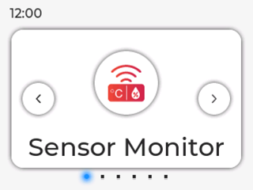</td>
<td>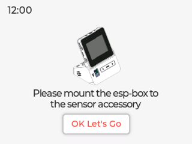</td>
</tr>
</table>

### Radar Monitoring
Enter the `Sensor Monitor` screen and tap `ON/OFF` button to enable/ disable radar monitoring feature. When the radar enables switch is set to `ON`, a red body icon will be shown if a person is detected in front of the device, and the icon will turn gray if no person is detected within 2 minutes.

<table border="0" align="center">
<tr>
<td>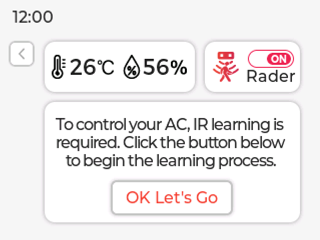</td>
<td>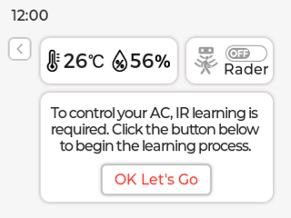</td>
</tr>
</table>

### IR Learning
Below the temperature and humidity data and radar functions is the infrared learning module. Currently, this module can only learn the `ON/OFF` function of a remote controller. Please follow the interface instructions to iteratively learn the `ON/OFF` command of your remote controller a total of **four** times. The interface upon successful learning will appear as follows:
<table border="0" align="center">
<tr>
<td>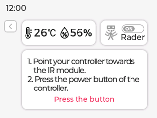</td>
<td>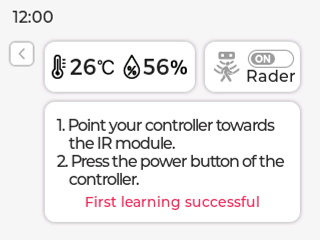</td>
</tr>
<tr>
<td></td>
<td>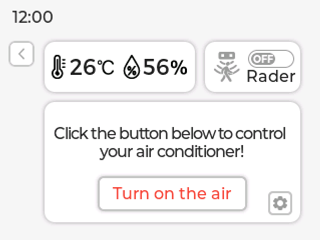</td>
</tr>
</table>

Perform an `ON/OFF` test on your air conditioner by pointing the ESP32-S3-BOX-3-SENSOR towards it. If you find that the logic of the air conditioner's `ON/OFF` function is opposite to your expectations, please click the `Reversal` button below to correct it. Of course, you can also click on `Relearn` to learn other remote controllers.

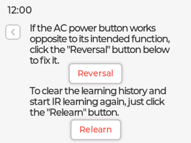

 >**Tips:**
   >* Please be aware that when the ESP32-S3-BOX-3 is not mounted to the ESP32-S3-BOX-3-SENSOR dock, the entire `Sensor Monitor` function will not be operational.
   >* During the period of experiencing the built-in firmware with ESP32-S3-BOX-3-DOCK, **avoid hot-plugging** ESP32-S3-BOX-3-DOCK and switching to ESP32-S3-BOX-3-SENSOR. This action could result in ESP32-S3-BOX-3-SENSOR **not being recognized and functioning properly**. To resolve this, simply power again ESP32-S3-BOX-3-SENSOR to restore normal operation.
   >* Due to the power limitations of the infrared emitter and differences among air conditioner brands, the effective control range for the **IR learning** feature has been tested to be between **1 to 1.5 meters**.

## Offline Voice Assistant

Firstly, connect the RGB LED module to your device. Refer to the pin definitions in the table below, and use Dupont wires to connect the R, G, B, and GND pins of the RGB LED module to the female header connector on the Pmod™ interface of the ESP32-S3-BOX-3-DOCK.

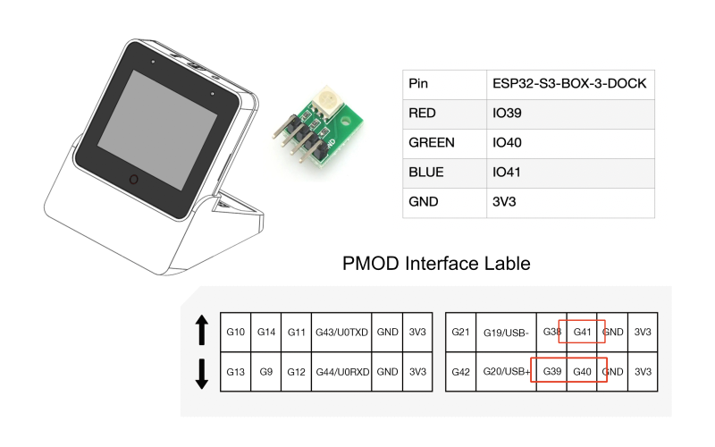

1. You may say `"Hi E. S. P." (pronounce in alphabet)` at any screen to wake up your device. When it wakes up, the screen will display the wake word you just used. If the wake word isn't displayed, give it another try. The screen below indicates your device is listening.

2. Utter a command within 6 seconds after the beep, such as `"Turn on the light"`. You will see the command shown on the screen and the LED light on the module turned on, and you will hear an `"OK"`. If no more commands follow in around 6 seconds, you'll exit the voice control screen.

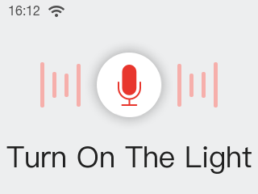

3. You can use voice commands to enjoy music. First, wake up the device, then say `"Sing a song"`. This will launch the music player and start playing built-in music. You can also use voice commands to pause or skip songs. There are two built-in songs.

   >**Tips:**

   >* If the LED light fails to turn on, check whether the module pins are inserted into the right ports.
   >* If the BOX doesn't recognize any command within the designated timeframe, a `Timeout` message will appear, and the screen will exit in approximately 1 second.

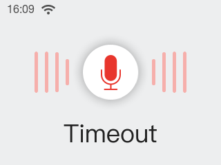

4. The default commands are: **turn on the light**, **turn off the light**, **turn red**, **turn green**, **turn blue**, **sing a song**, **next song**, **pause playing**.

## Continuous Speech Recognition

More interestingly, the device supports continuous speech recognition after waking up. This feature adds a natural and seamless quality to voice interaction, enhancing the interactive experience with a human touch.

**How to use**

- Say `"Hi, E. S. P"` to wake up the device, and you will hear a beep.
- Speak your command. Upon successful recognition, you will hear `"OK"`, and the device will remain ready for further commands.
- If no command is identified, the device will wait. Should no commands be given within 6 seconds, the device will autonomously exit the voice control screen and you need to wake it up again.

**Attention**

- If your commands are repeatedly unrecognized by the device, allow it to time out and then wake it up again before utilizing the feature.
- Upon saying the wake-up word, please do not move the device, as this could impact command recognition.
- We recommend that voice commands comprise 3-5 words for optimal results.
- Currently, the device cannot recognize commands while it's playing beep.

## Voice Command Customization

The ESP32-S3-BOX-3 is also equipped with Espressif proprietary AI Speech Recognition System, which allows you to customize commands through our ESP BOX APP. We will take the LED light on the module as an example, to show how to create your own voice commands. For a deeper understanding of the algorithms involved, please refer to the introduction of the ESP-SR speech model in the [Technical Architecture](technical_architecture.md).

**1. Connect to the ESP BOX mobile app**

1.1. Enter `Network`, and tap `To install APP` at the upper right corner. Scan the QR Code or search "ESP BOX" in App Store or Google Play to install the app.

   

   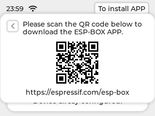
   

   

   
   

1.2. If you are new to this app, please register an account first.

1.3. Sign in with your ESP BOX account and turn on the Bluetooth on your phone. Tap `+` at the bottom of the screen, and scan the QR code on your device to set up the network.

<table border="0" align="center">
<tr>
  <td>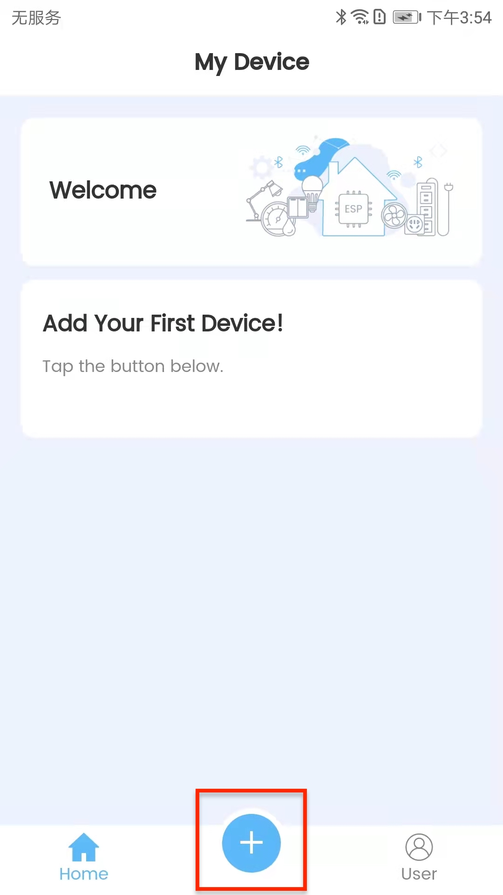</td>
  <td>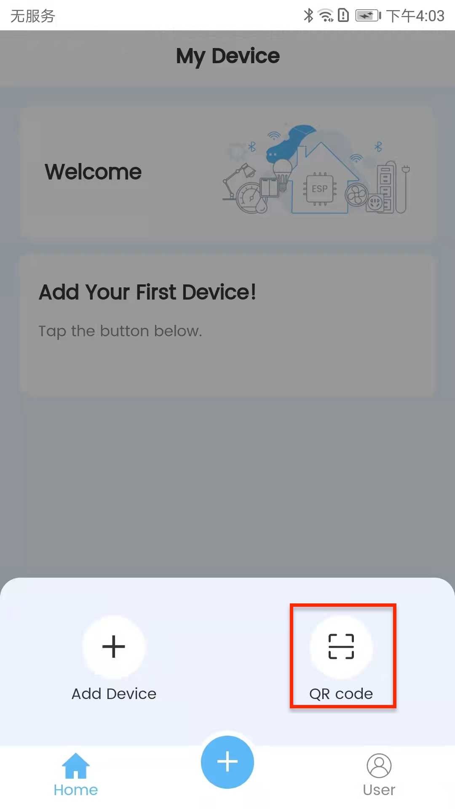</td>
</tr>
</table>

1.4 After adding the device, you will see the following prompts:

<table border="0" align="center">
<tr>
  <td>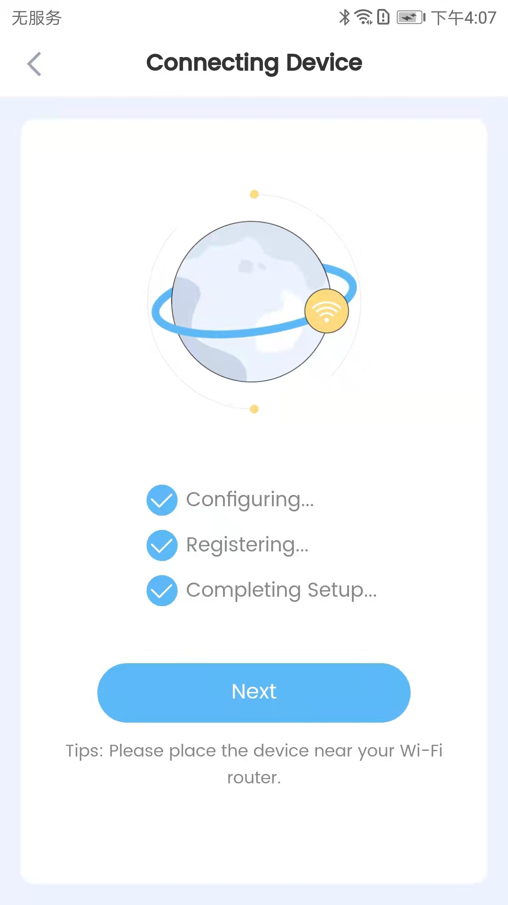</td>
  <td>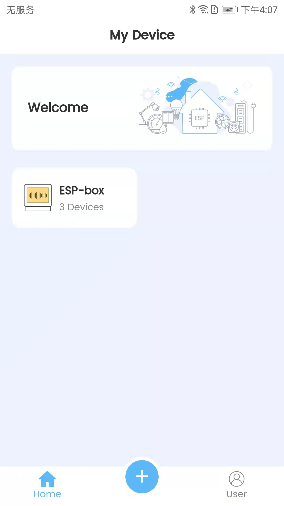</td>
</tr>
</table>

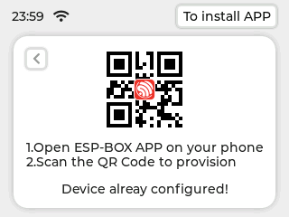

>**Tips:**

   >* Please do not exit the QR code page during the network provisioning.
   >* Make sure you connect the device to 2.4 GHz Wi-Fi instead of 5 GHz, and enter the correct Wi-Fi password. If the Wi-Fi password is incorrect, the prompt "Wi-Fi Authentication failed" will pop up.
   >* Long press the `Boot` button (i.e. `Funtion` button) for 5 seconds to clear the network information and restore the device to factory settings. After the device is reset, if the QR code or Bluetooth is not working, please restart your device by pressing the `Reset` button.

   

   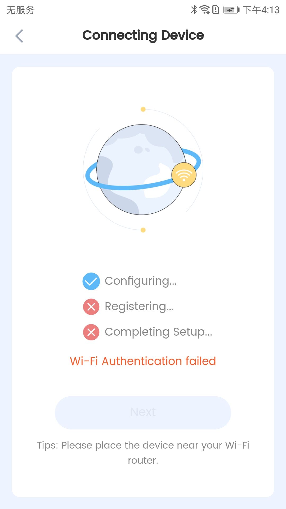
   

   **2. Customize Voice Commands**

2.1. Select the ESP-BOX device icon and access the screen displayed below. You can conveniently turn the light on or off by simply toggling the button, as indicated in the image. You may need to develop the Fan and Switch functionalities by yourself.

<table border="0" align="center">
<tr>
  <td>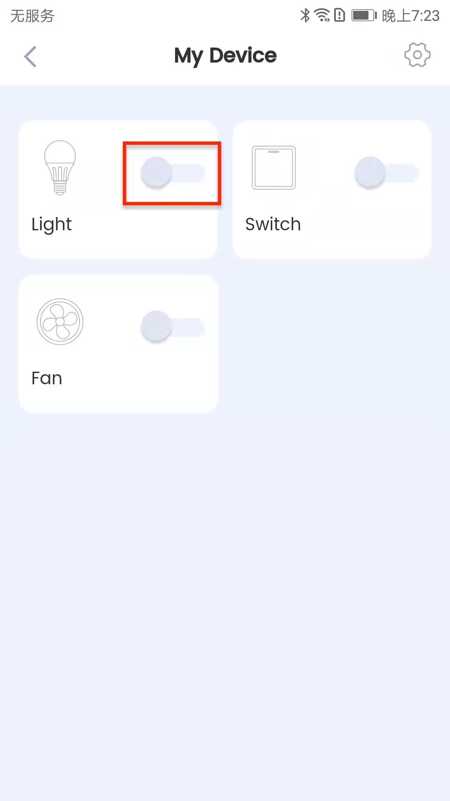</td>
  <td></td>
</tr>
</table>

2.2 Tap `Light`, and the `Configure` tab shows the default pin information and commands. The pins for Red, Green, and Blue can be changed as needed.

<table border="0" align="center">
<tr>
  <td></td>
  <td>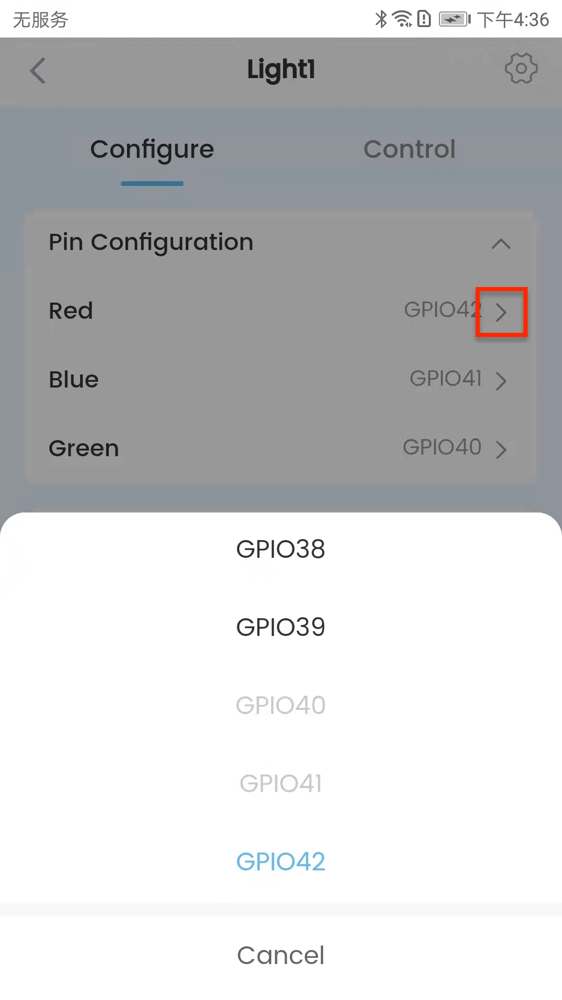</td>
</tr>
</table>

2.3 In the `Configure` tab, you may also customize commands to turn on or off the light and change its color. For example, you can set "Good Morning" as the command to turn on the light. Click `Save` to return to the previous screen. Then click `Save` again as shown below.

<table border="0" align="center">
<tr>
  <td></td>
  <td></td>
</tr>
</table>

2.4 In the `Control` tab, you may adjust the color, brightness, and saturation of the light.

   

   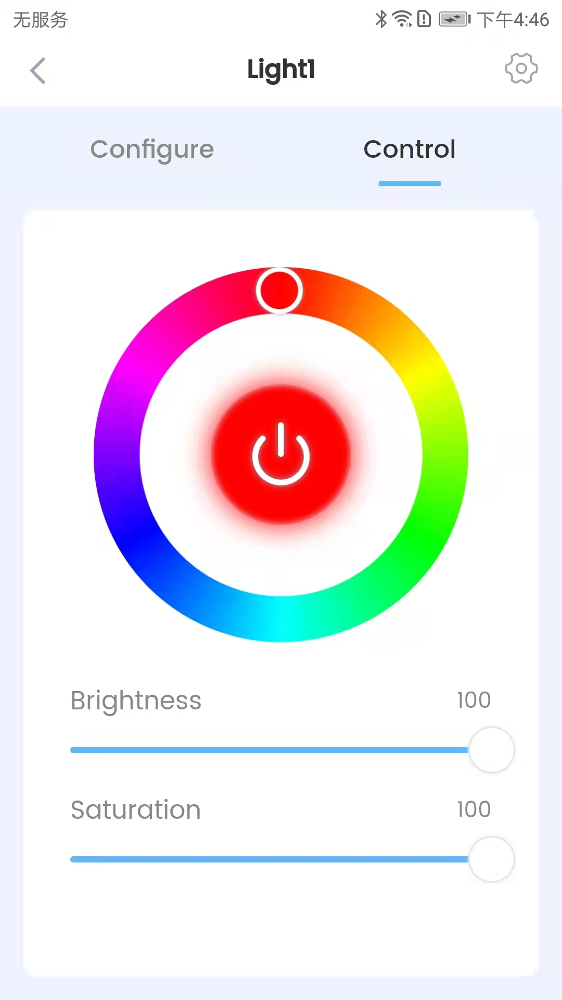
   

2.5 Now, you can try out your new command! First, say `"Hi E. S. P."` to wake up your device. Then say `"Good Morning"` within 6 seconds to turn on the light. The new command will show on the screen with the module light turned on.

   

   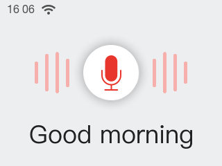
   

>**For effective command performance, kindly consider the following:**
>* Command Length: A command should consists of 2-8 words. While crafting a sequence of commands, it's advisable to maintain a consistent length across them.
>* Avoid Repetition: Please do not include shorter commands within longer ones. For example, if you create both "turn on" and "turn on the light" commands, the shorter "turn on" command won't be identified.

## Switch Voice Model Language

Access the `About Us` details page. In this page, press `Boot` button, the device will enter `factory Mode` voice model language setting page. Here, you can personally select the voice model. After switching the model, the device will reset and restart automatically.

   

   
   

## FCC Regulations

This device complies with part 15 of the FCC Rules. Operation is subject to the following two conditions: (1) This device may not cause harmful interference, and (2) this device must accept any interference received, including interference that may cause undesired operation. This device has been tested and found to comply with the limits for a Class B digital device, pursuant to Part 15 of the FCC Rules. These limits are designed to provide reasonable protection against harmful interference in a residential installation. This equipment generates, uses, and can radiate radio frequency energy and, if not installed and used in accordance with the instructions, may cause harmful interference to radio communications. However, there is no guarantee that interference will not occur in a particular installation. If this equipment does cause harmful interference to radio or television reception, which can be determined by turning the equipment off and on, the user is encouraged to try to correct the interference by one or more of the following measures:

- Reorient or relocate the receiving antenna.
- Increase the separation between the equipment and receiver.
- Connect the equipment to an outlet on a circuit different from that to which the receiver is connected.
- Consult the dealer or an experienced radio/TV technician for help.

**FCC Note Caution:** Changes or modifications not expressly approved by the party responsible for compliance could void the user's authority to operate the equipment.

## RF Exposure Information

This device meets the government’s requirements for exposure to radio waves.

This device is designed and manufactured not to exceed the emission limits for exposure to radio frequency (RF) energy set by the Federal Communications Commission of the U.S. Government.

This device complies with FCC radiation exposure limits set forth for an uncontrolled environment. In order to avoid the possibility of exceeding the FCC radio frequency exposure limits, human proximity to the antenna shall not be less than 20 cm during normal operation.

The guide only gives you a brief idea of how to use the latest firmware on your BOX series of development boards. Now, you may start writing programs, and embark on your IoT journey!
