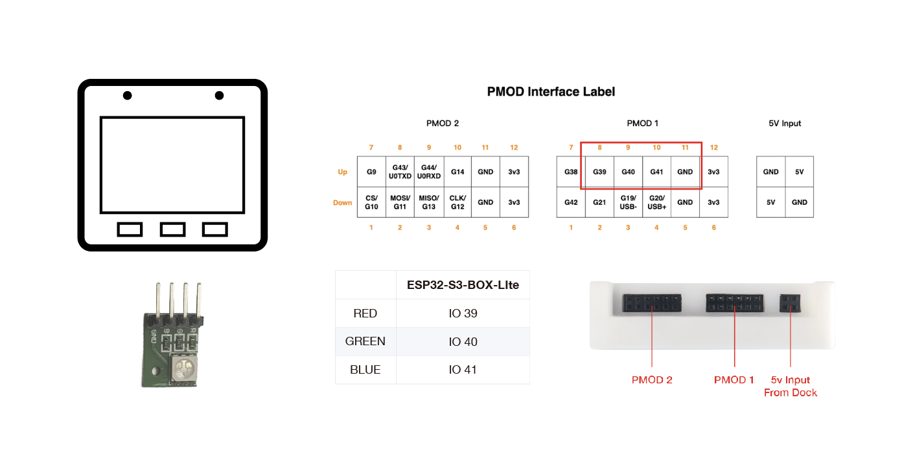
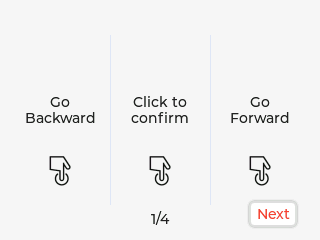
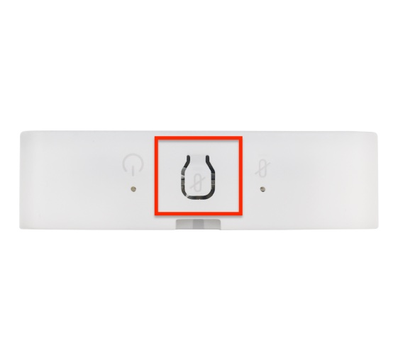
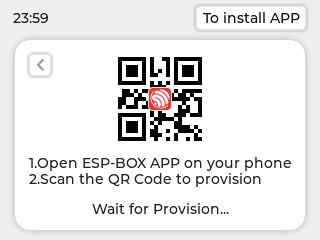
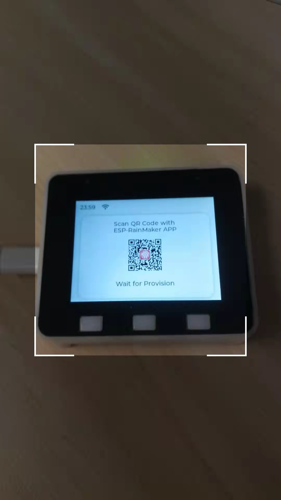

* [中文版本](./getting_started_cn.md)

The guide is suitable for the development boards that flashed the latest firmware, now it supports ESP32-S3-BOX Kit and ESP32-S3-BOX-Lite Kit, hereafter this text will be collectively referred to as BOX series products.

# Getting Started

The BOX series development boards based on ESP32-S3 SoC provides a platform for developing the control of home appliances using Voice Assistance + display with buttons controller, sensor, infrared controller, and intelligent Wi-Fi gateway. The BOX series development boards comes with pre-built firmware that allows you to experience voice wake-up and offline speech commands recognition in Chinese and English languages. 
The ESP-BOX SDK includes a reconfigurable AI voice interaction that allows you to customize commands to control your smart home appliances. The content of this material is to give you a brief concept of how the latest firmware works, a basic idea for you to know where to begin. Once you go through the guide below, you may start developing the application yourself. So, let’s begin the journey! 

**The BOX Kit contains:**

| ESP32-S3-BOX | ESP32-S3-BOX-Lite |
| :-----: | :---------------------: |
| A main unit that can work on its own | A main unit that can work on its own|
| An RGB LED module and Dupont wires for testing   | An RGB LED module and Dupont wires for testing|
| Dock, an accessory that serves as a stand for the device. |  N/A|

**Required Hardware:**

What do you need: An USB-C Cable (not included in the kit).

## Connect the RGB LED Module to your Device

Refer to the pin definition below, insert the RGB LED Module to the BOX. The RGB LED Module has four male pins: R, G, B, GND, which should connect to the G39, G40, G41, GND female port of the PMOD 1.

## Power on your Device
1. Power on your device via an USB-C cable.

2. Once power on, the interactive Espressif logo will display on the screen.   

## Let's Play Around!

1. Initially, the two Guide Pages introduces the functions of buttons of your BOX series development boards. Press Next to enter next page after reading them.

<table border="0" align="center">
<tr>
<td><b>ESP32-S3-BOX </b></td>
<td><b>ESP32-S3-BOX-Lite </b></td>
</tr>
<tr>
<td></td>
<td></td>
</tr>
 <tr>
<td></td>
<td></td>
</tr>
</table>

2. Next, the Steps for Voice Assistant window gives you a hint of how to use the AI voice control. Press "OK Let’s Go" to enter the Menu screen.

<table border="0" align="center">
<tr>
  <td></td>
  <td></td>
</tr>
</table>

3. The Menu screen has five functions, they are Device Control, Media Player, Network, Help and About Us. You can navigate to different sections by switching the pages. For example, enter the Device Control user interface, tap the Light icon to turn on or turn off the LED light. Moreover, go back to the Menu page and go forward to the Media Player section, you can operate buttons to control the music playback or adjust the volume.

<table border="0" align="center">
<tr>
<td></td>
<td></td>
</tr>
<tr>
<td></td>
<td></td>
</tr>
</table>

**The following features are only supported by ESP32-S3-BOX**

4. Press the Mute button on the top of the ESP32-S3-BOX to disable the voice wake-up and speech recognition function. Press again to restore the function.
   

   
   

5. You can press the "Red Circle" on the device and return to the last page.
   

   
   

## Offline Voice Assistant with your Device

1. In any interface, you can say the Chinese wake word "Hi Le Xin", or English wake word "Hi E. S. P." (Pronounce in alphabet) to activate your BOX series development boards. If the board wakes up, its screen will display the wake word you just speak. If the wake word is not displayed, try the wake word more times. The animation interface below gives you a hint that your device is listening. 

2. Utter a command phrase within 6 seconds after the beep, for example "turn on the light".  The command phrase will display on the screen and the RGB light of the LED Module will turn on, and there will be a voice feedback "OK".  Around 6 seconds the voice user interface exits if no more commands.

3. You can use voice commands to enjoy music. Please wake up the device first, then say the command phrase "Sing a song". The music player opens and start playing built-in music. You can also use voice commands to switch to the next song or pause playing (There are two build-in songs).
   
   >**Tips:**
   
   >* If the LED light fails to turn on, check whether the pins of the RGB Module are inserted into the right port of the BOX.
   >* If the BOX receives no command within the specified time, the voice user interface will show "Timeout" and jumps back to last page in about 1 second.
   

4. The default command words are: 

"**Turn on the light**", "**Switch off the light**", "**Turn Red**", "**Turn Green**", "**Turn Blue**", "**Sing a song**", "**Next Song**", "**Pause Playing**".

## Continuous Recognition 

More interestingly, the device supports continuous recognition of multiple command words after wake-up. Continuous recognition means that the user can talk to the device continuously once it is woken up. The continuous recognition makes the voice interaction more natural and smooth, and brings a more humanized interactive experience.

**How to use**

- Say "Hi, E. S. P" to wake up the device, a prompt beep will be played.
- Say a command phrase after the prompt beep. If the device recognizes the command word, it will play the corresponding prompt tone "OK", and then it can continue to recognize.
- If nothing is recognized, the device will continue to wait. If there is no new command word within 6S, the device will automatically exit and you need to wake it up again.

**Attention**

- If it fails to recognize normally for many times, please wait for timeout and wake up the device again to enter the recognition mode.
- After the wake-up word is spoken, the command word shall be sent out at the same position. The device does not support recognition during movement.
- The length of the best English offline command word we recommend is 3-5 English characters.
- The current version does not support continuous recognition when the speaker plays a prompt tone.

## Voice Command Customization

The BOX series development boards are equipped with the Espressif’s proprietary AI Speech Recognition system which allows you to customize command phrases through our ESP BOX APP. We will take the LED module as an example to show how to customize the voice commands.
(For the details of how the algorithm works, please refer to the technical architecture on the Developer Guide for an inside peek.)

**1. Connect to the ESP BOX mobile APP**

1.1. First, please navigate to the Network section, press confirm button, and enter device provisioning interface. You will see a QR Code as below. Before network provisioning, ESP BOX APP need to be installed. Tap on the "To install APP" icon that appears at the upper right corner and navigate to APP download interface. 

   

   
   

1.2. Scan the QR Code below to visit the APP download page, follow the instructions to install the ESP BOX APP. You can also search the "ESP BOX" either in Apple Store or Google Play to install the APP.

   

   
   

   

   
   

1.3. If you first download the APP, please click "User", "Register" to register a new account.

1.4. Sign in with your ESP BOX account and turn on the Bluetooth of your phone. Then tap + on the bottom of the interface, find the code scanning icon and scan the network provisioning QR code on your device.

<table border="0" align="center">
<tr>
  <td></td>
  <td></td>
  <td></td>
</tr>
</table>

1.5 Please follow the instructions to add your device. After adding the device, you will see the following interfaces:

<table border="0" align="center">
<tr>
  <td></td>
  <td></td>
</tr>
</table>

>**Tips:**
   >
   >* Make sure the device is connected to 2.4GHz Wi-Fi channel not 5GHz, if the Wi-Fi password is incorrect, it will lead to Wi-Fi Authentication failed as the figure below shows.
   >* Long press the Boot button for 5 seconds to clean the network information and restore to factory settings.
  * After the device is restored, if the QR code scan fails or the Bluetooth scan fails, please restart your device by pressing the reset button.
   

   
   

   **2. Customize Voice Command**

2.1. Tap the ESP-BOX device and enter to the below interface. You can simply turn on or turn off the light by toggling the button on the user interface, as the figure below shows. (We left the Fan and Switch parts for you to configure and develop by yourself.)

<table border="0" align="center">
<tr>
  <td></td>
  <td></td>
</tr>
</table>

2.2 Press on Light and navigate to the Configure page to check the current default pin information and command phrases. The pin number for RED, GREEN and BLUE can be modified as needed.

<table border="0" align="center">
<tr>
  <td></td>
  <td></td>
</tr>
</table>

2.3 The Control page allows you to adjust the color and brightness of the light, as well as the saturation of the color.

   

   
   

2.4 The Configure page allows you to define the preferred command phrase to control the on/off status and color of the light. For example, you can customize "Good morning" for action ON (as marked with "1" in the figure below). Click Save to return to the previous interface (as marked with "2" in the figure below). Then click Save again (as marked with "3" in the figure below).

<table border="0" align="center">
<tr>
  <td></td>
  <td></td>
</tr>
</table> 

2.5 Now, you can try out your new command! First, say "Hi E. S. P." to wake up your device. Then say "Good morning" to turn on your light within 6 seconds. The new command phrase will display on the screen and the LED module will turn on.

   

   
   

>**How to Add Appropriate Command Phrases: Now AI model supports users to define command phrases. In order to obtain the best recognition experience, you need to pay attention to the following matters when defining command phrase in the APP:**
>
>* Length of command word: The number of words in the command phrase must be greater than or equal to 2 and less than or equal to 8. When defining a series of command phrases, it is best to keep the length of different command phrases similar.
>* Avoid prefixes: Multiple command phrase should not be prefixed with each other. Short words will be not recognized, such as "Turn on" and "Turn on the light", "Turn on" will be not recognized.

The built-in function above gives you a brief idea of how to use the latest firmware on your BOX series products. The other three icons (Switch, Fan, Air) are added for illustration purposes, and you may start writing your exciting application program! Begin your IoT journey!
