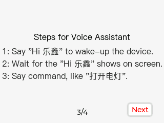
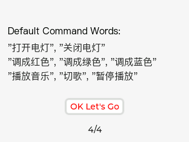
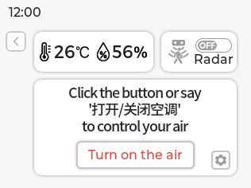
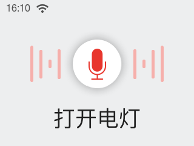
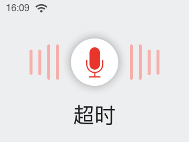

* [English Version](./getting_started.md)

本指南仅适用于 ESP32-S3-BOX-3。对于 ESP32-S3-BOX 和 ESP32-S3-BOX-Lite 的用户指南，请参考最新发布的 [Tag 分支](https://github.com/espressif/esp-box/blob/v0.5.0/docs/getting_started_cn.md)。

# 概览

在一个融合创新与艺术、分享与合作至关重要的世界中，我们隆重推出 ESP32-S3-BOX-3，这是一款全开源的 AIoT 开发套件，基于强大的 ESP32-S3 SoC。这款新一代工具为传统开发板带来了积极的改变，它拥有紧凑美观的外壳，并提供丰富的组件，让开发者可以轻松定制和扩展功能，借助 Espressif 的可靠软件解决方案， 如 ESP-BOX、ESP-SR、ESP-Rainmaker 和 ESP-Matter。无论是原型开发还是构建复杂的物联网系统，ESP32-S3-BOX-3 均能提供完美的外形和功能上的平衡，推动着开发板生态的未来发展。

ESP32-S3-BOX-3 出厂固件支持中文和英文离线语音唤醒和命令词识别。ESP-BOX 手机 APP 支持可重配置的 AI 语音交互，您可以创建个性化的命令词来控制智能设备。此外，固件还展示了多种传感器演示，并允许用户进行红外学习，快速将 BOX 转变为空调遥控器。

本用户指南详细介绍了内置固件的基本功能，帮助您开始新的探索之旅。在学习过程中，您将获得开发应用方案的宝贵经验。让我们一起踏上这激动人心的冒险吧！

# 目标群体
包括从事制作、原型设计和开发活动的个人和组织。它旨在满足广泛的用户群体，如业余爱好者、创客、工程师、教育工作者和寻求多功能扩展解决方案的专业人士，以满足他们项目的需求。

# 目标应用

* 智能家居
* 智慧农业
* 智慧城市
* 能源管理
* 物联网原型开发与教育
* 工业物联网
* 智能零售

# 开始使用
## 套件内容
###  ESP32-S3-BOX-3 套件

- ESP32-S3-BOX-3，独立工作的主模块
- ESP32-S3-BOX-3-DOCK，功能配件，可作为主机的座子
- ESP32-S3-BOX-3-SENSOR，功能配件，展示传感器应用
- ESP32-S3-BOX-3-BRACKET，转接配件，用于将主机安装在其他设备上
- ESP32-S3-BOX-3-BREAD，转接配件，方便主机与标准面包板连接
- 一根 USB-C 数据线
- 一个 RGB LED 模块和杜邦线，用于测试

###  ESP32-S3-BOX-3B 套件

- ESP32-S3-BOX-3，独立工作的主模块
- ESP32-S3-BOX-3-DOCK，功能配件，可作为主机的座子
- 一根 USB-C 数据线
- 一个 RGB LED 模块和杜邦线，用于测试

## 变体说明
ESP32-S3-BOX-3 提供两款不同配置的套件：分别命名为 ESP32-S3-BOX-3 和 ESP32-S3-BOX-3B。ESP32-S3-BOX-3 代表标准版，配备四款蓝色配件，而 ESP32-S3-BOX-3B 代表基础版，仅提供了一款配件，适用于不需要太多不必要硬件的初学者。以下是两个版本之间的区别:

## 给设备供电
1. 使用 USB-C 数据线给设备供电。

2. 设备启动后，屏幕上将显示 Espressif logo 的开机动画。

## 开始体验

1. 请阅读按键引导页，了解 BOX 开发板的按键功能，随后点按 `Next` 进入下一页。

<table border="0" align="center">
<tr>
  <td></td>
  <td></td>
</tr>
</table>

2. 请阅读语音助手使用说明引导页，了解 AI 语音控制功能，随后点按 `OK Let's Go` 进入主页。

<table border="0" align="center">
<tr>
  <td></td>
  <td></td>
</tr>
</table>

3. 主页包含六大功能，分别是 `Sensor Monitor`、`Device Control`、`Network`、`Media Player`、`Help` 以及 `About Us`，左右滑动可在这些选项之间切换。比如，进入 `Device Control` 界面，点按 `Light` 可打开或关闭灯。回到菜单页，再进入 `Media Player` 界面，可播放音乐或调节系统音量。

<table border="0" align="center">
<tr>
<td></td>
<td></td>
</tr>
<tr>
<td></td>
<td></td>
</tr>
</table>

4. 按下设备顶部的静音按钮以关闭语音唤醒和识别功能，再次按下即可恢复语音功能。

   

   
   

5. 轻触屏幕下方的红色圆圈以返回上一页。红圈是一块可自定义的触摸区域，允许用户根据自己的喜好配置额外的触摸功能。

   

   
   

## 传感器监测
此功能需要将 ESP32-S3-BOX-3 安装到 ESP32-S3-BOX-3-SENSOR 底座上。ESP32-S3-BOX-3-SENSOR 是一款多功能配件，集成了温湿度传感器、红外发射和接收器以及雷达传感器。它使用户能够轻松构建传感器网络和其他传感器应用。出厂固件提供实时环境温湿度显示，通过 2.4 GHz 雷达进行人体存在监测。此外，它还提供了红外学习接口，允许用户使用 ESP-BOX 来学习空调遥控器的红外信号，从而实现对空调的控制。这种学习功能还能扩展到其他红外遥控器，如风扇、电视、投影仪，提供别样的互动体验。
<table border="0" align="center">
<tr>
<td></td>
<td></td>
</tr>
</table>

### 雷达监测
进入 `Sensor Monitor`，点击 `ON/OFF`按钮以启用/禁用雷达监测功能。当雷达使能开关设置为`开`时，如果设备前方检测到人体存在，将显示红色人体图标；如果在两分钟内未检测到人体，图标将变为灰色。
<table border="0" align="center">
<tr>
<td></td>
<td></td>
</tr>
</table>

### 红外学习
在温湿度数据和雷达功能的下方是红外学习模块。目前，此模块只提供了学习遥控器的`开/关`功能。请按照界面指示，连续学习您遥控器的`开/关`命令**四次**。成功学习时的界面显示如下：
<table border="0" align="center">
<tr>
<td></td>
<td></td>
</tr>
<tr>
<td></td>
<td></td>
</tr>
</table>

此刻，将 ESP32-S3-BOX-3-SENSOR 对准你的空调来进行开关测试，如您发现空调`开/关`功能逻辑与预期相反，请点按下方的 `Reversal` 按钮进行更正。当然，您也可以点击 `Relearn` 来学习其他遥控器。

>**注意:**
   >* 当 ESP32-S3-BOX-3 未安装到 ESP32-S3-BOX-3-SENSOR 底座上时，整个`Sensor Monitor`功能将无法运行。
   >* 当使用 ESP32-S3-BOX-3-DOCK 体验出厂固件时，请**避免将 ESP32-S3-BOX-3-DOCK 热插拔**切换到 ESP32-S3-BOX-3-SENSOR。这样的操作会导致 ESP32-S3-BOX-3-SENSOR **无法被识别和正常工作**。若遇到这种情况，只需给 ESP32-S3-BOX-3-SENSOR 重新上下电即可恢复正常运行。
   >* 由于红外发射管功率的限制以及空调品牌之间的差异，红外学习功能实际控制距离，经测试在 1～1.5m 之间。

## 离线语音识别
首先，参考下表的管脚定义，将 RGB LED 模块的 R、G、B、GND 四个引脚用杜邦线连接至 ESP32-S3-BOX-3-DOCK PMOD 接口的母头连接器上。

1. 您可以在任意界面使用唤醒词来唤醒设备，唤醒词为`“Hi 乐鑫”`。设备唤醒后，唤醒词将显示在屏幕上并伴有提示音`“我在”`。如果唤醒词未出现，请再次尝试。出现如下界面表示您的设备正在倾听。

2. 请在提示音响起后的 6 秒内对设备说出命令词，比如`“打开电灯”`。您将看到命令词显示在屏幕上，RGB LED 模块的灯亮起，同时听到语音反馈`“好的”`。若无其他命令词，设备将在 6 秒左右退出语音控制界面。

3. 您还可以使用语音命令词欣赏音乐。请先唤醒设备，然后说出命令词`“播放音乐”`，设备将打开音乐播放器并开始播放内置音乐。您也可以用语音命令词切换歌曲或者暂停播放。出厂固件默认自带两首歌曲。

>**注意：**
   >
   >* 如果模块上的 LED 灯没有亮起，请检查模块管脚是否插错。
   >* 若在规定时间内未识别到命令词，则会显示 `超时`，约 1 秒后界面关闭。

4. 默认命令词包括：**打开电灯**，**关闭电灯**，**调成红色**，**调成绿色**，**调成蓝色**，**播放音乐**，**切歌**，**暂停播放**。

## 连续语音识别

更有趣的是，设备支持唤醒后连续识别多个命令词，即用户可以在唤醒设备后与其连续对话。连续语音识别使语音交互自然流畅，带来人性化的对话体验。

**使用方式**

- 使用`“Hi，乐鑫”`唤醒设备，唤醒后设备播放提示音`“我在”`。
- 说出命令词。如设备识别出命令词，则会播放提示音`“好的”`，然后将继续识别其他命令词。
- 如设备未识别命令词则会继续等待，6 秒内没有新命令将自动退出语音控制界面，使用语音识别功能需要再次唤醒设备。

**注意**

- 如设备多次未能识别命令词，请再次唤醒重新识别。
- 说出唤醒词后请勿移动设备，设备不支持在移动中识别命令词。
- 我们推荐使用长度为 3-5 个汉字的命令词。
- 暂不支持播放提示音时识别命令词。

**中文模型额外支持的命令词**

| command ID |    命令词    |
| :--------: | :----------:|
|     0      |   打开空调   |
|     1      |   关闭空调   |
|     2      |   舒适模式   |
|     3      |   制冷模式   |
|     4      |   制热模式   |
|     5      |   加热模式   |
|     6      |   除湿模式   |
|     7      |   送风模式   |
|     8      |   升高温度   |
|     9      |   降低温度   |

>**注意：**
   >
> 上述命令词仅供演示，您可以自行开发接入相关智能设备，用语音识别实现真实的控制效果。

## 语音命令词自定义

ESP32-S3-BOX-3 还配备了乐鑫专有的 AI 语音识别系统，通过我们的 ESP BOX APP，您可以自定义命令词。我们将以模块上的 LED 灯为例，展示如何创建您自己的语音命令词。如需深入了解所涉及的算法，请参考[技术架构](technical_architecture_cn.md)内对 ESP-SR 语音模型的介绍。

**1. 连接 ESP BOX 手机应用程序**

1.1. 进入 `Network` 界面，点按右上角 `To install APP`。扫描二维码下载并安装 ESP BOX 应用程序，或者直接在 App Store 或 Google Play 中搜索 "ESP BOX" 下载应用程序。

   

   
   

   

   
   

1.2. 如您第一次使用此应用程序，请先注册账号。

1.3. 登录您的 ESP BOX 账号并打开手机蓝牙。点按界面下方 `+`，扫描设备上的二维码配置网络。

<table border="0" align="center">
<tr>
  <td></td>
  <td></td>
</tr>
</table>

1.4. 设备添加成功后，您将看到如下提示：

<table border="0" align="center">
<tr>
  <td></td>
  <td></td>
</tr>
</table>

>**注意：**
   >
   >* 配网期间，请不要退出二维码界面。
   >* 请确保设备接入 2.4 GHz Wi-Fi 而非 5 GHz，且 Wi-Fi 密码输入正确。如果 Wi-Fi 密码错误，设备将会提示 "Wi-Fi Authentication failed"。
   >* 长按 `Boot` 键（即 `Function` 键）5 秒可清除网络配置信息，恢复出厂设置。设备重置后，如遇二维码扫码失败或蓝牙搜索不到设备，请按 `Reset` 键重启设备。

   

   
   

   **2. 自定义语音命令词**

2.1. 点按您的 ESP-BOX 设备图标，进入如下界面。在此界面，您可轻松控制开灯或者关灯。此外，我们预留了 `Switch` 和 `Fan` 功能供您自行开发。

<table border="0" align="center">
<tr>
  <td></td>
  <td></td>
</tr>
</table>

2.2. 点按 `Light`，`Configure` 标签页会显示当前默认的管脚信息和命令词。您可以根据需要修改 RGB LED 模块的 Red、Green 和 Blue 管脚。

<table border="0" align="center">
<tr>
  <td></td>
  <td></td>
</tr>
</table>

2.3. 您也可以在 `Configure` 标签页自定义控制设备“开”、“关”和“颜色”的命令词。比如，您可以将“开”的命令词自定义为“早上好”，点按 `Save` 后返回上一级界面，然后如图所示再次点按 `Save`。

<table border="0" align="center">
<tr>
  <td></td>
  <td></td>
</tr>
</table>

2.4. 在 `Control` 标签页更改灯光颜色、亮度和饱和度。

   

   
   

2.5. 现在，您可以体验新命令词了！请先使用`“Hi 乐鑫”`唤醒设备，然后在 6 秒内说出打开电灯的新命令词`“早上好”`，新命令词将显示在屏幕上，同时模块上的 LED 灯会亮起。

   

   
   

>**为了获得最优识别体验，自定义时需要注意以下事项：**
>
>* 命令词长度：命令词长度需要在 2-8 个汉字之间。在定义一系列命令词时，最好可以保持不同命令词的长度相似。
>* 避免重复：请勿在长命令词中包含短命令词，否则短命令词将无法识别。比如“打开”和“打开灯”，设备将无法识别“打开”。

## 中英文语音模型切换

点按您的 ESP-BOX `About Us` 设备图标，进入 `About Us` 详情页。在此界面，按下 `Boot` 按键，设备会快速进入 `factory Mode` AI 语音模型语言设置页面，用户可自行选择偏好的模型语言。模型切换后设备将自动重置重启。

   

   
   

