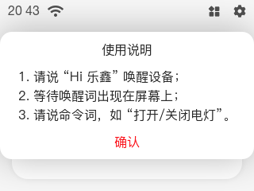
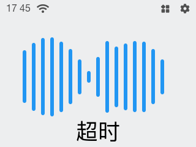
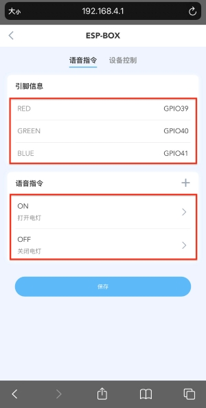
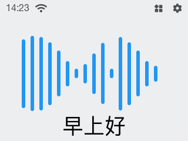

* [English Version](./getting_started.md)

# 开始使用

ESP32-S3-BOX 提供了一个使用语音助手+触摸屏控制、传感器、红外控制器和智能 Wi-Fi 网关的概念来开发智能控制产品的平台。ESP32-S3-BOX 出厂支持语音唤醒和离线中英文命令词识别，通过乐鑫丰富的 SDK 和解决方案，能够轻松构建在线和离线语音助手、智能语音设备、HMI 触摸屏设备、控制面板、多协议网关等多样的应用。

ESP32-S3-BOX 的 SDK 拥有可配置的 AI 语音交互功能，它允许您更改命令词以控制智能产品。本文的内容仅为您简要介绍 ESP32-S3-BOX 能实现的参考功能，让您了解如何开始使用开发板。一旦您完成阅读下面的指南，您可以尝试自己开发应用。让我们开始旅程吧！

   

   
   

**ESP32-S3-BOX 套件包含:**

1. 主机，可独立使用；
2. Dock 配件, 辅助主机站在桌面；
3. 供测试的 LED 模块和杜邦线。

**你可能还需要：**

1. Type-C 数据线 (不包含在 ESP32-S3-BOX Kit 内)

## 将 LED 模块插入 ESP32-S3-BOX

1. 参考下面的引脚定义，将 RGB LED 模块插入 ESP32-S3-BOX；
2. RGB LED 模块有四根公头针脚：分别将 R、G、B、GND 插入 PMOD 1 的 G39、G40、G41、GND 母头端口；
3. 套件中仅提供一个 RGB 模块。

   

   
   

## 给 ESP32-S3-BOX 供电

1. 使用一根 Type-C 数据线（不包含在 ESP32-S3-BOX 套件中）给 ESP32-S3-BOX 供电；

   

   
   

2. 设备启动后，屏幕上将显示 Espressif logo 的开机动画；

   

   
   

## 开始体验 ESP32-S3-BOX

1. 首先您会看到 “使用说明” 弹窗，请仔细阅读，它会提示您如何使用 AI 语音功能；

   

   
   

2. 点击 “确认” 完成“使用说明” 的阅读并回到主页；

   

   
   

3. 现在，请使用唤醒词 “Hi 乐鑫” 去唤醒设备。设备唤醒成功后，唤醒词将显示在如下屏幕上并伴有提示音，如果唤醒词未出现，请再次尝试。如下展示的动画提示您的设备正在聆听；

   

   
   

4. 请在提示音响起后的 6 秒左右时间内对设备说命令词，比如 “**打开电灯**”，同时命令词将显示在屏幕上并且 LED 模块打开。约 1s 后语音控制界面退出；

   

   
   

5. 默认命令词为："**打开电灯**", "**关闭电灯**", "**调成红色**", "**调成绿色**", "**调成蓝色**", "**调成白色**"；

   

   
   

    >注意:
    > 如果 LED 灯没有被打开，请检察 RGB 模块的 pin 脚是否插错；
    > 若在规定时间内未识别到命令词，则显示超时，约 1s 后界面关闭。

6. 按下 ESP32-S3-BOX 顶部的静音按钮，按下后设备语音唤醒和识别功能被禁用，再次按下恢复语音功能。

   

   
   

7. 您也可以轻触触摸屏下方的 “小红圈” 回到主页；

   

   
   

## 语音控制命令词自定义

ESP32-S3-BOX 最令人印象深刻的功能是乐鑫专有的 AI 语音识别系统。您可以自定义用于指令的任意命令词。有关 AI 算法工作原理的详细信息，请参阅我们 GitHub 上的开发指南。让我们开始了解语音命令词自定义：

**1. 首先，请将你的手机连接 ESP32-S3-BOX 的 Wi-Fi**

1.1. 点击主页左上角的 Wi-Fi 图标；

   

   
   

1.2. 您将看到如下二维码界面；

   

   
   

1.3. 打开你手机上的二维码扫描软件或者相机扫码配网，对于 iPhone 用户，您可以打开相机（如扫码失败，请手动打无线网络，找到 “ ESP-Box” 无线网络，然后输入密码 “password”）；

   

   
   

**2. 访问 Web “192.168.4.1” 进入控制界面**

再次扫码进入 Web 控制界面，或者打开手机浏览器，输入IP地址 “192.168.4.1”。

   

   
   

   

   
   

> 小提示：对于部分安卓手机，如果网页加载失败，建议您关闭手机的移动网络。建议您使用 Chrome, Safari, Firefox 浏览器访问网页。

**3. 自定义语音命令词**

   1. 您可以简单地在这个用户界面进行开灯或者关灯；

   

   
   

   2. 点按 “light” 图标并进入到语音命令控制页面查看当前默认的 Pin 脚信息和命令词；

   

   
   

   3. “设备控制” 允许您对灯光进行颜色、亮度和饱和度的更改。

   

   
   

   4. “语音指令”页面允许您针对设备的 “开”、“关”、“颜色”定义您喜欢的命令词来控制设备。比如，您可以自定义“开”的命令词为“早上好”（如下图标注“1”步骤），点击保存，界面返回上一级（如下图标注“2”步骤），然后再点击保存（如下图标注“3”步骤）。

   

   
   

   5. 现在，您可以体验您的新命令词了！请先使用 **“Hi 乐鑫”** 去唤醒设备，然后在**6秒**内说出打开电灯的新命令词 **“早上好”**，新命令词会显示在屏幕上并且 LED 模块打开。

   

   
   

   >**如何添加合适的命令词:**
   AI 模型支持自定义命令词，为了获得最优的识别体验，命令词定义时需要注意以下事项：
   >* 命令词的长度
   命令词中单词数需要大于等于 2 个，小于等于 8 个。
   在定义一系列命令词时，最好可以保持不同命令词的长度相似。
   >* 避免前缀
   多个命令词，相互之间不要是对方的前缀，短的词会被屏蔽，比如 “打开” 和 “打开灯”， “打开”会被屏蔽。

## ESP32-S3-BOX 图形界面

1. 点击主页右上角的功能图标进入用户界面；

   

   
   

2. 点按 “Light” 图标将允许您打开和关闭灯；

   

   
   

3. 长按 “Light” 图标将进入灯光调整界面，可以更改颜色显示。再次长按调光圆环，分别可调节灯光饱和度和亮度；

   

   
   

4. 以上出厂功能是预编程的，目的是让您简要了解如何在您的项目中使用此 ESP32-S3-BOX；

5. 其他三个功能图标（Media、Fan、Security）仅用于展示，暂未开发。您可以尝试编写令人兴奋的应用程序，请开启您的物联网之旅；

## ESP-BOX 论坛

访问乐鑫 BBS 论坛 [esp32.com](https://esp32.com/viewforum.php?f=43) 给我们提问，或者通过 sales@espressif.com 邮箱联系我们，我们将尽快答复您。
