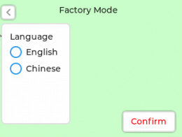

* [English Version](./getting_started.md)

本指南适用于已烧录最新固件的 ESP32-S3-BOX、ESP32-S3-BOX-Lite 产品，下文将其统称为 BOX 系列开发板。

# 开始使用

搭载 ESP32-S3 芯片的 BOX 系列开发板借助语音助手 + 屏幕控制、传感器、红外控制器和智能 Wi-Fi 网关等功能，为用户提供了一个开发智能家居设备控制系统的平台。BOX 系列开发板出厂支持语音唤醒和离线中英文命令词识别，其 SDK 具备可重构 AI 语音交互功能，用户可以通过自定义命令词控制家居设备。本文仅简要介绍最新固件能够实现的参考功能，供您了解如何开始使用开发板。阅读完该指南，您可以尝试自己开发应用。让我们开始吧！

**BOX 套件包含：**

| ESP32-S3-BOX | ESP32-S3-BOX-Lite |
| :-----: | :---------------------: |
| 主机，可独立使用    | 主机，可独立使用 |
| 供测试的 RGB LED 模块和杜邦线   | 供测试的 RGB LED 模块和杜邦线  |
| Dock 配件，辅助主机立于桌面 |  N/A|

**所需硬件：**

请您自行准备一根 USB-C 数据线。

## 连接 RGB LED 模块 
参考下面的管脚定义，用杜邦线连接 RGB LED 模块和设备。RGB LED 模块有 R、G、B、GND 四根公头针脚，请将其与 PMOD 1 的 G39、G40、G41、GND 母头端口连接。

## 给设备供电
1. 使用 USB-C 数据线给设备供电。

2. 设备启动后，屏幕上将显示 Espressif logo 的开机动画。

## 开始体验

1. 请阅读按键引导页，了解 BOX 系列开发板的按键功能，随后点按 `Next` 进入下一页。

<table border="0" align="center">
<tr>
<td><b>ESP32-S3-BOX 按键引导页</b></td>
<td><b>ESP32-S3-BOX-Lite 按键引导页</b></td>
</tr>
<tr>
<td></td>
<td></td>
</tr>
 <tr>
<td></td>
<td></td>
</tr>
</table>

2. 请阅读语音助手使用说明引导页，了解 AI 语音功能，随后点按 `OK Let's Go` 进入菜单页。

<table border="0" align="center">
<tr>
  <td></td>
  <td></td>
</tr>
</table>

3. 菜单页有五大功能，分别是 `Device Control`、`Network`、`Media Player`、`Help` 以及 `About Us`，左右滑动可选择功能。比如，进入 `Device Control` 界面，点按 `Light` 可打开或关闭模块上的 LED 灯。回到菜单页，再进入 `Media Player` 界面播放歌曲或调节音量。

<table border="0" align="center">
<tr>
<td></td>
<td></td>
</tr>
<tr>
<td></td>
<td></td>
</tr>
</table>

**仅 ESP32-S3-BOX 支持以下功能：**

4. 按下 ESP32-S3-BOX 顶部的静音按钮之后，语音唤醒和识别功能将被禁用，再次按下则会恢复语音功能。

   

   
   

5. 轻触屏幕下方的红色圆圈以返回上一页。红圈是一块可自定义的触摸区域，允许用户根据自己的喜好配置额外的触摸功能。

   

   
   

## 离线语音识别
1. 您可以在任意界面使用唤醒词来唤醒设备，唤醒词为“Hi 乐鑫”。设备唤醒后，唤醒词将显示在屏幕上并伴有提示音“我在”。如果唤醒词未出现，请再次尝试。出现如下界面表示您的设备正在倾听。

2. 请在提示音响起后的 6 秒内对设备说出命令词，比如“打开电灯”。您将看到命令词显示在屏幕上，模块的 LED 灯亮起，同时听到语音反馈“好的”。若无其他命令词，设备将在 6 秒左右退出语音控制界面。

3. 您还可以使用语音命令词欣赏音乐。请先唤醒设备，然后说出命令词“播放音乐”，设备将打开音乐播放器并开始播放内置音乐。您也可以用语音命令词切换歌曲或者暂停播放。最新固件默认自带两歌曲。
   
>**注意：**
   >
   >* 如果模块上的 LED 灯没有亮起，请检查模块管脚是否插错。
   >* 若在规定时间内未识别到命令词，则会显示 `超时`，约 1 秒后界面关闭。
   

4. 默认命令词包括：**打开电灯**，**关闭电灯**，**调成红色**，**调成绿色**，**调成蓝色**，**播放音乐**，**切歌**，**暂停播放**。

## 连续语音识别

更有趣的是，设备支持唤醒后连续识别多个命令词，即用户可以在唤醒设备后与其连续对话。连续语音识别使语音交互自然流畅，带来人性化的对话体验。

**使用方式**

- 使用“Hi，乐鑫”唤醒设备，唤醒后设备播放提示音“我在”。
- 说出命令词。如设备识别出命令词，则会播放提示音“好的”，然后将继续识别其他命令词。
- 如设备未识别命令词则会继续等待，6 秒内没有新命令将自动退出语音控制界面，使用语音识别功能需要再次唤醒设备。

**注意**

- 如设备多次未能识别命令词，请再次唤醒重新识别
- 说出唤醒词后请勿移动设备，设备不支持在移动中识别命令词
- 我们推荐使用长度为 3-5 个汉字的命令词
- 暂不支持播放提示音时识别命令词

**额外支持的命令词**

| command ID |    命令词    | command ID |    命令词    | command ID |     命令词     |
| :--------: | :----------: | :--------: | :----------: | :--------: | :------------: |
|     0      |   打开空调   |     24     |   二十六度   |     48     |  音量调到最小  |
|     1      |   关闭空调   |     25     |   二十七度   |     49     |    打开电灯    |
|     2      |   舒适模式   |     26     |   二十八度   |     50     |    关闭电灯    |
|     3      |   制冷模式   |     27     |   二十九度   |     51     |   打开卧室灯   |
|     4      |   制热模式   |     28     |    三十度    |     52     |   关闭卧室灯   |
|     5      |   加热模式   |     29     |   增大风速   |     53     |   打开客厅灯   |
|     6      |   除湿模式   |     30     |   减小风速   |     54     |   关闭客厅灯   |
|     7      |   送风模式   |     31     |    高速风    |     55     |    打开音箱    |
|     8      |   升高温度   |     32     |    中速风    |     56     |    关闭音箱    |
|     9      |   降低温度   |     33     |    低速风    |     57     |    拉开窗帘    |
|     10     | 温度调到最高 |     34     |    自动风    |     58     |    关闭窗帘    |
|     11     | 温度调到最低 |     35     | 打开左右摆风 |     59     |    打开风扇    |
|     12     |    太热了    |     36     | 打开上下摆风 |     60     |    关闭风扇    |
|     13     |    太冷了    |     37     | 关闭左右摆风 |     61     | 打开饮水机插座 |
|     14     |    十六度    |     38     | 关闭上下摆风 |     62     | 关闭饮水机插座 |
|     15     |    十七度    |     39     |   打开辅热   |     63     |   打开投影仪   |
|     16     |    十八度    |     40     |   关闭辅热   |     64     |   关闭投影仪   |
|     17     |    十九度    |     41     |  打开自清洁  |     65     |    灯光调暗    |
|     18     |    二十度    |     42     |  关闭自清洁  |     66     |    灯光调亮    |
|     19     |   二十一度   |     43     |   打开静音   |            |                |
|     20     |   二十二度   |     44     |   关闭静音   |            |                |
|     21     |   二十三度   |     45     |   音量大点   |            |                |
|     22     |   二十四度   |     46     |   音量小点   |            |                |
|     23     |   二十五度   |     47     | 音量调到最大 |            |                |

> 上述命令词仅供演示，由于没有接入相关智能设备，所以无法实现命令词功能。

## 语音命令词自定义
BOX 系列开发板配备乐鑫专有的 AI 语音识别系统，您可以通过 ESP BOX 应用程序自定义任意命令词。我们将以模块上的 LED 灯为例，介绍如何自定义语音命令词。如需了解算法详细信息，请参阅[技术架构](./technical_architecture_cn.md)。

**1. 连接 ESP BOX 手机应用程序**

1.1. 进入 `Network` 界面，点按右上角 `To install APP`。扫描二维码下载并安装 ESP BOX 应用程序，或者直接在 App Store 或 Google Play 中搜索 "ESP BOX" 下载应用程序。

   
   

   
   

   

   
   

   
1.2. 如您第一次使用此应用程序，请先注册账户。

1.3. 登录您的 ESP BOX 账号并打开手机蓝牙。点按界面下方 `+`，扫描设备上的二维码配置网络。

<table border="0" align="center">
<tr>
  <td></td>
  <td></td>
  <td></td>
</tr>
</table>

1.4. 设备添加成功后，您将看到如下提示：

<table border="0" align="center">
<tr>
  <td></td>
  <td></td>
</tr>
</table>

>**注意：**
   >
   >* 请确保设备接入 2.4 GHz Wi-Fi 而非 5 GHz，且 Wi-Fi 密码输入正确。如果 Wi-Fi 密码错误，设备将会提示 "Wi-Fi Authentication failed"。
   >* 长按 `Boot` 键（即 `Function` 键）5 秒可清除网络配置信息，恢复出厂设置。设备重置后，如遇二维码扫码失败或蓝牙搜索不到设备，请按 `Reset` 键重启设备。

   

   
   

   **2. 自定义语音命令词：**

2.1. 点按您的 ESP-BOX 设备图标，进入如下界面。在此界面，您可轻松控制开灯或者关灯。此外，我们预留了 `Switch` 和 `Fan` 功能供您自行开发。

<table border="0" align="center">
<tr>
  <td></td>
  <td></td>
</tr>
</table>

2.2. 点按 `Light`，`Configure` 标签页会显示当前默认的管脚信息和命令词。您可以根据需要修改 RGB LED 模块的 Red、Green 和 Blue 管脚。

<table border="0" align="center">
<tr>
  <td></td>
  <td></td>
</tr>
</table>

2.3. 您也可以在 `Configure` 标签页自定义控制设备“开”、“关”和“颜色”的命令词。比如，您可以将“开”的命令词自定义为“早上好”，点按 `Save` 后返回上一级界面，然后如图所示再次点按 `Save`。

<table border="0" align="center">
<tr>
  <td></td>
  <td></td>
</tr>
</table>

2.4. 在 `Control` 标签页更改灯光颜色、亮度和饱和度。

   

   
   

2.5. 现在，您可以体验新命令词了！请先使用“Hi 乐鑫”唤醒设备，然后在 6 秒内说出打开电灯的新命令词“早上好”，新命令词将显示在屏幕上，同时模块上的 LED 灯会亮起。

   

   
   

>**为了获得最优识别体验，自定义时需要注意以下事项：**
>
>* 命令词长度：命令词长度需要在 2-8 个汉字之间。在定义一系列命令词时，最好可以保持不同命令词的长度相似。
>* 避免重复：请勿在长命令词中包含短命令词，否则短命令词将无法识别。比如“打开”和“打开灯”，设备将无法识别“打开”。

   **3. 中英文语音模型切换：**

3.1. 点按您的 ESP-BOX `About Us` 设备图标，进入 `About Us` 详情页。在此界面，按下 `Boot` 按键，设备会快速进入 `factory Mode` 语言设置页面，用户可以自行设置语音的唤醒模型。模型切换后设备将自动重置重启。

   

   
   

此指南仅供您简要了解如何在 BOX 系列开发板上使用最新的固件。现在，请开始编写自己的应用程序，开启物联网之旅吧！

