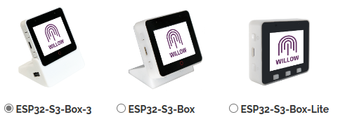
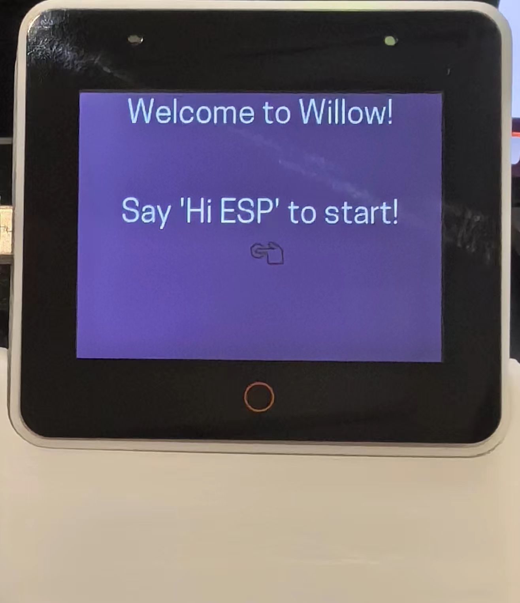
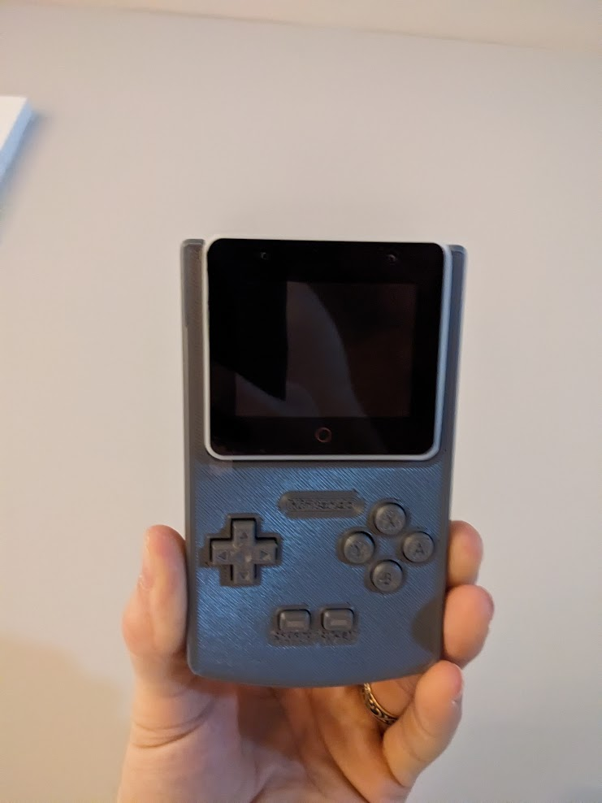
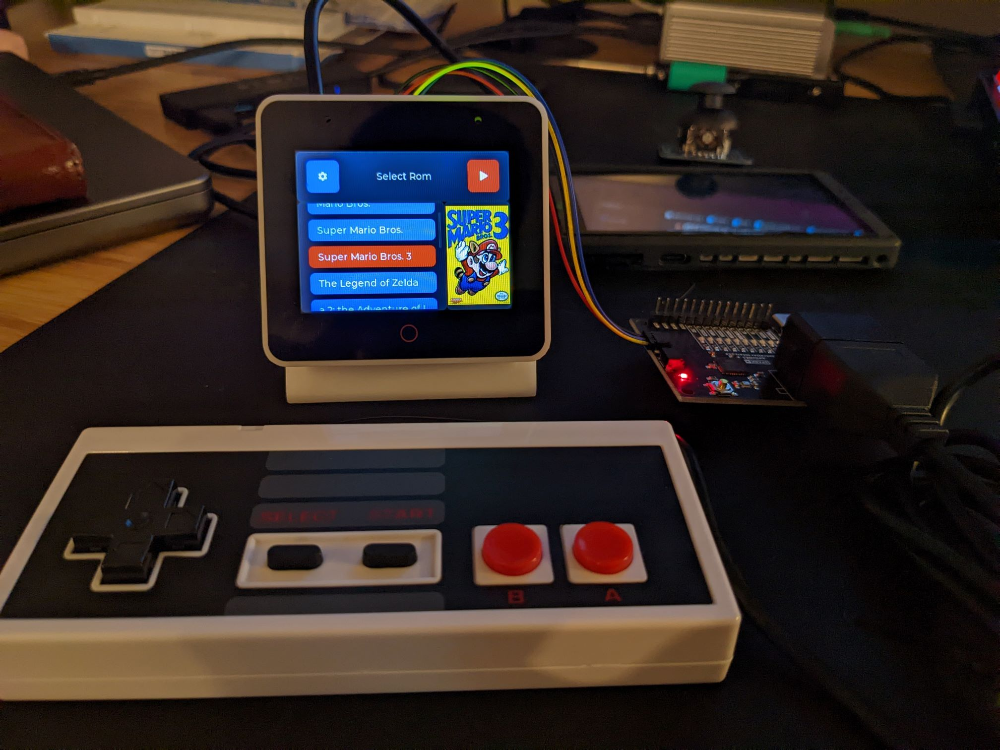
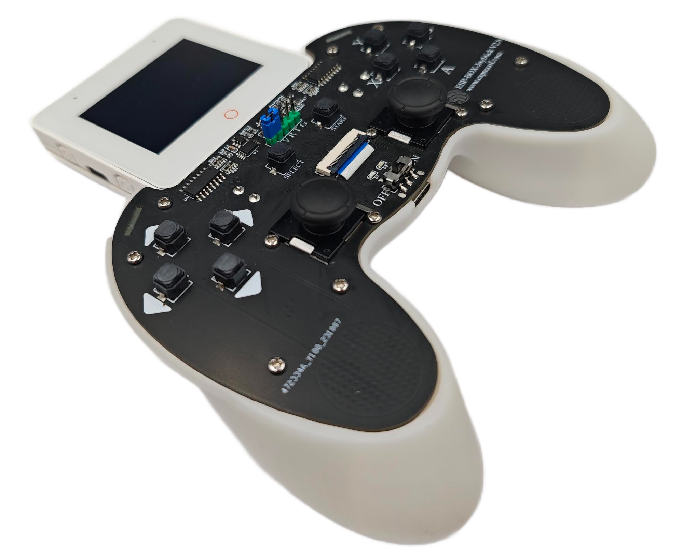

# Great projects using ESP-BOX serials

##  Willow - A Practical, Open Source, Privacy-focused Platform for Voice Assistants and Other Applications

<td></td>

### Project Source

[GitHub link](https://github.com/toverainc/willow)

[GitHub URL](https://heywillow.io)

### Project description

Willow is a powerful and privacy-focused voice assistant platform designed for the ESP32-BOX hardware family, offering a cost-effective, open-source, and highly customizable solution for voice interaction and home automation.

<td></td>

Willow is an ESP IDF-based project primarily designed for the ESP32-BOX hardware family from Espressif. The project's main objectives are to deliver performance, accuracy, cost-effectiveness, and functionality comparable to Amazon Echo and Google Home when used with Home Assistant, openHAB, and other platforms.

It is 100% open source and self-hosted, providing fast response times (500ms or less), high wake word accuracy, and low false activation rates. Willow offers flexibility with the option to use the Willow Inference Server or perform command recognition solely on the device. The project is known for its reliability, having been tested extensively with a failure rate of less than 1%.

Willow is not only fast and accurate but also prioritizes privacy. Users can inspect the source code, build and flash it themselves, proxy through another server for traffic inspection, use it on their own server, or operate it without internet access. It is a practical and aesthetically pleasing solution, ready to be deployed without drawing attention. The hardware cost is approximately $50, making it a cost-effective choice.

Willow supports features such as wake word detection, voice activity detection, integration with Home Assistant, openHAB, and generic REST APIs, far-field voice recognition, excellent audio quality, and reliable performance in challenging Wi-Fi environments.

The project's future plans include running the Willow Inference Server without CUDA, improving the LCD and touchscreen features, adding support for buttons and custom wake words, and configuring GPIO for user customization.

## ESP-BOX-EMU -  A Retro Game Emulation System

<td></td>

### Project Source

[GitHub link](https://github.com/esp-cpp/esp-box-emu)

### Project description

ESP-BOX-EMU is a comprehensive project that allows users to enjoy retro game emulation on the ESP32-BOX hardware, with a user-friendly interface and various features for an enhanced gaming experience.

<td></td>

This project, "esp-box-emu," is an emulation system running on the ESP32-BOX hardware. It is designed to emulate retro games and is built using various components and software libraries, including ESPP, LVGL, Squareline Studio for LVGL design, Nofrendo for NES emulation, and GNUBoy for Game Boy/Game Boy Color emulation.

The project offers videos showcasing its capabilities, including emulation for Game Boy Color, NES games (e.g: Super Mario Bros. and Zelda), and Game Boy games (e.g: Pokemon and Link's Awakening).  The videos demonstrate features like audio and video settings, ROM scaling options, and audio control.

The project supports both internal storage using LittleFS and external storage via a uSD card with a FAT filesystem. ROM images and metadata are organized in a specific format for ease of use.

## **ESP32-S3-BOX-3-JoyStick** - A JoyStick Combines Gaming Controller And Aircraft Remote

<td></td>

### Project Source

[OSHWHub link](https://oshwhub.com/esp-college/esp_box_3_joystick)

### Project description

The ESP32-S3-BOX-3-JoyStick hardware system comprises the ESP32-S3-BOX-3 development board, JoyStick controller, and ESP32-S3-USB-Bridge receiver. The ESP32-S3-BOX-3 serves as the main controller, connecting to the JoyStick controller and ESP32-S3-USB-Bridge receiver through a PCI-E interface. The system operates in "Game Mode" and "RC Remote Control Mode." In Game Mode, it supports USB-HID and BLE-HID protocols for computer gaming control, as well as an NES emulator mode. In RC Remote Control Mode, it utilizes the ESP-NOW wireless communication protocol to pair with ESP32-S3-USB-Bridge and other Espressif development boards, enabling wireless control of RC vehicles and ESP-Drone quadcopters.