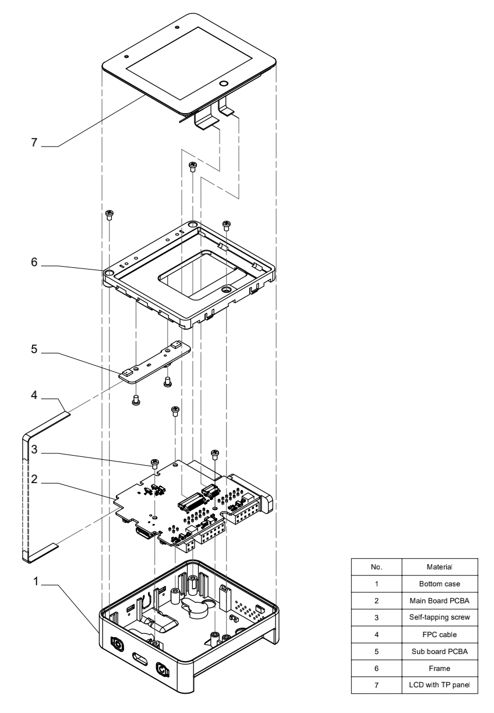
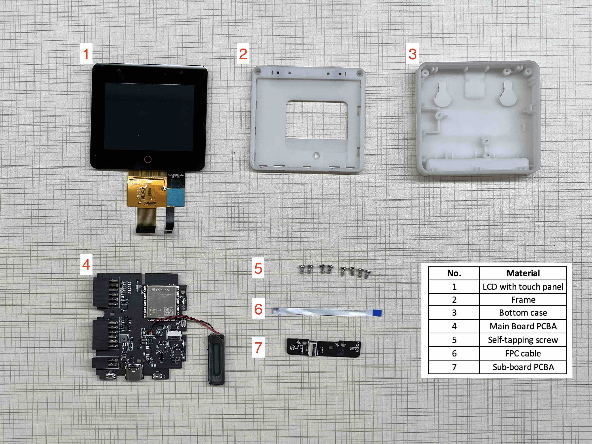
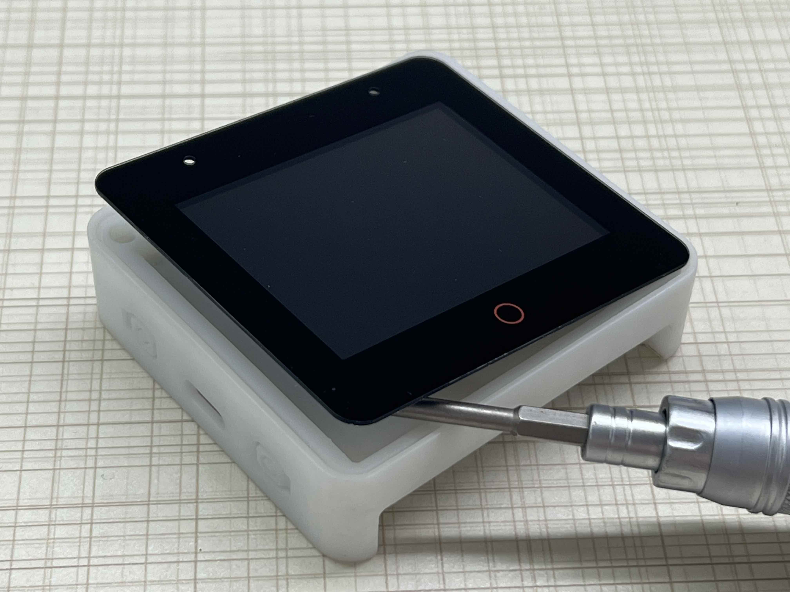
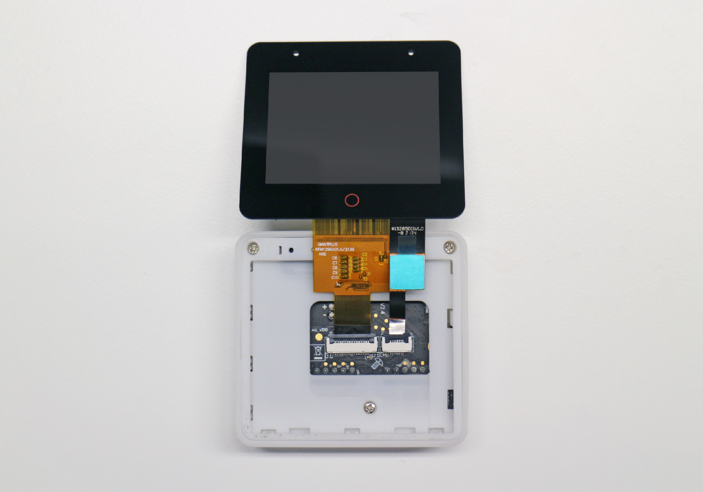
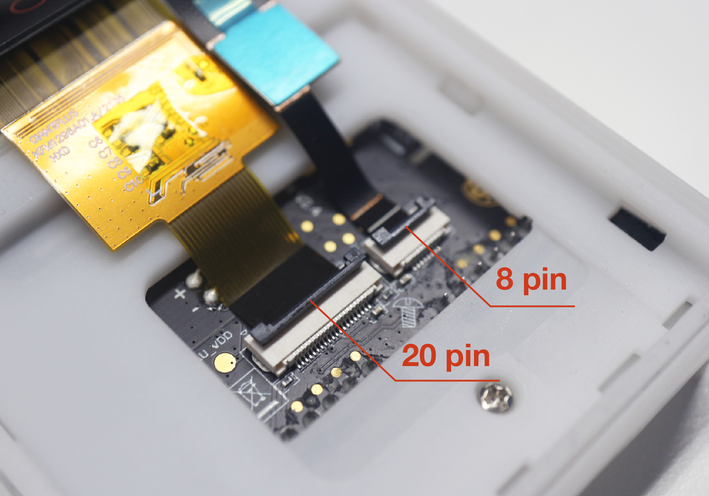
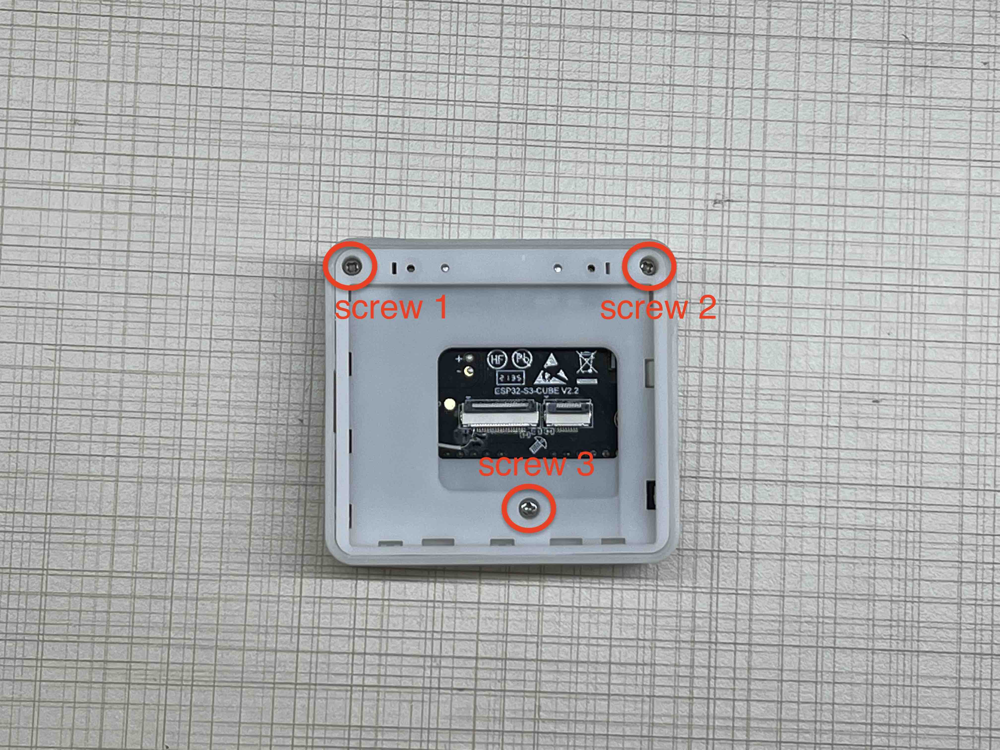
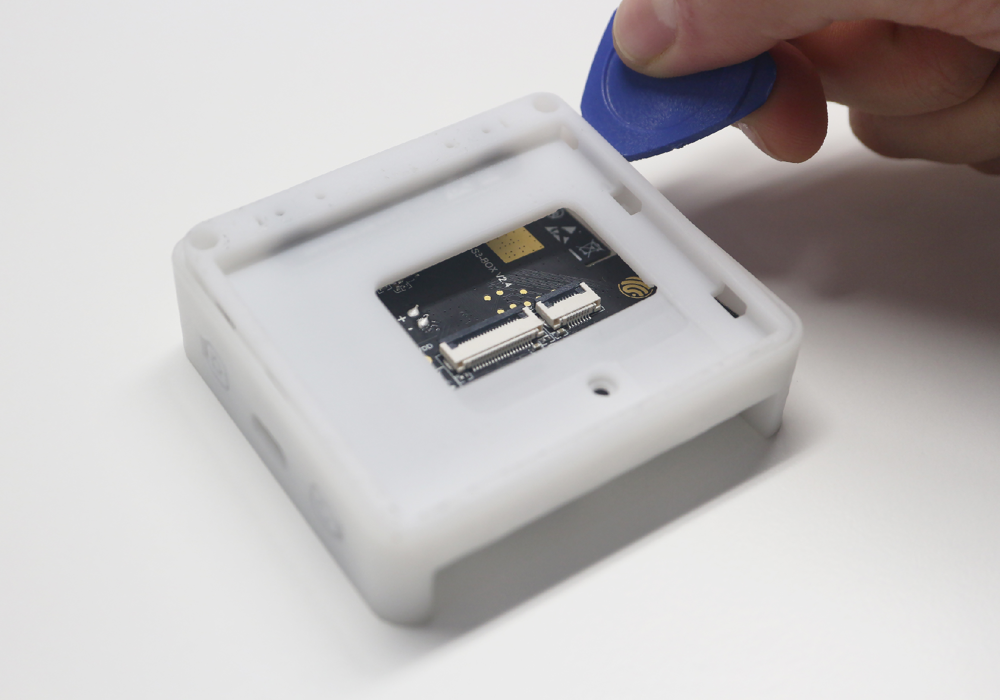
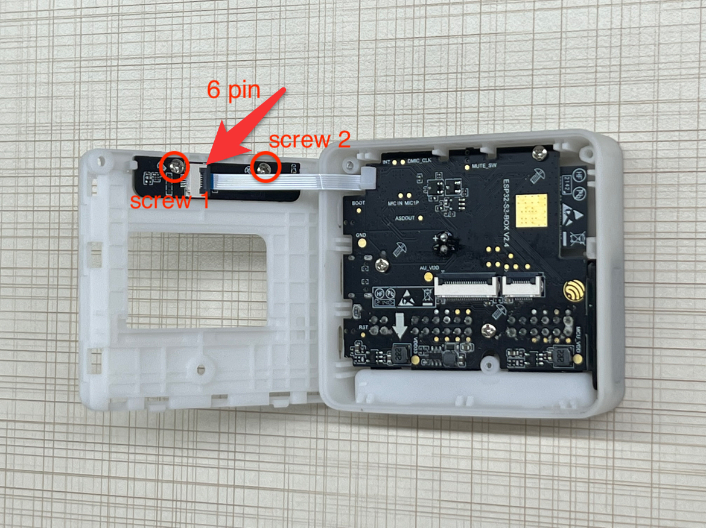
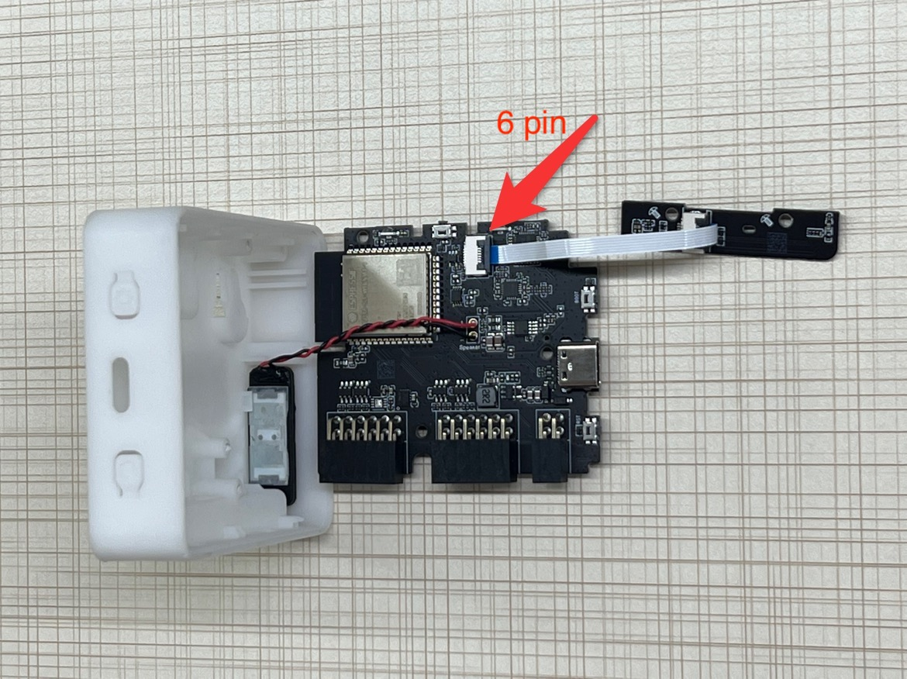
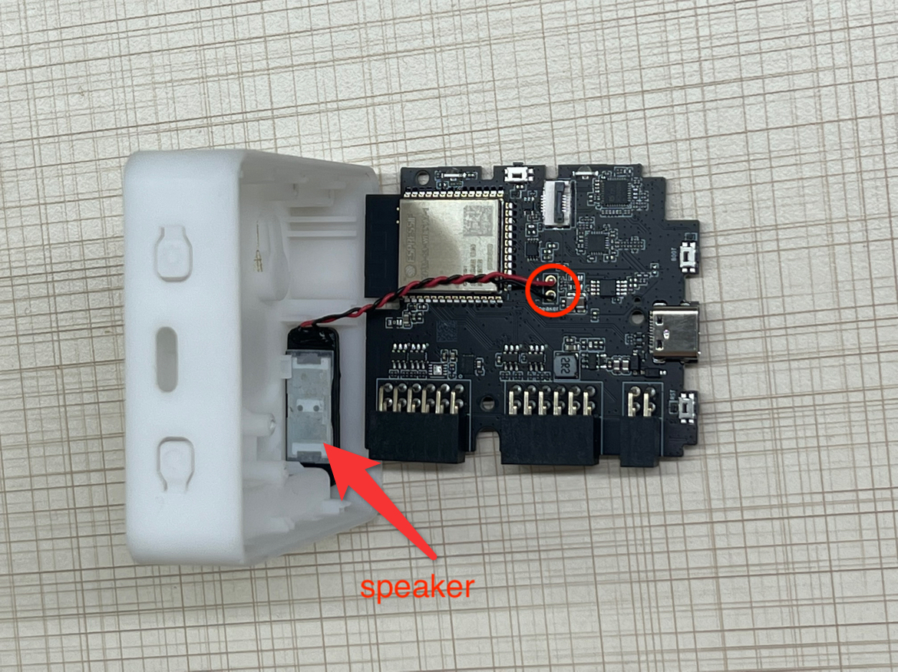

# ESP32-S3-BOX Disassembly Tutorial

## Exploded View

The figure below depicts an exploded view of the ESP32-S3-BOX, which shows the relationship or order of assembly of various parts and how they fit together. The projection of the ESP32-S3-BOX main unit has seven layers, beginning from the top layer and arranging in descending order as shown in the picture below. 

    

> **Warning**: Disassembling the ESP32-S3–BOX may damage the hardware structure. Espressif will not be responsible for any damages resulting from the disassembling.

## Disassembly Tutorial

### What Do You Need

* A Hot Air Blower
* A Flat-Head Screwdriver
* A Phillips-Head Screwdriver
* Triangle Plastic Pry Opening Tool

### Components Overview

The following tutorial will guide you to disassemble the development board step-by-step. Once you have dissembled the development board, there will be 7 main components as shown below. Please keep them well.

  

### Step-by-step Guide

- The first step is to remove the touch display that is glued to the frame. Please use a "Hot Air Blower" perpendicularly on the edge of the touch screen to loosen the adhesive materials. 
- Next, use the "Flat-Head Screwdriver" or "Triangle Plastic Pry Opening Tool" to pry off the touch screen. Please be careful, as you may damage the FPC cable and the glass cover of the touch screen when removing the touch screen from the development board. 

  

- While tearing off the touch screen, you will observe the touch panel is connected to the mainboard by two FPC cables, 8 pin and 20 pin, respectively. Unlock the two FPC connectors and take down the whole touch screen.

  

  

- Use the “Phillips-Head Screwdriver” to remove the three self-tapping screws.

  

- Use the "Flat-Head Screwdriver" or "Triangle Plastic Pry Opening Tool" to remove the middle frame from the edge.

  

> **Note**: The middle frame is 3D printed, it might be tight while removing the middle frame from the case. Try to open the snap-fit from the edge. 

- You will see a microphone sub-board attached to the back of the middle frame. The mic sub-board is connected to the mainboard through a 6 pin FPC cable. Unscrew the two screws of the mic sub-board and unlock one side of the 6 pin FPC cable to remove the sub-board completely.

  

- Now, only the mainboard is embedded in the case. Unscrew the last three screws on the mainboard and take out the board. You will see the 6 pin FPC cable on the other side, unlock the connector and take off the FPC cable.

  

  
  

- The speaker is glued to the side of the bottom case, and its connector is soldered to the mainboard PCBA. You can remove it from PCBA using the soldering iron. 

  

