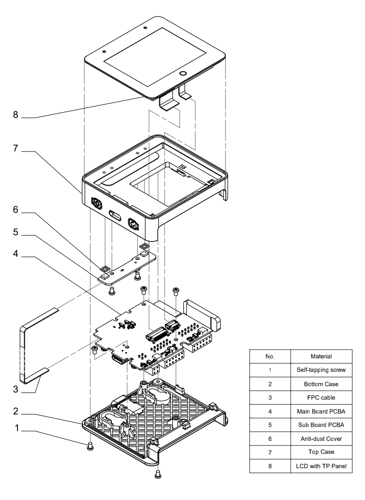
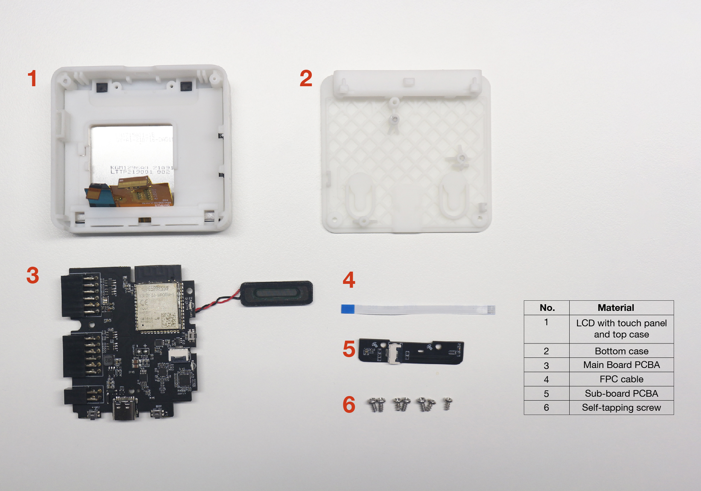
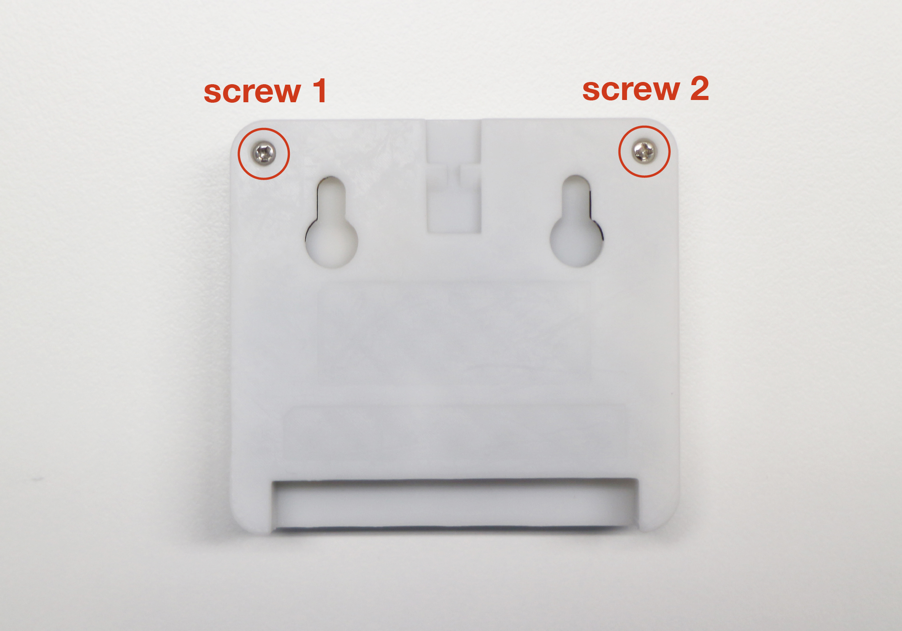
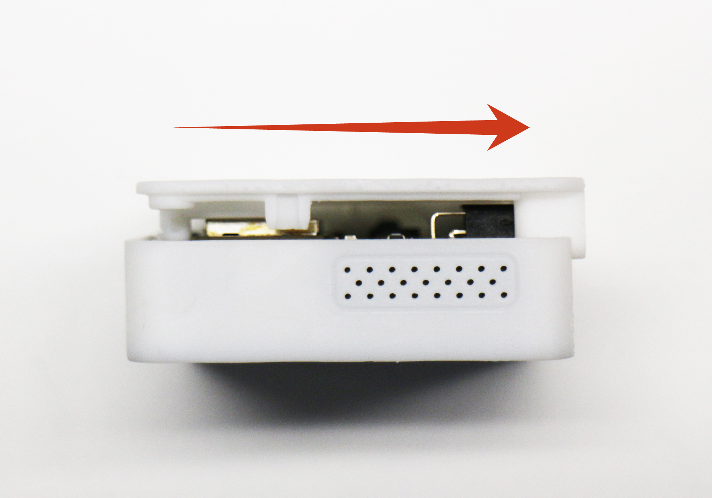
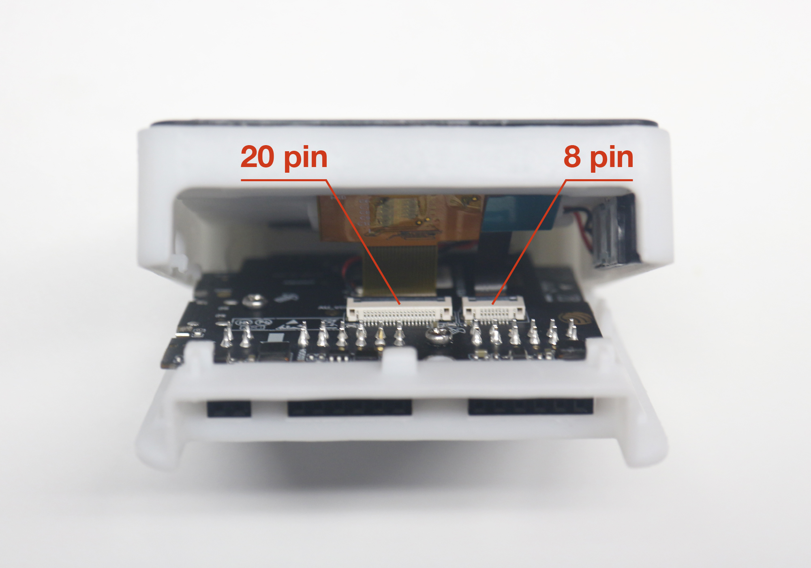
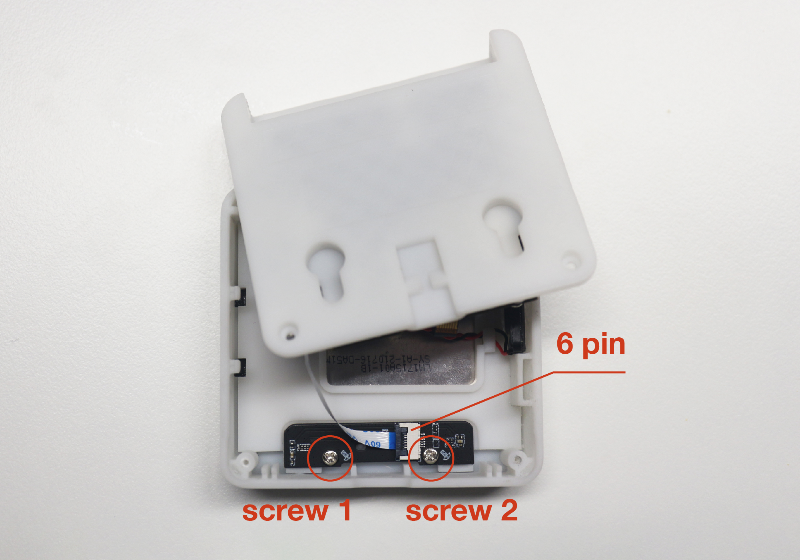
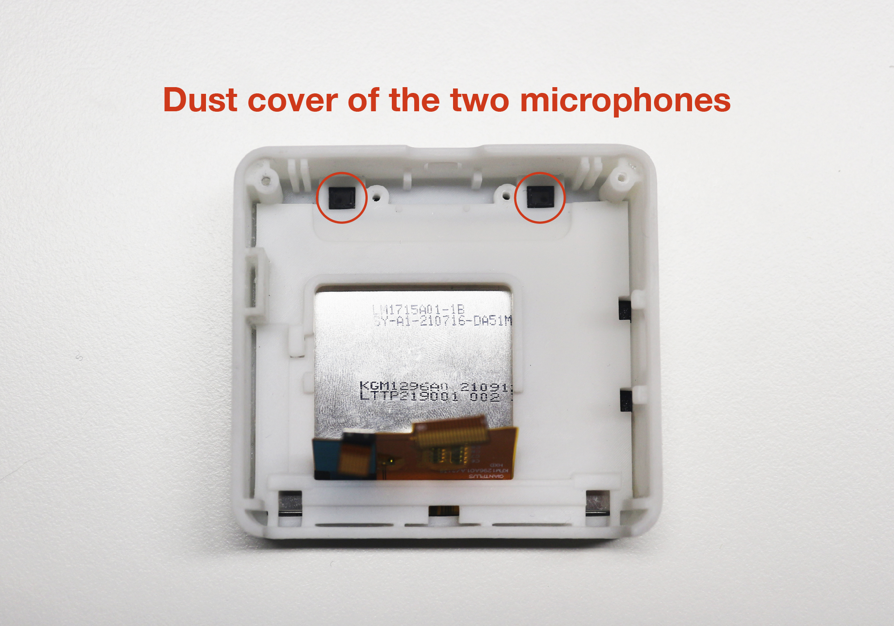
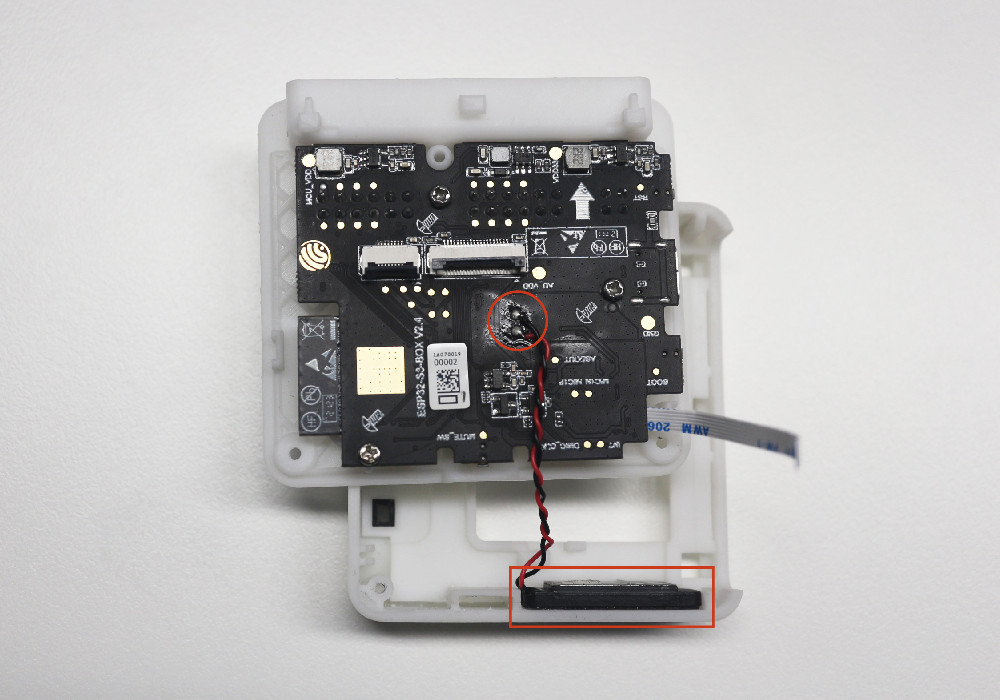
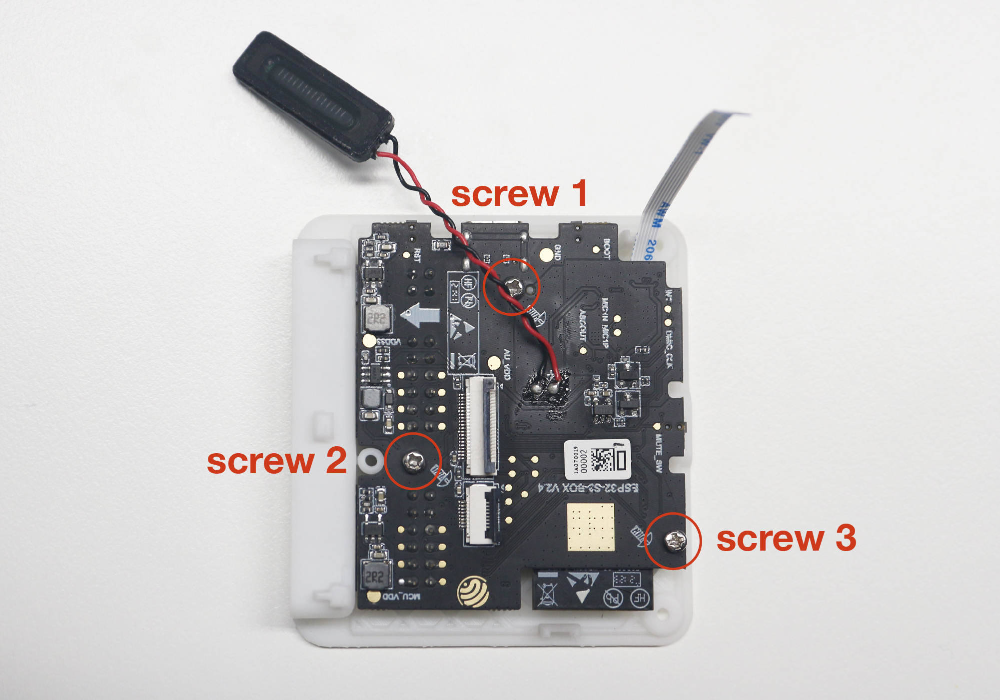
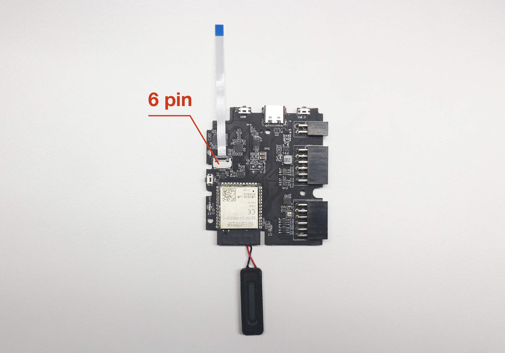

# ESP32-S3-BOX Disassembly Tutorial V2 (Also suitable for ESP32-S3-BOX-Lite)

## Exploded View

The figure below depicts an exploded view of the new batch of the ESP32-S3-BOX, which shows the relationship or order of assembly of various parts and how they fit together. The projection of the ESP32-S3-BOX main unit has eight layers, beginning from the top layer and arranging in descending order as shown in the picture below. The guide is also suitable for the ESP32-S3-BOX-Lite product as they are similar in structure.

> **Warning**: Disassembling the ESP32-S3–BOX may damage the hardware structure. Espressif will not be responsible for any damages resulting from the disassembling.

## Disassembly Tutorial

### What Do You Need

- A Phillips-Head Screwdriver

### Components Overview

The following tutorial will guide you to disassemble the development board step-by-step. Once you have dissembled the development board, there will be six main components as shown below. This tutorial doesn't cover how to disassemble the components of the sixth layer and eight layer. Please keep them well.

  

### Step-by-step Guide

- Use the “Phillips-Head Screwdriver” to remove the two self-tapping screws from the bottom case. 

  

- Gently push the bottom case to the right to separate the bottom case and the top case.

  

- You will observe the touch panel is connected to the main board by two FPC cables, 8 pin and 20 pin, respectively. Unlock the two FPC connectors to separate the main board and touch screen. The touch screen is glued to the top case, we don't recommend you to tear off the whole touch screen as you may damage the FPC cable and the glass cover of the touch screen. 

  

- You will see a microphone sub-board attached to the bottom case. The mic sub-board is connected to the main board through a 6 pin FPC cable. Unscrew the two screws of the microphone sub-board and unlock one side of the 6 pin FPC cable to remove the sub-board completely. Behind the microphone sub-board are the dust cover of two microphones, we do not recommend that you take down them since they are glued to the top case.

  

  

- The speaker is glued on the side of the top case, you can slightly remove it. Its connector is soldered to the main board PCBA. You can remove it from PCBA using the soldering iron.
 

  

- Now, only the main board is embedded in the buttom case. Unscrew the last three screws on the main board and take out the board. You will see the 6 pin FPC cable on the other side, unlock the connector and take off the FPC cable.

  

  

