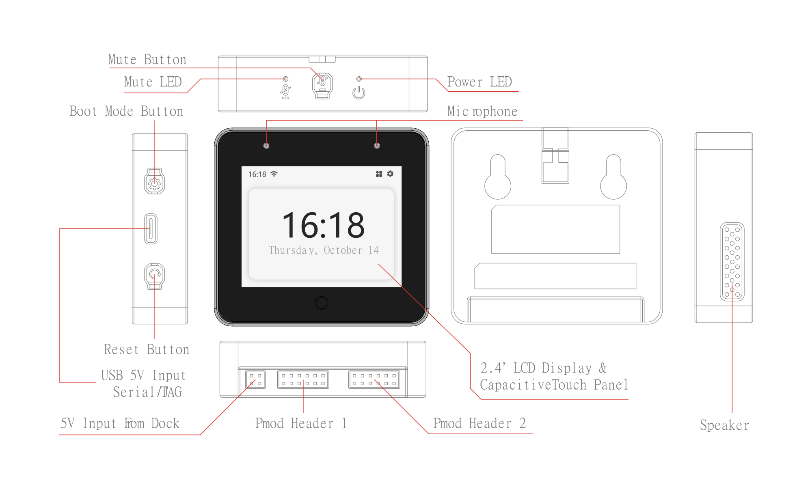
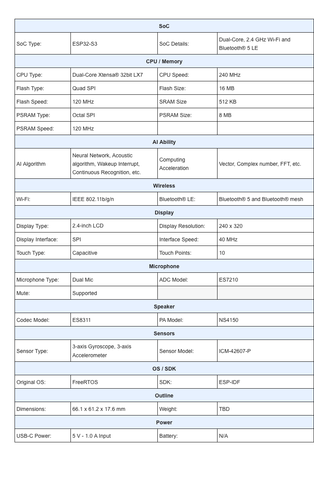

* [中文版本](./hardware_overview_for_box_cn.md)

## Hardware Overview

### Hardware Source Files

* [ESP32-S3-BOX Mainboard Schematic](../../../hardware/esp32_s3_box_v2.5/schematic)
* [ESP32-S3-BOX Mainboard PCB](../../../hardware/esp32_s3_box_v2.5/pcb)
* [ESP32-S3-BOX Mainboard Gerber](../../../hardware/esp32_s3_box_v2.5/gerber)
* [ESP32-S3-BOX Subboard Schematic](../../../hardware/esp32_s3_box_sub_v2.2/schematic)
* [ESP32-S3-BOX Subboard PCB](../../../hardware/esp32_s3_box_sub_v2.2/pcb)
* [ESP32-S3-BOX Subboard Gerber](../../../hardware/esp32_s3_box_sub_v2.2/gerber)
* [ESP32-S3-BOX Shell CAD STEP](../../../hardware/esp32_s3_box_shell_step)

### Specifications:

### Ports:

* [Digilent Pmod™ Interface Specification](https://digilent.com/reference/_media/reference/pmod/pmod-interface-specification-1_3_1.pdf)