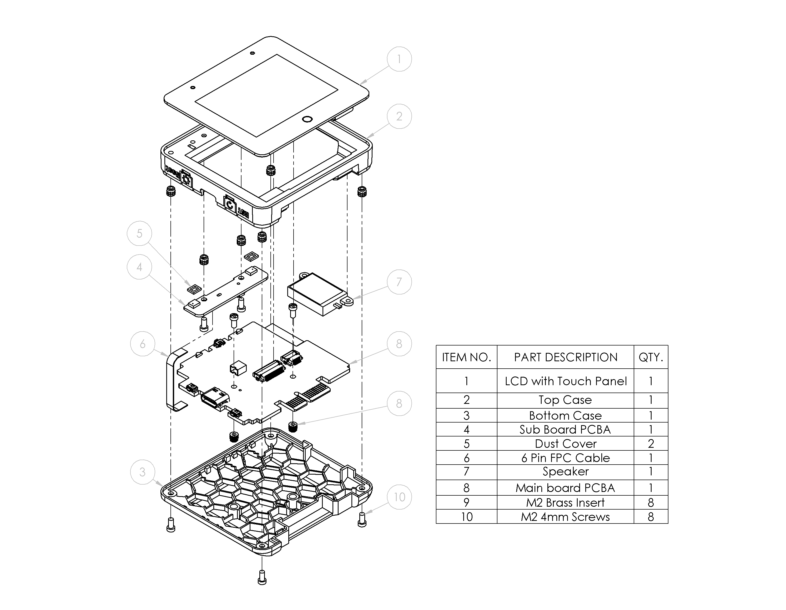
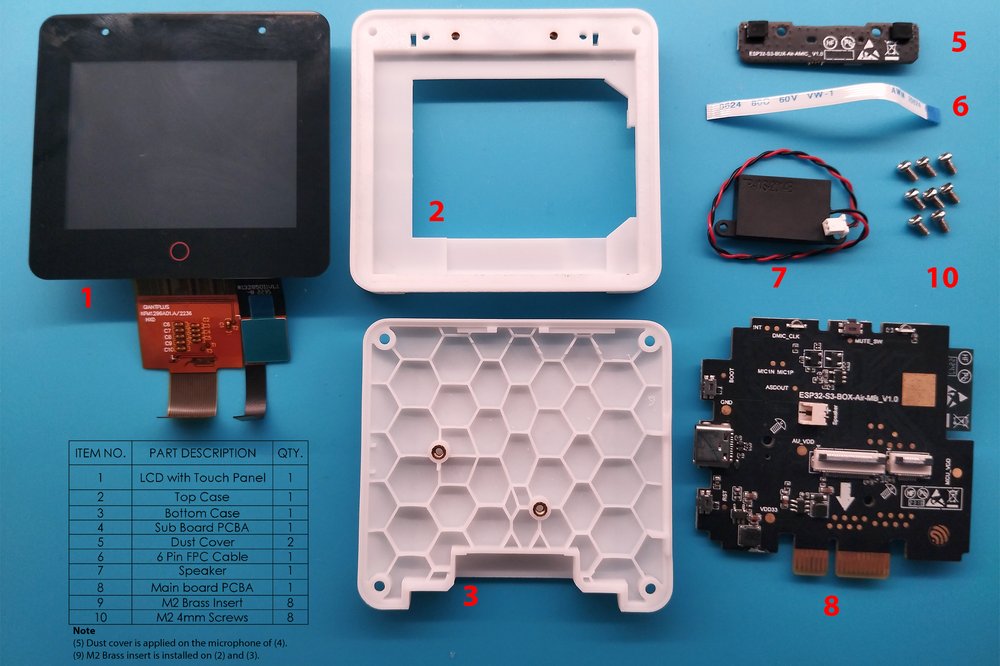

# ESP32-S3-BOX-3 Disassembly Tutorial

## Exploded View

The figure below depicts an exploded view of the ESP32-S3-BOX-3, which shows the order of assembly of various parts and how they fit together. The projection of the ESP32-S3-BOX main unit has 10 layers, beginning from the top layer and arranging in descending order as shown in the picture below.

> **Warning**: Disassembling the ESP32-S3–BOX-3 may damage the hardware structure. Espressif will not be responsible for any damages resulting from the disassembling.

## Disassembly Tutorial

### What Do You Need

- Size #1 Phillips-Head Screwdriver

### Components Overview

The following tutorial will guide you to disassemble the development board step-by-step. Once you have dissembled the development board, there will be six main components as shown below. This tutorial will not cover how to disassemble the layer 1, 5, 7 and 9 as they are held with permanent adhesives. Please keep them well.

  

### Step-by-step Guide

- Use the “Phillips-Head Screwdriver” to remove the four screws from the bottom case. 

  

- Gently move the bottom case out, as per arrow, to separate the bottom case and the top case. Avoid tugging onto the LCD FPC cables and speaker cable.

  

- Observe that the microphone sub-board is connected to the main board through a 6 pin FPC cable. Unlatch the FPC connector and unplug the FPC cable. 

  

- Move the top case and bottom case apart carefully to expose the main board. Observe that the LCD, touch panel, and speaker is connected to the main board by a 20 pin FPC cable, 8 pin FPC cable, and JST connector respectively. Unlock the two FPC connectors, and disconnect the speaker to separate the top case and bottom case.

  
  

- With this, you will have the top case with LCD, touch screen , speaker and microphone sub-board, as well as the bottom case with main board.

  

- Unscrew the two screws on the microphone sub-board and remove the sub-board completely.

- The dust covers are located on the microphone of the sub-board. It is NOT recommended to remove them as they are glued to the top case.
 

  

- The touch screen is glued to the top case. It is NOT recommended to disassemble it as there is a risk of damaging the FPC cable and the glass cover of the touch screen. 

- The speaker is located on the inside of the top case. It is NOT recommended to remove it as it is glued to the top case.

  

- Unscrew the last two screws on the main board and take out the board.

  

- Note the 6 pin FPC cable connector on the other side of the main board, unlock the connector and take off the FPC cable. You have completed the disassembly.

  

## Assembly Tips

Assembly is as simple as reversing the above disassembly tutorial but to facilitate a smoother assembly experience, this section will cover some of the assembly issues and things to take note before assembly.

### Things to note
- Ensure that the speaker wire is not covering the screw holes of the main board PCBA before screwing in the screws.
- When placing the bottom case onto the top case, do so by aligning the side with the PMOD first, before putting the case together.
- When placing the bottom case onto the top case, Ensure that the snap fits near the PMOD are fully in place before screwing in the last 2 screws.

  

