* [English Version](./hardware_overview_for_box_3.md)

## 硬件概览

### ESP32-S3-BOX-3 

ESP32-S3-BOX-3 主控单元由 ESP32-S3-WROOM-1 模组驱动，该模块提供了 2.4 GHz Wi-Fi + Bluetooth 5 (LE) 的无线功能，同时具备 AI 加速能力。在 ESP32-S3 SoC 提供的 512 KB SRAM 基础上，该模块还附带额外的 16 MB 四线 Flash 和 16 MB 八线 PSRAM。开发板配备一片 2.4 英寸 320 x 240 的 SPI 接口触摸屏（‘红圈’支持触摸），两个数字麦克风，一个扬声器，三轴陀螺仪，三轴加速度计，一个用于电源和下载/调试的 Type-C 接口，一个可实现硬件扩展的高密度 PCIe 连接器，以及三个功能按钮。

#### 正视图

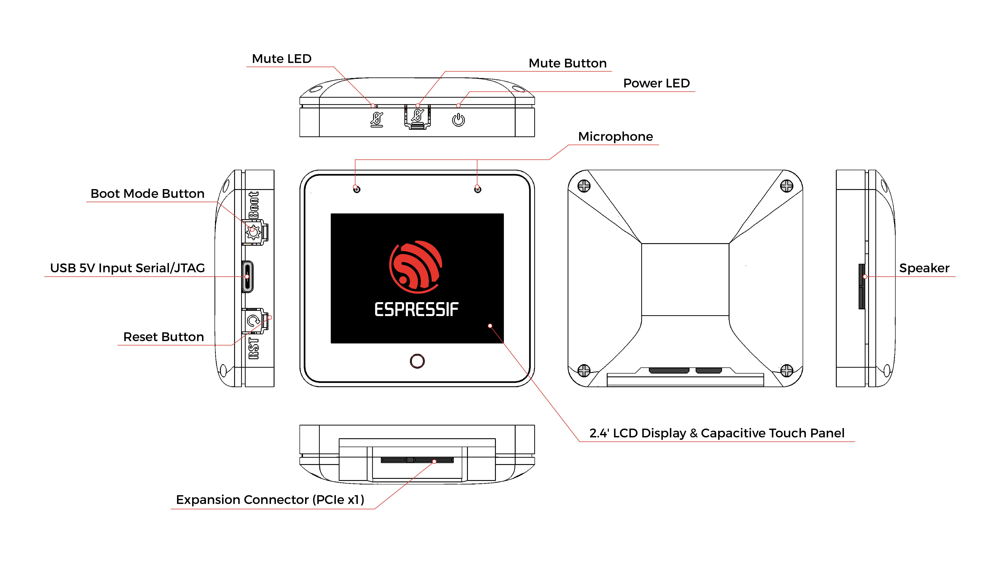

#### 规格参数

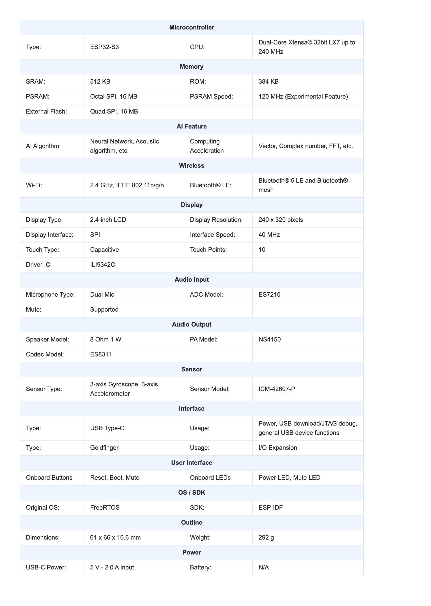

### ESP32-S3-BOX-3-DOCK

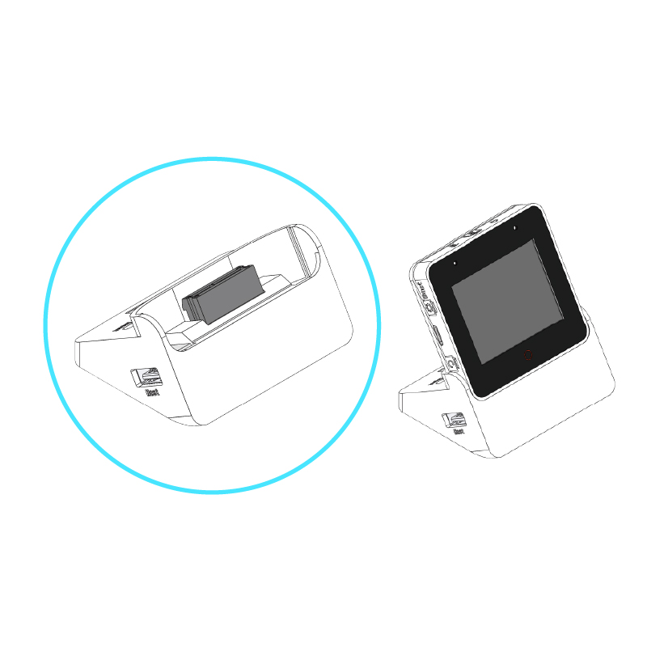

ESP32-S3-BOX-3-DOCK 被设计成通过插拔金手指为 ESP32-S3-BOX-3 提供支架，并拥有多样化的扩展性。它有两个 Pmod™ 兼容的 I/O 接口，允许用户扩展额外的外设模块。这些接口共提供了 16 个可编程的 GPIO 引脚，同时可以向外设供 3.3 V 电。一个 USB Type-A 接口用于连接各种 USB 设备，如 USB 摄像头（最大分辨率为 720 P）、U 盘和其他 HID 设备。另一个 USB Type-C 接口仅用于 5 V 输入电源。

#### 正视图

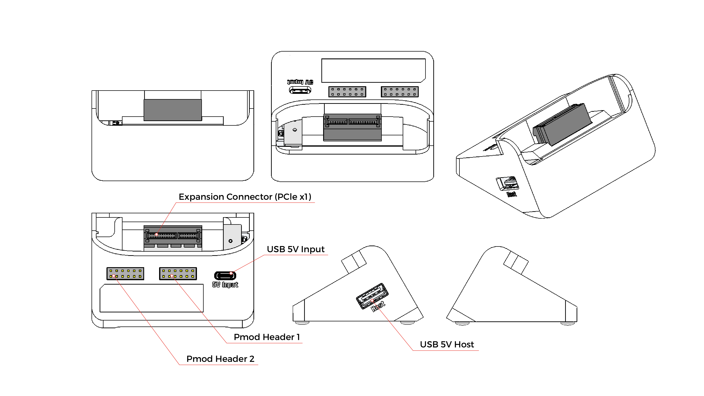

#### 规格参数
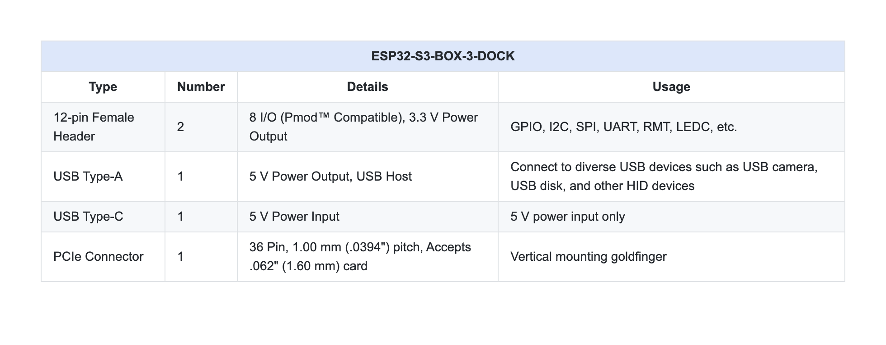
* [Digilent Pmod™ Interface Specification](https://digilent.com/reference/_media/reference/pmod/pmod-interface-specification-1_3_1.pdf)

#### 引脚图

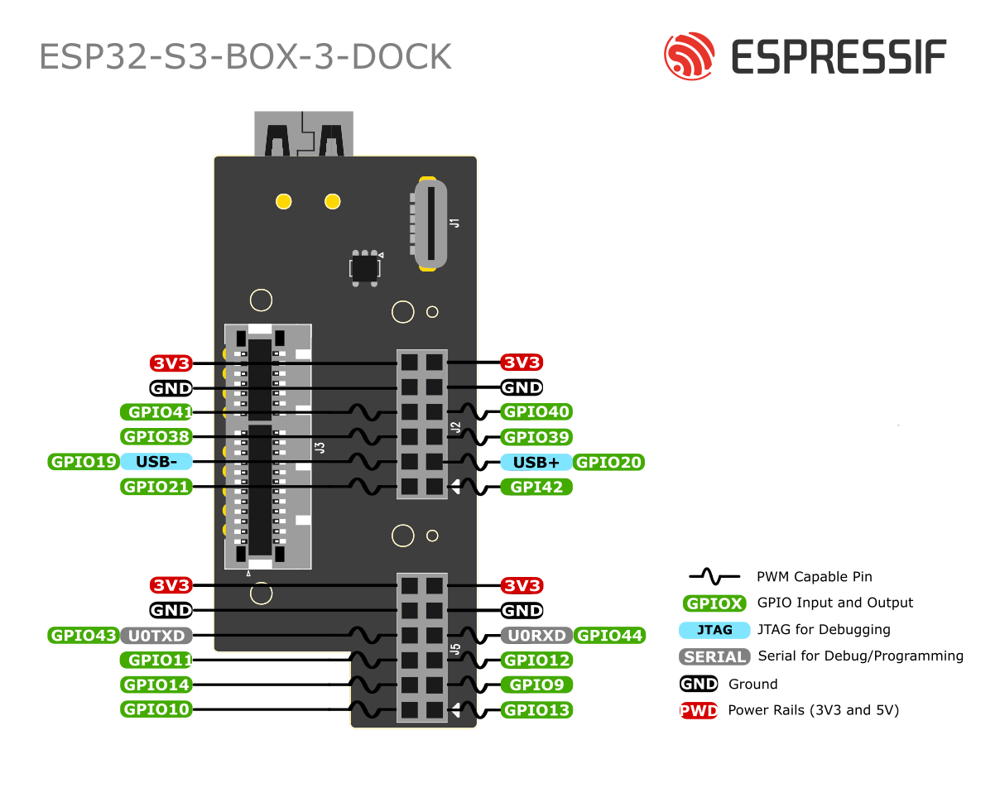

  
### ESP32-S3-BOX-3-SENSOR

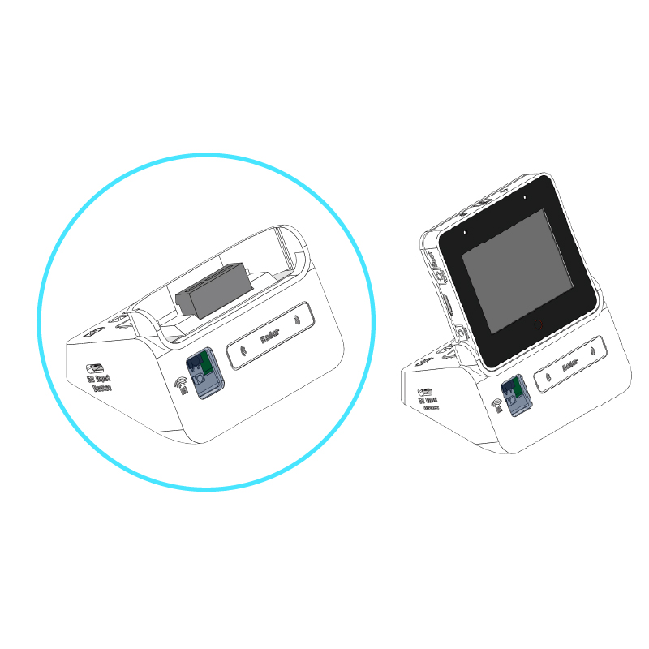

ESP32-S3-BOX-3-SENSOR 是一个多功能配件，集成了温湿度传感器、红外发射器和接收器、雷达传感器、18650 可充电电池插槽和 MicroSD 卡插槽。它使用户能够轻松地创建各种创新项目。通过整合多个传感器进行检测和控制，利用可充电电池实现便携性，并使用 MicroSD 卡插槽扩展存储能力（最多可扩展到 32 GB）。

#### 正视图

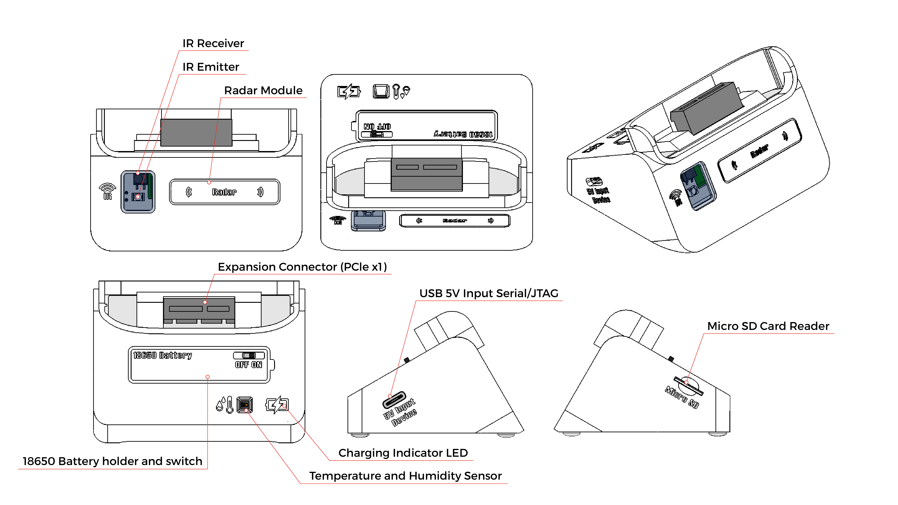

#### 规格参数
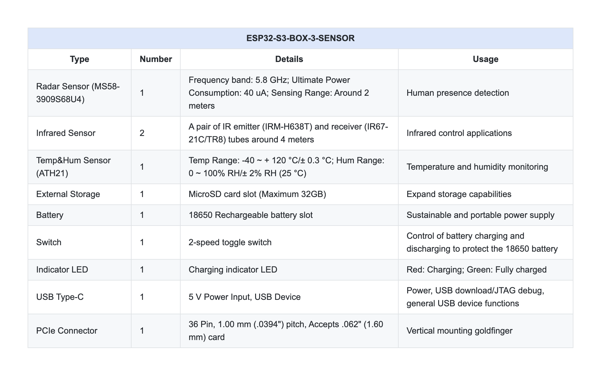

>**注意**
>* 当给 18650 电池充电时，请将开关拨至“ON”位置，并将 ESP32-S3-BOX-3 插入 ESP32-S3-BOX-3-SENSOR。

### ESP32-S3-BOX-3-BRACKET

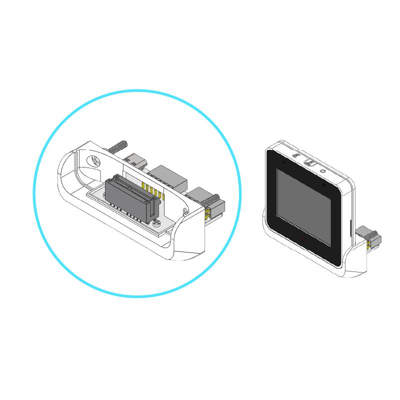

ESP32-S3-BOX-3-BRACKET 可用于帮助 ESP32-S3-BOX-3 安装到其他设备上，为将非智能设备转变为智能设备开启了多种可能性。ESP32-S3-BOX-3-BRACKET 的安装非常简单，只需使用[模板](../../../hardware/ESP32-S3-BOX-3-BRACKET_template.PDF)准备 2 个孔和一个槽即可。通过利用其两个 Pmod™ 兼容的引脚，用户可以有效地为非智能设备集成无线连接、语音控制和屏幕控制功能。ESP32-S3-BOX-3-BRACKET 转接配件使您能够充分发挥非智能设备的潜力。

#### 正视图

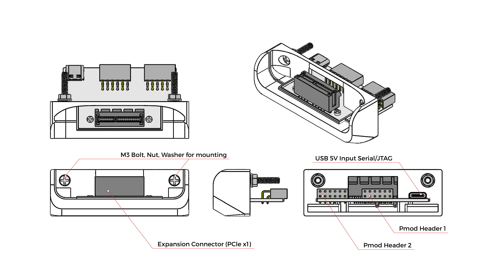

#### 规格参数
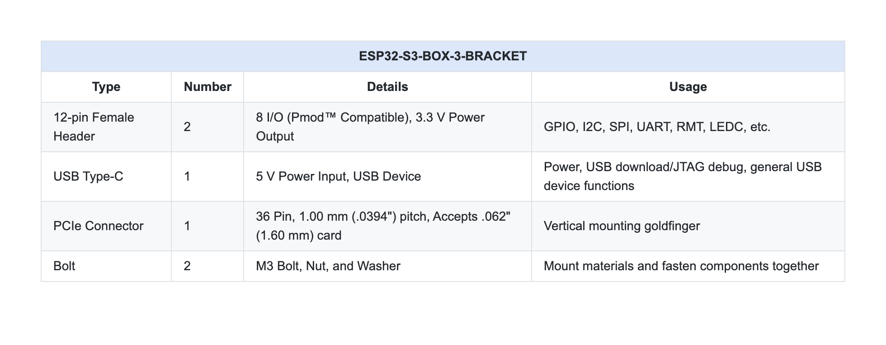

### ESP32-S3-BOX-3-BREAD

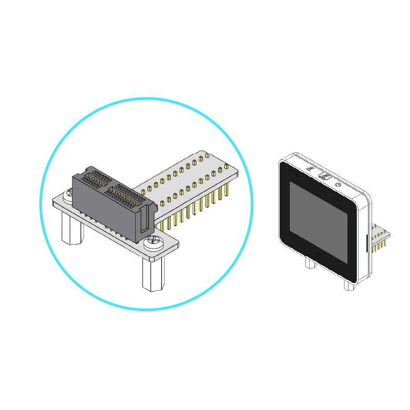

ESP32-S3-BOX-3-BREAD 是一个转接板，方便用户轻松连接 ESP32-S3-BOX-3 到标准面包板，为热爱自己动手的创客们扩展和连接其他设备提供了便利。它利用高密度 PCIe 连接器和两排 2.54 mm 间距的排针，引出了 ESP32-S3 共 16 个可编程 GPIO 引脚，ESP32-S3-BOX-3-BREAD 极具实用价值。

#### 正视图

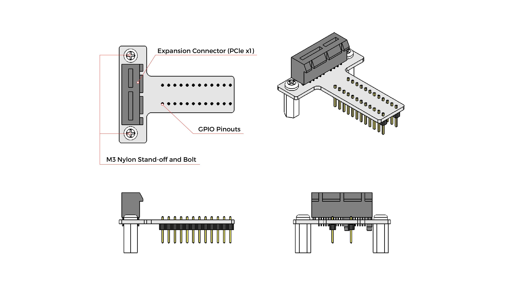

#### 规格参数
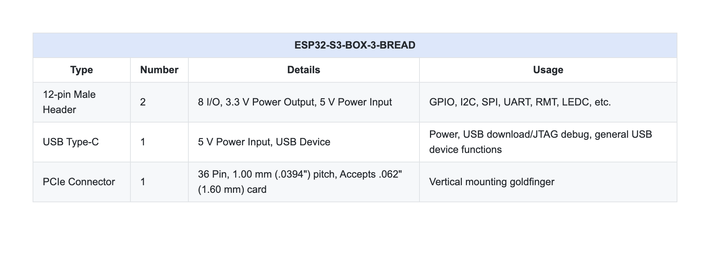

#### 引脚图

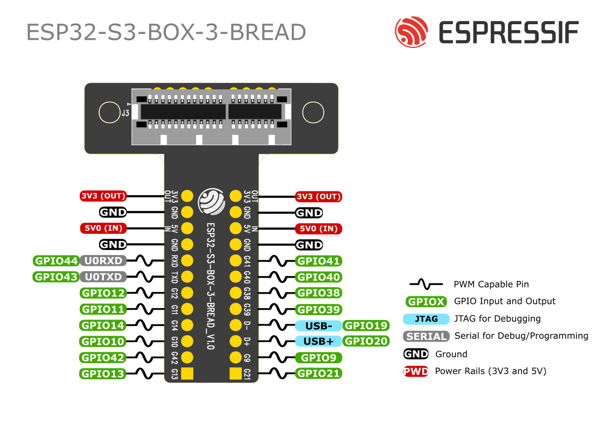

## 硬件开源资料

* [ESP32-S3-BOX-3 Kit PCB](../../../hardware/PCB_ESP32-S3-BOX-3_V1.0)
* [ESP32-S3-BOX-3 Kit Schematic](../../../hardware/SCH_ESP32-S3-BOX-3_V1.0)
* [ESP32-S3-BOX-3 3D Shell CAD](../../../hardware/esp32_s3_box_3_shell)
* [ESP32-S3-BOX-3 Bracket Mounting Template](../../../hardware/ESP32-S3-BOX-3-BRACKET_template.PDF)
