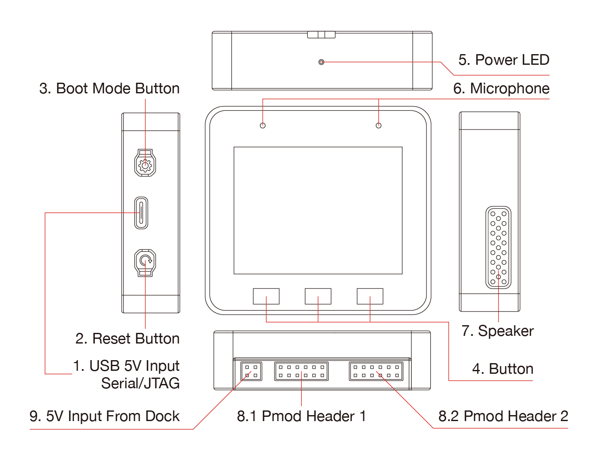
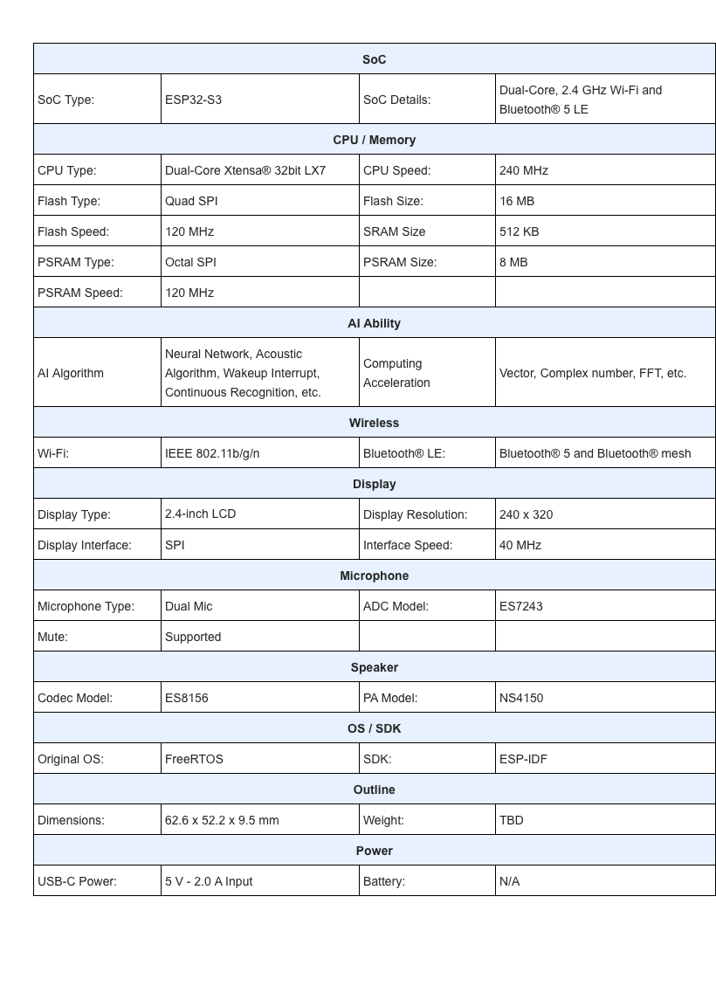

* [中文版本](./hardware_overview_for_lite_cn.md)

## Hardware Overview

### Hardware Source Files

* [ESP32-S3-BOX-Lite Mainboard Schematic](../../../hardware/esp32_s3_box_lite_MB_V1.1/schematic)
* [ESP32-S3-BOX-Lite Mainboard PCB](../../../hardware/esp32_s3_box_lite_MB_V1.1/pcb)
* [ESP32-S3-BOX-Lite Mainboard Gerber](../../../hardware/esp32_s3_box_lite_MB_V1.1/gerber)
* [ESP32-S3-BOX-Lite Subboard Schematic](../../../hardware/esp32_s3_box_lite_MIC_V1.0/schematic)
* [ESP32-S3-BOX-Lite Subboard PCB](../../../hardware/esp32_s3_box_lite_MIC_V1.0/pcb)
* [ESP32-S3-BOX-Lite Subboard Gerber](../../../hardware/esp32_s3_box_lite_MIC_V1.0/gerber)
* [ESP32-S3-BOX-Lite Shell CAD STEP](../../../hardware/esp32_s3_box_lite_shell_step)

### Specifications:

### Ports:

* [Digilent Pmod™ Interface Specification](https://digilent.com/reference/_media/reference/pmod/pmod-interface-specification-1_3_1.pdf)