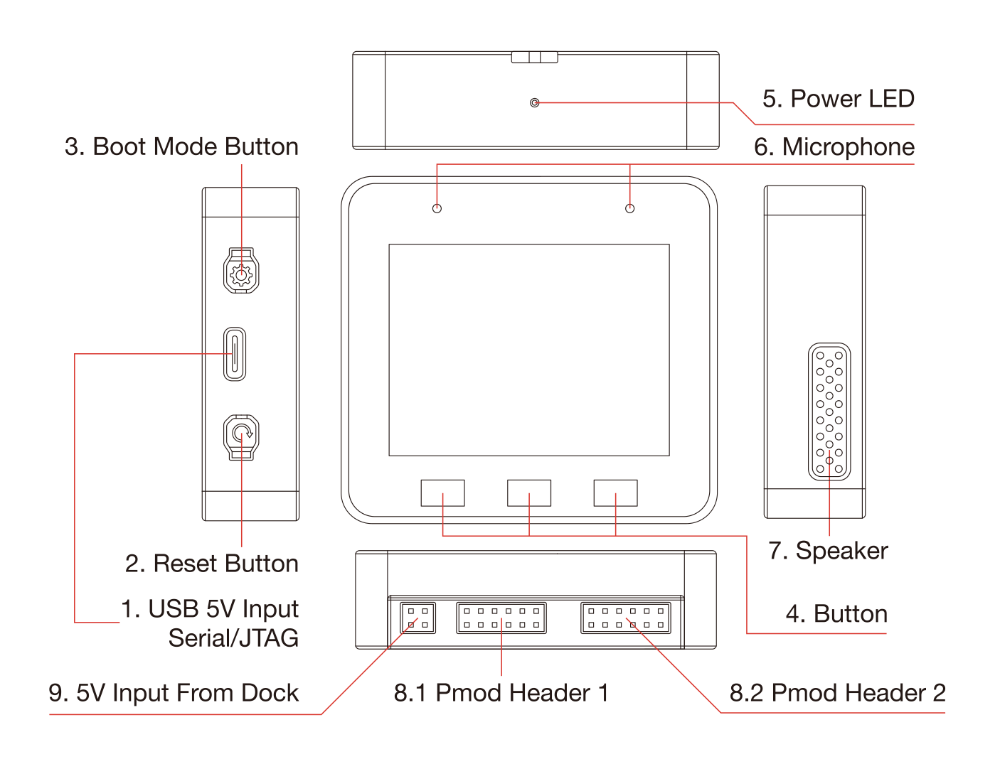

* [English Version](./hardware_overview_for_lite.md)

## 硬件总览

### 硬件开源资料

* [ESP32-S3-BOX-Lite Mainboard Schematic](../../../hardware/esp32_s3_box_lite_MB_V1.1/schematic)
* [ESP32-S3-BOX Mainboard PCB](../../../hardware/esp32_s3_box_lite_MB_V1.1/pcb)
* [ESP32-S3-BOX Mainboard Gerber](../../../hardware/esp32_s3_box_lite_MB_V1.1/gerber)
* [ESP32-S3-BOX Subboard Schematic](../../../hardware/esp32_s3_box_lite_MIC_V1.0/schematic)
* [ESP32-S3-BOX Subboard PCB](../../../hardware/esp32_s3_box_lite_MIC_V1.0/pcb)
* [ESP32-S3-BOX Subboard Gerber](../../../hardware/esp32_s3_box_lite_MIC_V1.0/gerber)
* [ESP32-S3-BOX Shell CAD STEP](../../../hardware/esp32_s3_box_lite_shell_step)

### 规格参数

### 接口

* [Digilent Pmod™ Interface Specification](https://digilent.com/reference/_media/reference/pmod/pmod-interface-specification-1_3_1.pdf)
