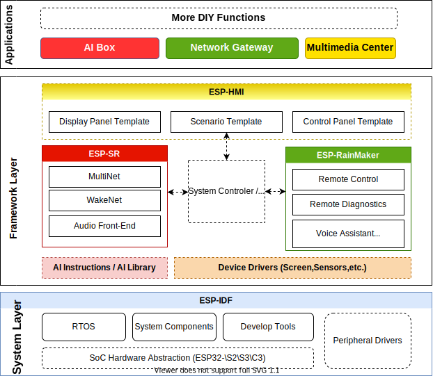
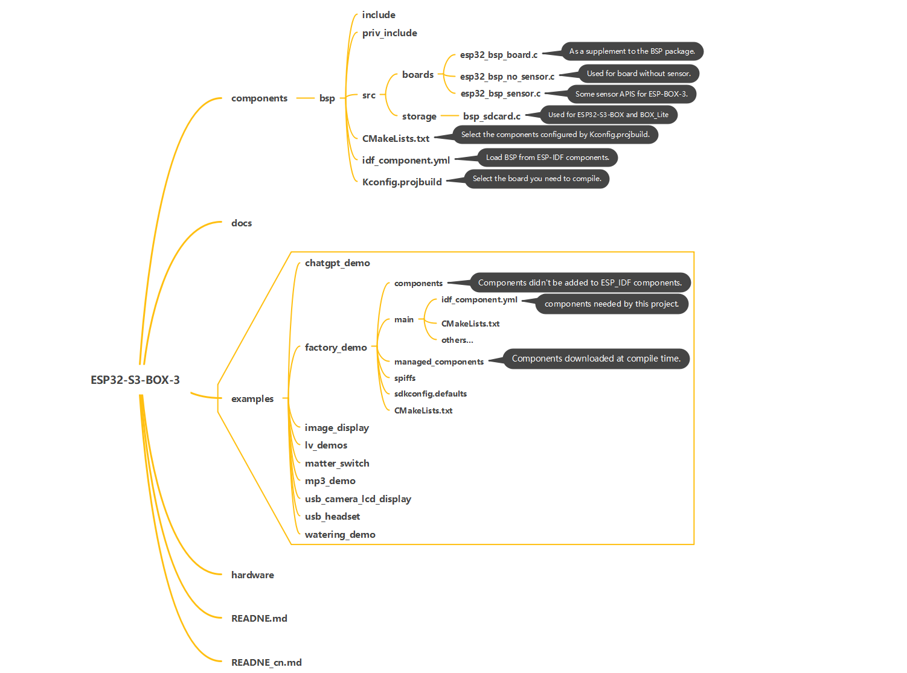

* [中文版](./technical_architecture_cn.md)

## Technical Architecture

The ESP-BOX development framework includes three main layers: system layer, framework layer, and application layer:

   

   
   

The code file structure of the ESP-BOX repository includes BSP components, examples, open-source hardware resources, user guides, and more, as shown in the diagram below:

   

   
   

### System Layer 

ESP-IDF is the open-source development framework for Espressif SoCs including ESP32、ESP32-S and ESP32-C series. It integrates a large number of system-level basic components, a set of development tools for code compilation and debugging, and detailed development guidance documents:

1. System-level basic components, mainly including multi-tasking, multi-core support based on FreeRTOS, and memory heap allocator with external expansion of PSRAM; a uniform operation interface support for LL, HAL, Driver, and VFS layers of multiple ESP chips; multiple standard network protocol stacks like TCP/IP, HTTP, MQTT, WebSocket, etc.
2. Set of development tools, mainly including GCC cross-toolchain for code building, JTAG debugging tool based on OpenOCD, real-time tracking based on Segger SystemView, Flash and eFuse programmers, etc.
3. Development guidance documents, API references, guidelines, and notes of Espressif’s various chip platforms and software versions. Developers can view these documents [online](https://docs.espressif.com/projects/esp-idf/en/latest/esp32/get-started/).

### Framework Layer

In addition to system-level support, ESP-BOX also integrates several excellent solution frameworks for typical problems in different scenarios. Including the speech recognition framework ESP-SR, the human-computer interaction framework ESP-HMI, and the end-to-end IoT development framework ESP-RainMaker. The functions and customization methods of these solution frameworks will be briefly introduced as follows:

**ESP-SR**

ESP-SR is a speech recognition framework developed by Espressif for the field of intelligent speech. ESP-SR can provide high-performance and high-reliability speech recognition functions for developers by using ESP32-S3 AI extension instructions. Now, this framework has three modules:

1. Espressif's acoustic algorithm ([Audio Front-End, AFE](https://github.com/espressif/esp-sr/tree/3ce34fe340af15e3bfb354c21c1ec2e6e31a37e8/docs/audio_front_end)), which is specially designed to improve speech recognition performance in far-field or noisy environments to enable developers to obtain high-quality and stable audio data. It mainly includes AEC (Acoustic Echo Cancellation), BSS (Blind Source Separation), NS (Noise Suppression). ESP-SR encapsulates the above algorithms into simple APIs. Without understanding details of these algorithms, developers only need to arrange and combine the algorithms that need to be used for specific application scenarios, and input the voice data to be processed according to the API format requirements and can get the results.
2. Espressif wake-up word engine ([WakeNet](https://github.com/espressif/esp-sr/tree/3ce34fe340af15e3bfb354c21c1ec2e6e31a37e8/docs/wake_word_engine/README.md)), which is used to monitor specific language fragments in real-time in a continuous audio streaming, and wake up the smart device from the standby state to the voice interaction state. WakeNet uses MFC (Mel-frequency Cepstrum) to obtain the features of the input audio clip, then classifies the characteristic signals by the neural network algorithm optimized for ESP32-S3. That can trigger the wake-up signal when analysed the command word, and the [effective recognition rate](https://github.com/espressif/esp-sr/tree/3ce34fe340af15e3bfb354c21c1ec2e6e31a37e8/docs/wake_word_engine/README.md#performance-test) is more than 80% in a noisy environment. ESP-BOX provides different offline wake words like "Hi, ESP" or "Hi, Lexin". And also allows [customized wake word](https://github.com/espressif/esp-sr/tree/3ce34fe340af15e3bfb354c21c1ec2e6e31a37e8/docs/wake_word_engine/ESP_Wake_Words_Customization.md).
3. Espressif multi-command recognition model ([MultiNet](https://github.com/espressif/esp-sr/tree/3ce34fe340af15e3bfb354c21c1ec2e6e31a37e8/docs/speech_command_recognition/README.md)), which is designed to provide a flexible command recognition after the device is awakened. MultiNet supports both Chinese and English speech commands, like "Guan Bi Dian Deng", "Turn on the air conditioner" through a lightweight model specially designed based on CRNN and CTC, and supports up to 200 offline customized speech commands. The command words can be added and modified simply through configuring [Chinese Pinyin string](https://github.com/espressif/esp-sr/tree/3ce34fe340af15e3bfb354c21c1ec2e6e31a37e8/docs/speech_command_recognition/README.md#modify-speech-commands) or [English Phonetic String](https://github.com/espressif/esp-sr/tree/3ce34fe340af15e3bfb354c21c1ec2e6e31a37e8/docs/speech_command_recognition/README.md#modify-speech-commands) and the corresponding ID. Developers do not need to understand the details of the MultiNet nor re-train the model. The event will be triggered after the command words are recognized.

**ESP-HMI**

ESP-HMI is a human-computer interaction solution designed by Espressif based on the open-source GUI framework LVGL. With the powerful computing and peripheral resources in ESP32-S3, it can achieve excellent data visualization, touch control, and other functions:

1. Screen driver library: compatible with a variety of mainstream RGB, 8080, SPI, I2C interface color screens, monochrome screens, touch screens, and provide a uniform display driver interface. Developers can directly use the adapted screen controller or add their screens according to the display driver interface. And the UI interface can be deployed to a variety of screens.
2. Open source UI templates: Espressif has designed multiple open source UI templates suitable for IoT control panels, multimedia players, voice assistants, and other different IoT scenarios, which can help developers carry out more professional secondary development.
3. Hardware design reference: Espressif provides hardware reference designs, circuit schematics, and development guides related to screen applications to help developers quickly complete hardware designs.

**ESP-RainMaker**

[ESP-RainMaker](https://rainmaker.espressif.com/docs/get-started.html) is a complete system for AIoT development, and it can as an end-to-end platform, it can provide developers with one-stop IoT product functions and examples such as device distribution, cloud connection, and OTA, it contains the following functions:

1. Device-side SDK, developers can use Espressif chips to define their IoT products by designing device parameters and attributes, and complete device-side firmware development quickly.
2. Secure cloud middleware, developers do not need to manage device certificates and cloud infrastructure. They can directly use Espressif chips to quickly establish a secure communication link with the cloud.
3. iOS / Android APP, which integrates the necessary functions such as device discovery, Wi-Fi provisioning, user login, device association, and control. Developers do not need to carry out additional code development work.

**AI Instructions and Libraries**

With the help of ESP32-S3 Xtensa® 32bit LX7 dual-core CPU and AI / DSP extended instruction set, ESP32-S3 can efficiently complete vector operations, complex number operations, FFT, and other operations, which can accelerate neural network calculations and digital signal processing calculation capabilities. AI developers can implement high-performance image recognition, voice wake-up, and recognition with Espressif's open-source software library based on the AI / DSP extended instruction set.

**Device Drivers**

Device driver is the foundation base of the framework layer, which provides the interface for the framework layer to control peripheral devices. [ESP-IoT-Solution](https://github.com/espressif/esp-iot-solution) provides rich
open source device drivers for the development of IoT system, which works as extra components of ESP-IDF and much easier to start. It contains device drivers for sensors, display, audio, input, USB, etc.

### Application Layer

**Voice Assistance**

The voice assistance allows the user to control the light on/off, change color, play/pause the music player and switch songs through voice commands. More interestingly, the device supports continuous recognition of multiple command words after wake-up. Continuous recognition means that the user can talk to the device continuously once it is woken up.
