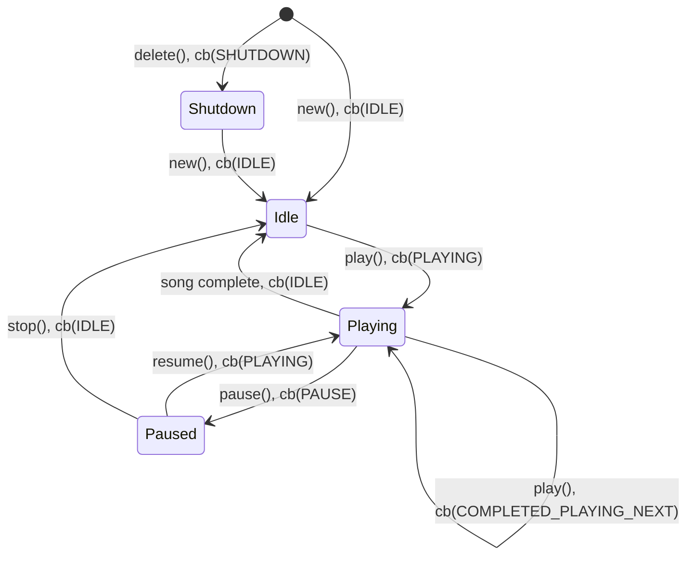

# Audio player component for esp32

## Capabilities

* MP3 decoding (via libhelix-mp3)
* Wav/wave file decoding

## Who is this for?

Decode only audio playback on esp32 series of chips, where the features and footprint of esp-adf are not 
necessary.

## What about esp-adf?

This component is not intended to compete with esp-adf, a much more fully developed
audio framework.

It does however have a number of advantages at the moment including:

* Fully open source (esp-adf has a number of binary modules at the moment)
* Minimal size (it's less capable, but also simpler, than esp-adf)

## Dependencies

For MP3 support you'll need the [esp-libhelix-mp3](https://github.com/chmorgan/esp-libhelix-mp3) component.

## Tests

Unity tests are implemented in the [test/](../test) folder.

## States

Note: Diagram shortens callbacks from AUDIO_PLAYER_EVENT_xxx to xxx, and functions from audio_player_xxx() to xxx(), for clarity.

## Release process - Pushing component to the IDF Component Registry

The github workflow, .github/workflows/esp_upload_component.yml, pushes data to the espressif
[IDF component registry](https://components.espressif.com).

To push a new version:

* Apply a git tag via 'git tag vA.B.C'
* Push to the 'main' branch

The github workflow *should* run and automatically push to the IDF component registry.
