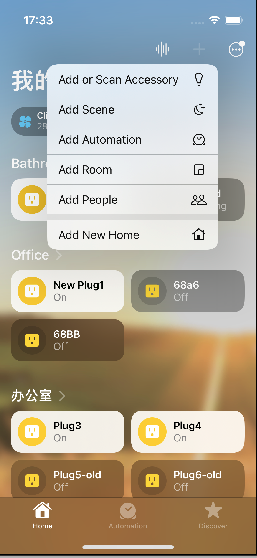
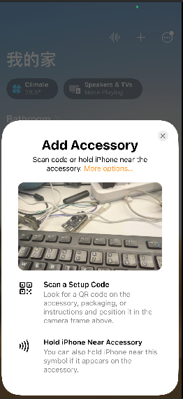
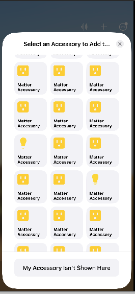
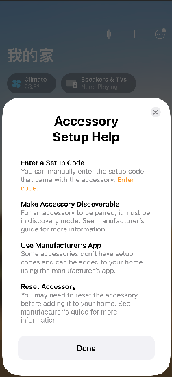
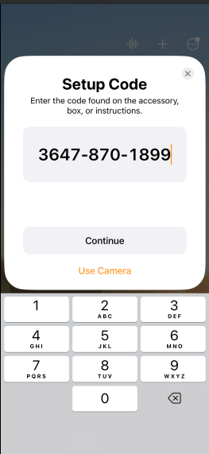
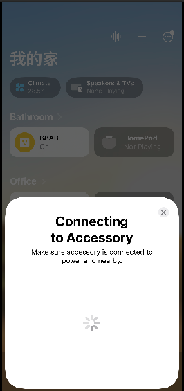

# ESP32-S3-BOX Matter Switch

| Board             | Support Status |
| ----------------- | -------------- |
| ESP32-S3-BOX      | YES            |
| ESP32-S3-BOX-Lite | YES            |
| ESP32-S3-BOX-3    | YES            |


In this example, we are setting up ESP-BOX to operate as a Matter device, specifically a switch, with the capability to turn other Matter devices on and off. Currently, the ESP-BOX Matter switch can control up to three Matter devices(Light, Fan and Switch).

## How to use example
* ESP-IDF [master](https://github.com/espressif/esp-idf)
* ESP-MATTER [master](https://github.com/espressif/esp-matter)

See the [docs](https://docs.espressif.com/projects/esp-matter/en/latest/esp32/developing.html#developing-with-the-sdk) for more information about esp-matter building and flashing the firmware.


If you encounter any errors during the upgrade process, please make sure to use the ESP-IDF version [master](https://github.com/espressif/esp-idf) at commit ID `67552c31dac8cd94fb0d63192a538f4f984c5b6e` and ESP-MATTER [master](https://github.com/espressif/esp-matter) at commit ID `de3fc77b03c2bd0e59bca623290399ae5302a0f6`.This specific commits represent a stable state of the ESP-IDF and ESP-MATTER repository for this example and can help ensure a smoother transition or troubleshooting process.

### Hardware Required
* An ESP32-S3-BOX，ESP32-S3-BOX-Lite or ESP32-S3-BOX-3
* An ESP32C3 devkit for testing (Not necessary if you have another Matter device for testing)
* An USB-C or Micro USB cable for power supply and programming
* A Bluetooth connection to the PC to facilitate the hardware connection and transmit the Wi-Fi password and SSID using Chip-tool

## Build and Flash
**1. Export IDF and Matter**

The first step is to export both ESP-IDF and ESP-MATTER into the terminal 

``` bash
. ./export.sh
```

**2. Build & Flash ESP_BOX**

After setup the esp-matter environment, get into the [matter-switch project folder](https://github.com/espressif/esp-box/tree/master/examples/matter_switch), then
execute below commands:

```bash
idf.py set-target esp32s3 build

cd build && esptool.py --chip esp32s3 merge_bin `cat flash_args` -o demo_box_s3_box_switch.bin

esptool.py -p /dev/ttyACM0 write_flash 0 demo_box_s3_box_switch.bin

cd ..

idf.py -p /dev/ttyACM0 monitor

```
**3. Commissioning ESP-BOX**

After flash the firmware, then use the chip-tool to pairing the Matter network, The command is as follows:

```bash
./chip-tool pairing ble-wifi 0x4 wifi-name wifi-password 20202021 3840
```
- 0x4 is the node id for ESP-BOX Matter Switch.

After pairing successfully, the ESP-BOX will start displaying splash screen.


**4. Build & Flash Matter Devices**

To test the functionality of the ESP-BOX Matter Switch with a Matter Devices, You can utilize an examples from the [ESP-Matter](https://github.com/espressif/esp-matter/tree/main/examples) SDK.

- For Light:

We can use the example named [Light Switch Example](https://github.com/espressif/esp-matter/tree/main/examples/light_switch) from ESP-Matter.

```bash
idf.py set-target esp32c3 build flash monitor
```
This command will set the target for the ESP32-C3, build the project, flash it onto the device, and then start monitoring the output.

- For Fan:

                  **At the moment, this example is not accessible to the general public**

- For Switch: 

                  **At the moment, this example is not accessible to the general public**


>Note: "As Matter-Fan and Matter-Switch are presently unavailable for public use, developers can make use of the Matter-Light example. Flash it onto the devkits and then follow the subsequent steps to assess the functionality of Fan and Switch."

**5. Commissioning ESP-Matter Devices**

After flashing the firmware, use the chip-tool to pair the Matter network. The default command is as follows:

- For Light: 

```bash
./chip-tool pairing ble-wifi 0x1 wifi-name wifi-password 20202021 3840
```
0x1 is the node id for Matter Light.

- For Fan:
```bash
./chip-tool pairing ble-wifi 0x2 wifi-name wifi-password 20202021 3840
```
0x2 is the node id for Matter Fan.

- For Switch:

```bash
./chip-tool pairing ble-wifi 0x3 wifi-name wifi-password 20202021 3840
```
0x3 is the node id for Matter switch.


**6. Post Commissioning Setup**

After commissioning, the next step is to bind Matter devices (Light, Fan, and Switch) with the ESP-BOX Matter switch and control them via the touchscreen and speech recognition.

**6.1 Bind devices to ESP-BOX Matter switch**

Utilizing chip-tool to write access control to the Matter devices in order to control through ESP-BOX Matter Switch.

- For Light: 

```bash
./chip-tool accesscontrol write acl '[{"fabricIndex": 1, "privilege": 5, "authMode": 2, "subjects": [ 112233, 4 ], "targets": null}]' 1 0x0
```

- For Fan:

```bash
./chip-tool accesscontrol write acl '[{"fabricIndex": 1, "privilege": 5, "authMode": 2, "subjects": [ 112233, 4 ], "targets": null}]' 2 0x0
```
- For Switch:

```bash
./chip-tool accesscontrol write acl '[{"fabricIndex": 1, "privilege": 5, "authMode": 2, "subjects": [ 112233, 4 ], "targets": null}]' 3 0x0
```

> Note: If you are having trouble, try commissioning them one at a time (by powering off the other device) 

**6.2 Update device binding attribute to ESP-BOX Matter Switch**

To update the ESP-BOX Matter Switch binding attribute and add an entry for a remote device (Matter Light, Fan, and Switch) to the binding table, use the following command:

- For Light:

```bash
./chip-tool binding write binding '[{"fabricIndex": 1, "node":1, "endpoint":1, "cluster":6}]' 4 0x1
```

- For Fan:

```bash
./chip-tool binding write binding '[{"fabricIndex": 1, "node":2, "endpoint":1, "cluster":6}]' 4 0x2
```

- For Switch:

```bash
./chip-tool binding write binding '[{"fabricIndex": 1, "node":3, "endpoint":1, "cluster":6}]' 4 0x3
```

## Control devices

After binding successfully, To control the onoff devices via touch screen and speech recognition.

**1. Touch screen control**

Enter the device control interface, click the *Light*, *Fan*, *Switch* buttons respectively to control the onoff light, fan and onoff switch.


**2. Speech recognition control**

Current matter-switch example only support English mode, Saying "Hi ESP" to wake up the switch, then say

```
Turn on the light
Turn off the light
Turn on the fan
Turn off the fan
Turn on the switch
Turn off the switch
```

to control the three onoff devices.


## Commissioning window and pairing using Homekit

To initiate the commissioning window and establish a connection between the ESP-BOX Matter Switch and an Apple HomePod, send the following command using chip-tool:

```bash
./chip-tool pairing open-commissioning-window 0x4 1 180 1000 3840
```
The output generated by the chip-tool resembles the following:

```bash
[1689931442.902596][2216299:2216301] CHIP:CTL: Successfully opened pairing window on the device
[1689931442.902603][2216299:2216301] CHIP:CTL: Manual pairing code: [36478701899]
[1689931442.902607][2216299:2216301] CHIP:CTL: SetupQRCode: [MT:MH5B4BFN00KCTW7I200]
[1689931442.902623][2216299:2216301] CHIP:DMG: ICR moving to [AwaitingDe]
```
Then we can use the ***SetupQRCode: [MT:MH5B4BFN00KCTW7I200]*** or ***Manual pairing code: [36478701899]*** to paring to Homekit, as below show:








## Factory Reset Matter Switch

Long press *Boot* button for more than 5 seconds, then release, the matter switch will trigger factory reset, all the matter related information will be factory reset.

## Build & Flash Using LaunchPad
The LaunchPad can be utilized to directly build and flash both the [ESP-Box Matter Switch](https://espressif.github.io/esp-launchpad/?flashConfigURL=https://espressif.github.io/esp-box/launchpad.toml) and [ESP-Matter Light](https://espressif.github.io/esp-launchpad/?flashConfigURL=https://espressif.github.io/esp-matter/launchpad.toml). However, even with the LaunchPad, still require to employ the chip-tool for commissioning and subsequent post-commissioning procedures.

> On the LaunchPad, you can find the ESP-Matter Light example available under the name "Light Switch."

## FAQs
My light is not getting bound to my switch:

-   Make sure the light's acl is updated. You can read it again to make
    sure it is correct: `accesscontrol read acl 0x5164 0x0`.
-   If you are still facing issues, reproduce the issue on the default
    example for the device and then raise an [issue](https://github.com/espressif/esp-matter/issues).
    Make sure to share these:
    -   The complete device logs for both the devices taken over UART.
    -   The complete chip-tool logs.
    -   The esp-matter and esp-idf branch you are using.

