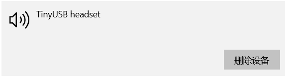

# USB Headset Example

| Board             | Support Status |
| ----------------- | -------------- |
| ESP32-S3-BOX      | YES            |
| ESP32-S3-BOX-Lite | YES            |
| ESP32-S3-BOX-3    | YES            |

This demo makes ESP32-S3-BOX work as a USB headset that can play music and record voice. Default uses 48k single mic and single channel audio data, and it uses FFT to display the music spectrum on the screen and supports multiple animations.

## How to use example

### Hardware Required

* A ESP32-S3-Box or ESP32-S3-BOX-Lite
* A USB-C cable for power supply and programming

Follow detailed instructions provided specifically for this example. 

### Build and Flash

Run `idf.py flash monitor` to build, flash and monitor the project.

Once a complete flash process has been performed, you can use `idf.py app-flash monitor` to reduce the flash time.

(To exit the serial monitor, type `Ctrl-]`. Please reset the development board f you cannot exit the monitor.)

**Note**: After you flash this project, the device will act as a USB sound card. If you want to flash other projects by USB again, Please hold down `Boot` and then press `Reset` to initiates firmware-download-mode.

### How To Use

* When you plug in the PC, you will find a USB device, When you play music the sound will play from the esp-box.

    

* You can also use box to record.

    

* You can see the real-time FFT effect on the screen.

    
