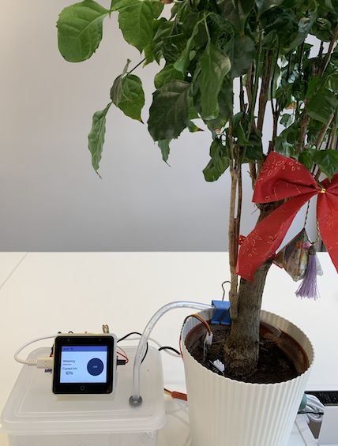
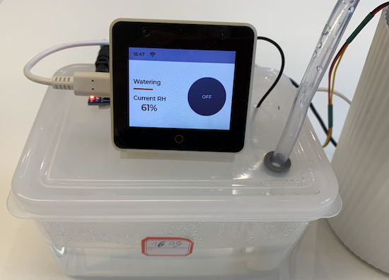
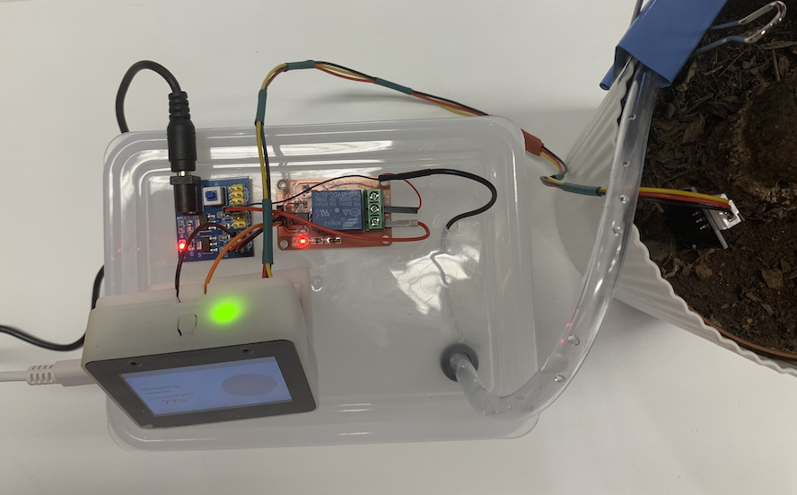
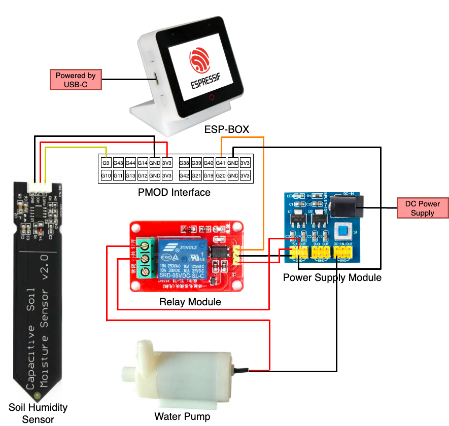
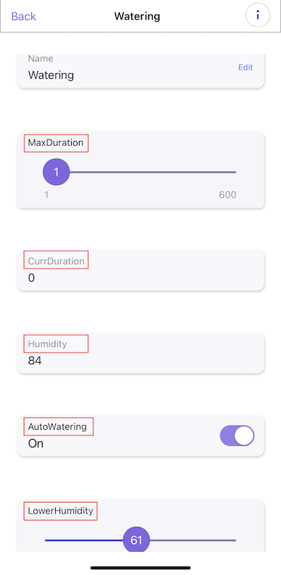

# Watering System Example

| Board             | Support Status |
| ----------------- | -------------- |
| ESP32-S3-BOX      | YES            |
| ESP32-S3-BOX-Lite | YES            |
| ESP32-S3-BOX-3    | YES            |

The example is a prototype that simulates a smart watering system. The example utilizes ESP-BOX as a control panel, providing cloud connection capability as well as a voice control function. It also supports remote control from a mobile app using ESP RainMaker.


This is the overview of the watering system:

<div align=center>

</div>

You can press the button on the ESP-BOX screen to override the current status of the pump (controlled automatically depending on the reading from the soil humidity sensor) to start or stop watering.

<div align=center>

</div>

The following photo shows the connection of the modules. For detailed connections, please refer to the connection diagram in [Required Hardware](#required-hardware).

<div align=center>

</div>                

## Table of Contents

  - [Required Hardware](#required-hardware)
  - [Hardware Connections](#hardware-connections)
    - [Connection Diagram](#connection-diagram)
    - [GPIO Allocation](#gpio-allocation)
  - [Build Project](#build-project)
    - [Build Project in ESP-IDF](#build-project-in-esp-idf)
    - [Flash Binaries onto ESP-BOX](#flash-binaries-onto-esp-box)
    - [Monitor the Output](#monitor-the-output)
  - [Remote Control with ESP RainMaker](#remote-control-with-esp-rainmaker)
    - [Install ESP RainMaker App](#install-esp-rainmaker-app)
    - [Remote Control](#remote-control)
  - [Voice Control](#voice-control)

## Required Hardware

- ESP-BOX
- USB-C cable
- Power supply module (5 V and 3.3 V)
- Relay module
- Soil humidity sensor
- Water pump

## Hardware Connections

### Connection Diagram

<div align=center>

</div>

### GPIO Allocation

| ESP-BOX GPIO |Sensor     | Relay     | Description of GPIO Pin Functionality |
|--------------|-----------|-----------|---------------------------------------|
|GPIO11        |AUOT       |-          | Acquire ADC channel                   |
|GPIO41        |-          |IN1        | Relay control                         |

## Build Project

### Build Project in ESP-IDF

You can build this project in ESP-IDF, which is the official development framework for Espressif SoCs supported on Windows, Linux and macOS. Pleaser refer to [Get Started](https://docs.espressif.com/projects/esp-idf/en/latest/esp32s3/get-started/index.html) to install ESP-IDF and set up tools. 

Clone the [ESP-BOX repository](https://github.com/espressif/esp-box) using the following command:

`git clone --recursive https://github.com/espressif/esp-box`

Then connect your ESP-BOX to your computer and check under which serial port the board is visible using the following command:

`ls /dev/cu*` for macOS  
`ls /dev/ttyACM*` for Linux

On Windows, you can check the port in the Windows Device Manager. For more information, please refer to [Establish Serial Connection with ESP32-S3](https://docs.espressif.com/projects/esp-idf/en/latest/esp32s3/get-started/establish-serial-connection.html).

Please note that the ESP-IDF supported by ESP-BOX is [ESP-IDF v5.1](https://docs.espressif.com/projects/esp-idf/en/release-v5.1/esp32s3/index.html), and the corresponding commit ID is 22cfbf30c3. You need to switch to ESP-IDF v5.1 using the following command. For details, please refer to [Readme of ESP-BOX](https://github.com/espressif/esp-box):

```
cd esp-idf
git checkout 2bdea81b2a
```

Navigate to your watering-demo directory, and set ESP32-S3 as the target using the following command:

```
cd watering-demo
idf.py set-target esp32s3
```

Build the project by running:

`idf.py build`

This command will compile the application and all ESP-IDF components, then it will generate application binaries.

### Flash Binaries onto ESP-BOX

To flash the binaries that you just built for ESP-BOX in the previous step, you need to run the following command:

`idf.py -p PORT flash`

Replace PORT with your ESP-BOX's USB port name. 

### Monitor the Output

Check the running process of the watering-demo project by the following command:

`idf.py -p PORT monitor`

Replace PORT with your ESP-BOX's USB port name. 

After powering up the device, you can see the current humidity on the LCD screen, and you can toggle the watering button to start or stop watering. The LCD screen looks like the following figure:

<div align=center>

</div>

## Remote Control with ESP RainMaker

### Install ESP RainMaker App

It is recommended to use the ESP RainMaker app available for mobile phones to remotely control the pump. The app can be found here:

- Android: [Google Play Store](https://play.google.com/store/apps/details?id=com.espressif.rainmaker), [Direct APK](https://github.com/espressif/esp-rainmaker/wiki)
- iOS: [Apple APP Store](https://apps.apple.com/app/esp-rainmaker/id1497491540)

Follow the following steps on the phone app：

- Sign in using any of the third party options available (or sign up using your email address and then sign in).
- Click on `Add Device` (or if you already have a device added, then click `+` at the top right).
- This will open the camera for QR code scanning. To get the QR code of ESP-BOX, you should run the following command on your terminal:
  
  `idf.py -p PORT monitor`

  Then you may can see the QR code on the terminal. But if the QR code is not rendered properly or not visible, please copy and paste the given URL in a browser. Then you can see the clear QR code.

- Follow the "Provision" workflow so that ESP-BOX can connect to your Wi-Fi network.

- If everything goes well, you should see a "Switch" device added at the end.
  
- Tapping on the "Switch" icon will take you to the control page.
  
### Remote Control

On the control page, you can acquire the soil humidity in real time. You also can adjust the lower limit of humidity. When the soil humidity is lower than this value, the irrigation system will be triggered automatically.

<div align=center>

</div>

By adjusting the MaxDuration slider, you can control the maximum duration of the pump operation during each watering cycle. The current watering duration is shown below the slider.

You can also see the soil humidity on the screen updated in real time.

You can set the threshold of the humidity in the LowerHumidity. If the real-time soil humidity is lower than this value, the watering system will be triggered on automatically, and the button of AutoWatering will be switched on automatically.

## Voice Control

ESP-BOX supports voice control, so you can also control this watering system by voice commands. The following Chinese Pinyin commands are available:

* "hi, lexin" -- wake up the ESP32-S3-BOX

* "kai shi jiao shui" -- start watering

* "ting zhi jiao shui" -- stop watering

You can refer to this [example](https://github.com/espressif/esp-box/tree/master/examples/factory_demo) to define your favorite voice commands.