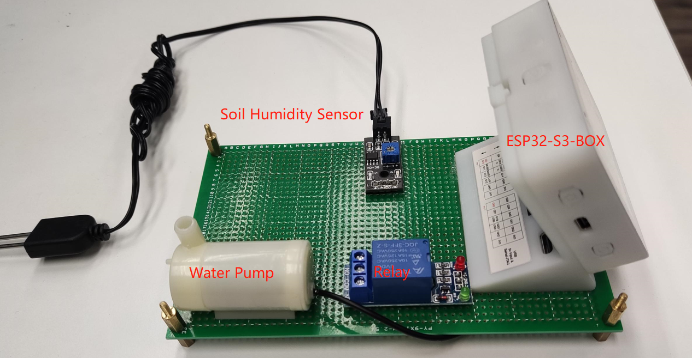
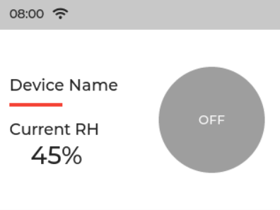
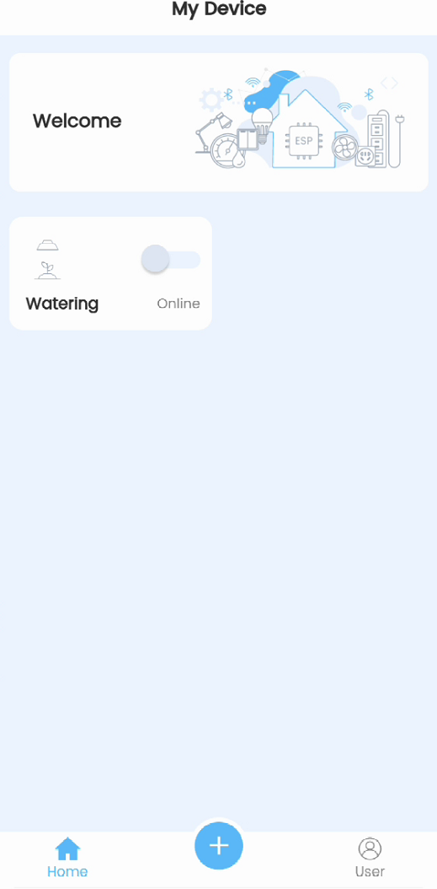
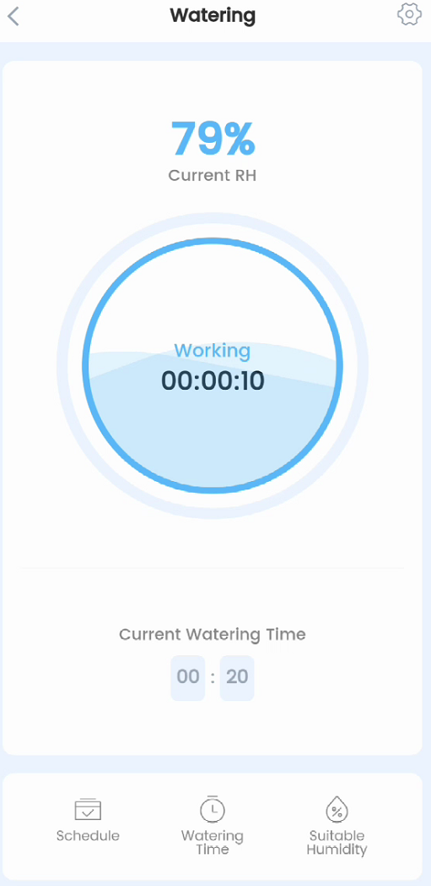
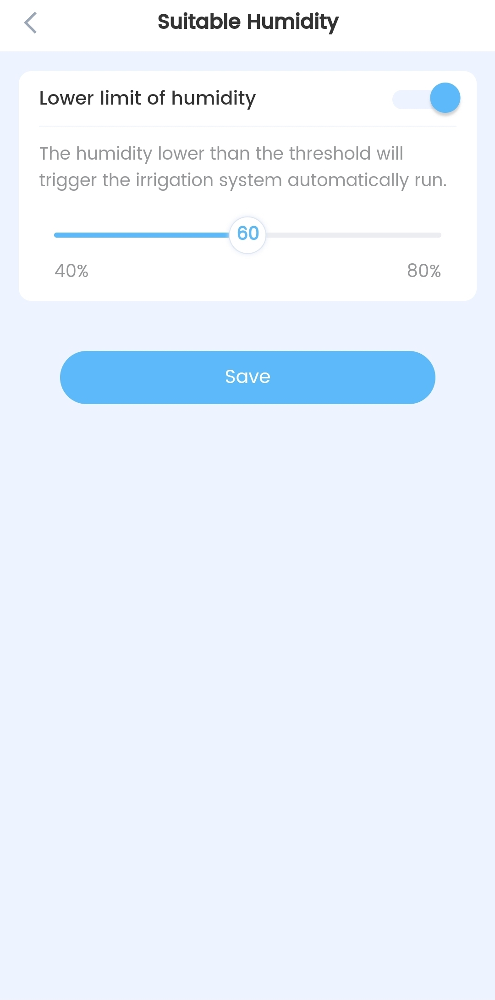

# Watering System Example

| Board             | Support Status |
| ----------------- | -------------- |
| ESP32-S3-BOX      | YES            |
| ESP32-S3-BOX-Lite | YES            |

The example is a prototype that simulates a smart watering system. The example utilizes ESP32-S3-BOX as a control panel, provides cloud connection capability as well as voice control function. It also supports interfacing with various peripherals for flexibly implementing the watering system.

## Features

- Remote control works with ESP rainmaker
- Off-line voice control
- Soil humidity smart monitor
- Scheduled watering task support

## Hardware Required

- An ESP32-S3-BOX with power supply USB-C cable
- A water pump
- A relay
- A soil humidity sensor

The required hardwares are shown in the following figure:

## Working Pattern

In this demo, the water pump is controlled by the relay , which using GPIO41（low level active）to control.
The ESP32-S3-BOX uses ADC to acquire humidity data from the sensor, the ADC channel is ADC1_CHANNEL_8.
When power up the device, the current humidity will be shown on the LCD screen, user can toggle the watering button to start/stop the watering, it may look like this:

## Remote control 

The demo can be configured to connect ESP-Rainmaker via ESP-BOX App. User can configure the watering time or setup watering task schedule. User also can adjust the suitable lower limit of humidity, when the humidity is lower than a threshold, the irrigation system will be triggered to run automatically.

<table class="tg" border=0px>
<tbody>
  <tr>
    <td class="tg-wa1i"></td>
    <td class="tg-wa1i"></td>
  </tr>
  <tr>
    <td class="tg-wa1i"></td>
    <td class="tg-wa1i"></td>
    <td class="tg-wa1i"></td>
  </tr>
</tbody>
</table>

## Voice Control

The demo can be controlled by voice command, please 

say "hi, lexin" to wake up the ESP32-S3-BOX

say "kai shi jiao shui" to start watering

say "ting zhi jiao shui" to stop watering

You can refer to this [example](https://github.com/espressif/esp-box/tree/master/examples/factory_demo) to define your favorite voice commands.

